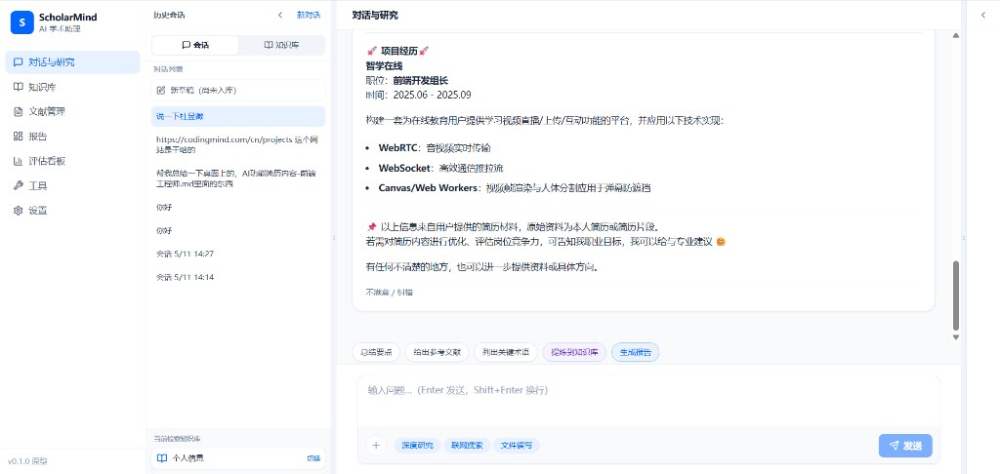
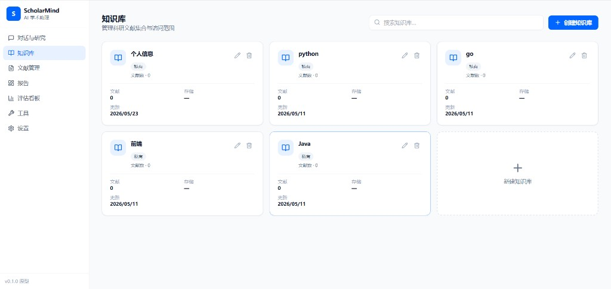
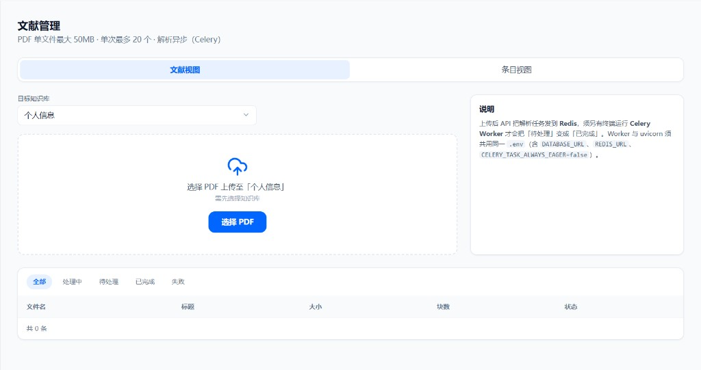
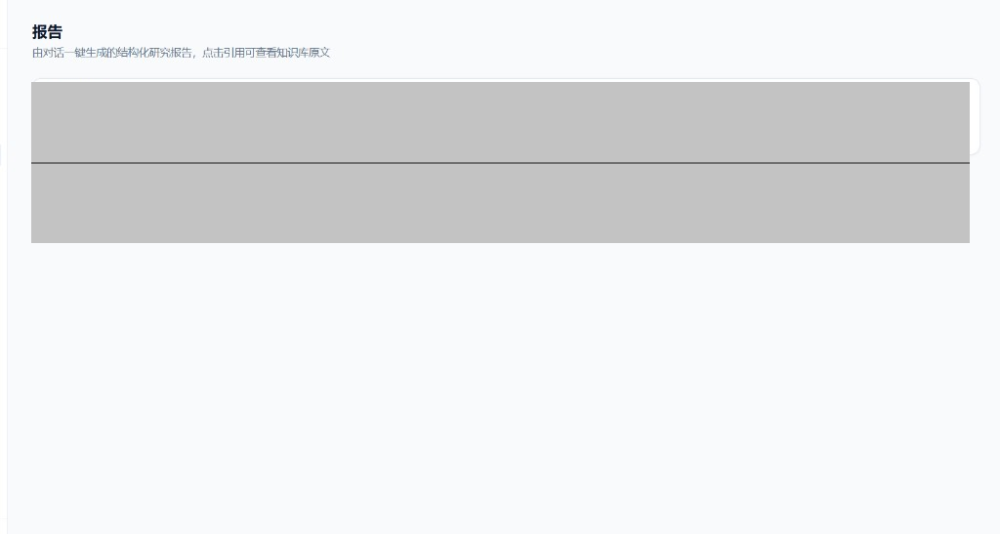
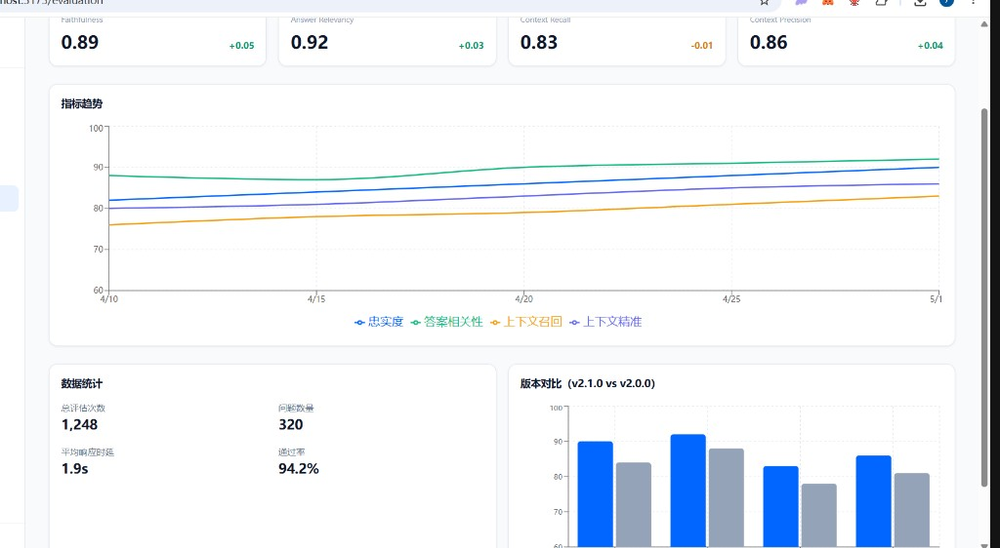
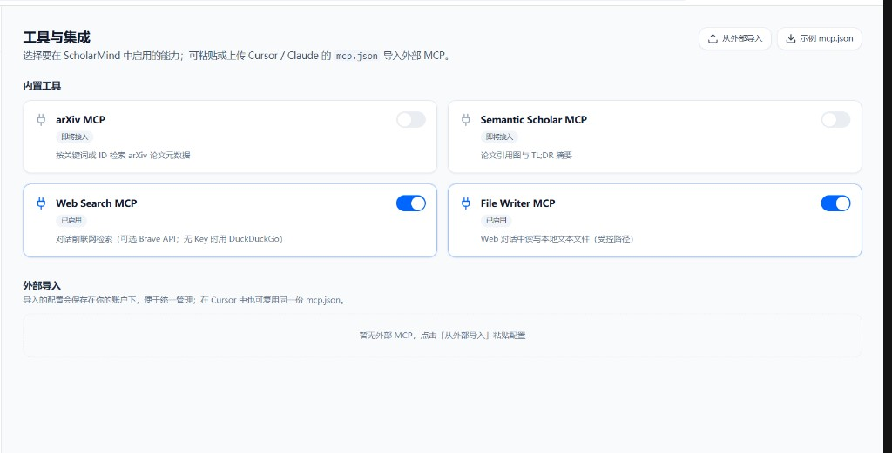

# KnowMind

**KnowMind** 是一款 **AI Native 私有知识库平台**：用户注册登录后，可创建多个知识库、上传 PDF 文档并完成自动解析与索引，在对话页基于所选知识库进行 **Hybrid RAG 检索增强问答**，并将对话提炼为结构化条目、生成报告。工程上采用 **React（Vite + Tailwind）+ FastAPI** 单仓架构。

---

## 界面预览

> 在 Cursor / VS Code 中请用 **Markdown 预览** 查看截图：`Ctrl+Shift+V`（Mac：`Cmd+Shift+V`），或右上角点击预览图标。

### 智能对话

基于所选知识库的 RAG 流式问答；支持会话历史、深度研究 / 联网搜索 / arXiv / Semantic Scholar、对话附件、文件读写开关，以及「提炼到知识库」「生成报告」等快捷操作。回答正文中的 **`[1]`、`[^2]` 引用编号可点击**，直达 PDF 页或知识条目。



### 知识库

创建与管理多个私有知识库，展示文档数量、存储与更新时间；支持创建、重命名与删除。



### 文档管理 · 文档视图

选择目标知识库上传 PDF（单文件 ≤ 50MB，单次最多 20 个），查看解析状态（pending → processing → done / failed），失败可重试；支持 Celery 异步解析或本机后台线程模式。



### 文档管理 · 条目视图

除 PDF 原文外，还可管理从对话提炼、URL 采集等来源的 **知识条目**（草稿 / 已发布 / 已归档），支持预览、编辑与删除。


### 报告

由对话一键生成结构化报告，展示摘要与引用数量；正文脚注可点击溯源，支持导出 **Markdown** 与 **PDF**。



### 评估看板

RAGAS / 简易指标（忠实度、答案相关性、上下文召回 / 精准）趋势与版本对比；可通过 API 触发 `knowmind-eval` 流水线写入报告。



### 工具与集成

内置 MCP 工具开关（联网搜索、arXiv、Semantic Scholar、本地文件读写等），并支持从 Cursor / Claude 等环境导入外部 `mcp.json` 配置。



---

## 功能概览

| 维度 | 说明 |
|------|------|
| **产品目标** | 问题 → 私有 RAG（可选 MCP 扩展）→ 可核对、结构化的回答与报告 |
| **典型用户** | 需要管理文档 / 笔记、希望对「自己的材料」提问并得到带依据回答的个人或团队 |
| **技术栈** | FastAPI、Celery / 后台线程、Chroma 向量 + Whoosh BM25、MCP、MySQL 多租户隔离 |

### 典型工作流


1. **入库**：PDF 上传后由 Worker 抽取文本、切块、Embedding，写入 Chroma + Whoosh。
2. **问答**：对话页选定知识库，后端检索相关片段注入 Prompt，SSE 流式返回；正文 `[N]` 与引用卡片序号一致，可点击跳转原文。
3. **沉淀**：对话结果可提炼为知识条目，或一键生成带脚注的研究报告。
4. **扩展**：在「工具与集成」中启用联网搜索、学术检索、文件读写或导入外部 MCP。

---

## 仓库结构

| 目录 | 说明 |
|------|------|
| [`knowmind-server/`](knowmind-server/) | **FastAPI** 后端：JWT 鉴权、知识库 / 文档 / 条目 / 报告 API、PDF 解析、Chroma + Whoosh 索引、SSE 流式对话、MCP 工具 |
| [`knowmind-web/`](knowmind-web/) | **React + Vite + Tailwind** 前端：登录、知识库、文档与条目、对话、报告、评估、工具、设置等页面 |
| [`knowmind-mcp/`](knowmind-mcp/) | 内置 MCP 服务（联网搜索、arXiv、Semantic Scholar、文件读写等） |
| [`knowmind-eval/`](knowmind-eval/) | RAG 评估流水线（RAGAS + 简易回退指标） |
| [`docs/`](docs/) | 工程文档 |
| [`assets/`](assets/) | README 界面截图 |

---

## 已实现功能

### 后端（`knowmind-server`）

| 模块 | 能力 |
|------|------|
| **鉴权** | 邮箱注册 / 登录；JWT 访问令牌 + Refresh 续期 |
| **知识库** | 创建、列表、重命名、删除（多租户按 `user_id` 隔离） |
| **文档** | 多格式上传、列表、预览、删除、失败重试；本地存储 |
| **解析流水线** | 文本抽取 → 切块 → Embedding（`bge` / `http` / `hash`）→ Chroma + Whoosh |
| **知识条目** | 对话提炼、URL 采集、草稿 / 发布 / 归档生命周期 |
| **对话** | `POST /api/v1/chat` 与 `/chat/stream`（SSE）；RAG 检索 + `rag_sources` 事件；深度研究多步预取；对话附件上传；多轮会话记忆 |
| **专家** | 领域专家人设 + 流式对话，支持学术检索开关 |
| **报告** | 由对话生成结构化报告；导出 Markdown / PDF |
| **评估** | 读 `knowmind-eval/reports`；`POST /evaluation/run` 触发流水线 |
| **MCP** | 内置联网搜索、学术检索、文件读写等工具配置与开关 |
| **任务执行** | Celery + Redis，或 `INGEST_BACKGROUND_THREAD=true` 本机后台模式 |

### 前端（`knowmind-web`）

| 路由 | 页面 |
|------|------|
| `/login` | 登录 / 注册 |
| `/chat` | 智能对话（会话列表、知识库切换、流式 Markdown、可点击 `[N]` 引用） |
| `/knowledge-bases` | 知识库管理 |
| `/documents` | 文档视图 + 条目视图 |
| `/documents/items/:kbId/:itemId` | 条目详情与编辑 |
| `/reports`、`/reports/:id` | 报告列表与详情（脚注可点击、PDF 导出） |
| `/evaluation` | RAG 评估看板 |
| `/experts` | 领域专家列表与对话 |
| `/tools` | MCP 工具与集成 |
| `/settings` | 账户、改密等设置 |

对话与报告正文使用 **[Streamdown](https://streamdown.ai/)** + Shiki 代码高亮与 CJK 排版；全站 API 请求经 `apiFetch` 封装，**401 时自动 Refresh 重试**。

---

## 生产部署（Docker，推荐）

终端里手动跑 `uvicorn`，SSH 断开或进程退出服务就停。推荐用仓库根目录的 **Docker Compose**（自动重启、健康检查、启动时迁移）：

```bash
cp .env.docker.example .env.docker   # 改密码、JWT、EDGEFN_API_KEY
docker compose --env-file .env.docker up -d --build
```

详见 [**Docker 部署说明**](docs/KnowMind_Docker部署.md)。

---

## 快速开始

### 环境要求

| 依赖 | 说明 |
|------|------|
| **MySQL 8.x** | 需提前创建数据库与用户 |
| **Redis** | 使用 Celery Worker 时需要，默认 `redis://127.0.0.1:6379/0`；可用 Docker 启动（见下方） |
| **EdgeFN（或兼容 OpenAI 的网关）** | 对话与（可选）云端 Embeddings |
| **Node.js + pnpm** | 前端开发 |
| **Python 3.11+ + uv** | 后端开发（推荐） |

### 1. 启动 Redis（可选，Celery 模式需要）

```bash
cd knowmind-server
docker compose -f docker-compose.redis.yml up -d
```

### 2. 启动后端

```bash
cd knowmind-server
cp env.example .env
# 编辑 .env：DATABASE_URL、JWT_SECRET、EDGEFN_API_KEY 等

uv sync
uv run alembic upgrade head
uv run uvicorn app.main:app --reload --host 127.0.0.1 --port 8000
```

- API 文档：<http://127.0.0.1:8000/docs>
- 健康检查：<http://127.0.0.1:8000/api/v1/health>

**解析任务两种模式（二选一）：**

| 模式 | 配置 | 说明 |
|------|------|------|
| 后台线程（开发推荐） | `.env` 设置 `INGEST_BACKGROUND_THREAD=true` | 无需 Celery，解析在 API 进程内异步执行 |
| Celery Worker | 保持默认，**另开终端** | 与 API 共用同一 `knowmind-server/.env` |

**Celery Worker 启动（生产或不用后台线程时）：**

```bash
cd knowmind-server
uv run python -m celery -A app.workers.celery_app.celery_app worker -l info
```

Windows PowerShell 同上；需已启动 Redis，且 `.env` 中 `INGEST_BACKGROUND_THREAD=false`。

### 3. 启动前端

```bash
cd knowmind-web
pnpm install   # 或 npm install
pnpm dev       # 默认 http://localhost:5173
```

开发环境通过 `vite.config.ts` 将 `/api` 代理到 `http://127.0.0.1:8000`。

### 4. 首次使用

1. 打开 <http://localhost:5173/login> 注册并登录
2. 在「知识库」创建库，进入「文档管理」上传 PDF
3. 等待解析完成后，在「智能对话」选择该库开始提问
4. 若回答中出现 `[1]` 等编号，点击可跳转至对应 PDF 页或条目

---

## 主要环境变量（后端）

完整说明见 [`knowmind-server/env.example`](knowmind-server/env.example)。

| 变量 | 作用 |
|------|------|
| `DATABASE_URL` | MySQL 异步连接（`mysql+asyncmy://...`） |
| `JWT_SECRET` | JWT 签发密钥 |
| `REFRESH_TOKEN_EXPIRE_DAYS` | Refresh 令牌有效期（天） |
| `STORAGE_LOCAL_ROOT` | 上传文件本地根路径 |
| `CHROMA_DATA_PATH` / `WHOOSH_INDEX_ROOT` | 向量与全文索引目录 |
| `EDGEFN_API_KEY` / `EDGEFN_API_BASE_URL` / `EDGEFN_CHAT_MODEL` | 对话模型网关 |
| `EMBEDDING_MODE` | `bge` \| `http` \| `hash` |
| `ARXIV_ENABLED` / `SEMANTIC_SCHOLAR_ENABLED` | 学术检索 MCP |
| `CHAT_ATTACHMENT_ROOT` | 对话附件临时目录 |
| `EVAL_REPORTS_DIR` | 评估报告 JSON 目录 |
| `INGEST_BACKGROUND_THREAD` | `true` 时在本进程内异步解析 |
| `REDIS_URL` / `CELERY_TASK_ALWAYS_EAGER` | Celery 任务队列 |

**切勿**将真实 `.env` 或密钥提交到版本库。

---

## 测试

```bash
# 后端
cd knowmind-server
uv sync --dev
uv run pytest tests/ -q

# 前端构建
cd knowmind-web
pnpm run build
```

---

## 相关文档

- [**设计技术方案**](docs/KnowMind_设计技术方案.md) · [**架构方案**](docs/KnowMind_架构方案.md)
- [knowmind-server README](knowmind-server/README.md)
