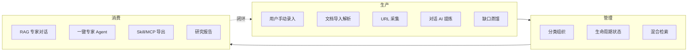
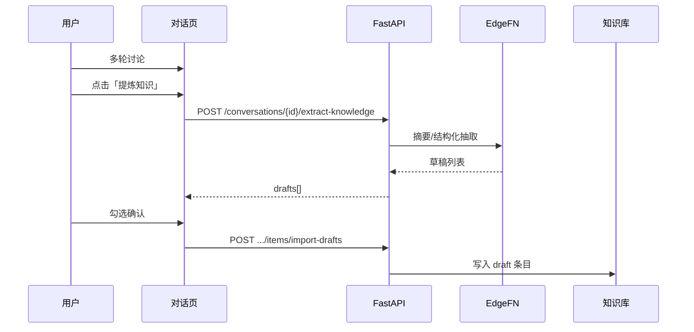
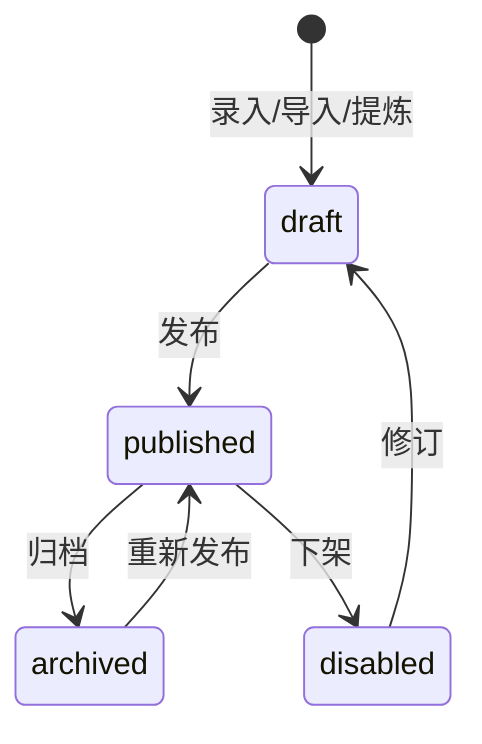
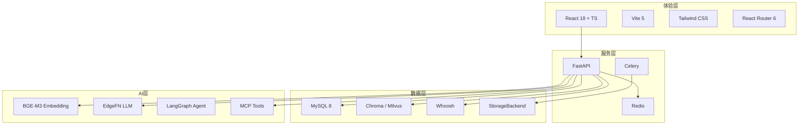

# AI 知识库管理平台 —— 产品需求规格说明书

> **产品代号**：KnowMind AI / KnowMind  
> **文档类型**：课题「AI 知识库管理平台」产品需求规格说明书（PRD）  
> **依据**：课题要求 2.2–2.5

| 属性 | 内容 |
|------|------|
| **文档编号** | KM-PRD-2026-003 |
| **文档版本** | v3.0（最高规格 · 课题对齐） |
| **文档状态** | 正式发布 |
| **编写日期** | 2026-05-24 |
| **适用仓库** | `KnowMind` 单仓 |
| **关联文档** | [KnowMind_PRD_v2.0.md](KnowMind_PRD_v2.0.md)、[KnowMind_课题最高规格执行流程_v1.md](KnowMind_课题最高规格执行流程_v1.md)、[KnowMind_开发流程与步骤_v1.md](KnowMind_开发流程与步骤_v1.md) |

### 修订记录

| 版本 | 日期 | 修订说明 |
|------|------|----------|
| v3.0 | 2026-05-24 | 首版最高规格 PRD：完整对齐课题 2.2–2.5；补全接口契约、页面路由、技术选型理由、数据模型、验收矩阵 |
| v3.1 | 2026-05-24 | 去除实现状态标注，统一以优先级（P0/P1/P2）组织需求；删除超出课题范围的 RBAC/后台扩展 |

### 文档约定

- **优先级定义**：
  - **P0（必须交付）**：课题 **2.4 基础要求** 全部条目，以及 **2.3 核心能力** 中知识生产/管理/消费的主干功能。
  - **P1（首版增强）**：课题 **2.5 加分项** 中实现成本较低、答辩演示价值高的能力，以及 **2.4.2** 方式二/方式三的扩展消费形式。
  - **P2（远期加分）**：课题 **2.5** 中实现成本较高、可作为迭代目标的能力。
- **读者**：产品、研发、测试、答辩评审；本文档为课题交付的**权威需求来源**。

---

## 目录

1. [课题背景与目标（2.2–2.3）](#第一章--课题背景与目标)
2. [需求追溯矩阵（2.4–2.5）](#第二章--需求追溯矩阵)
3. [功能需求详细设计](#第三章--功能需求详细设计)
4. [非功能需求](#第四章--非功能需求)
5. [系统架构设计](#第五章--系统架构设计)
6. [技术选型与选用理由](#第六章--技术选型与选用理由)
7. [数据设计](#第七章--数据设计)
8. [接口设计（API 契约）](#第八章--接口设计api-契约)
9. [前端页面与路由设计](#第九章--前端页面与路由设计)
10. [开发里程碑与排期](#第十章--开发里程碑与排期)
11. [部署、运维与验收](#第十一章--部署运维与验收)
12. [附录](#附录)

---

## 第一章  课题背景与目标

### 1.1  课题背景（2.2）

在企业日常运作中，大量业务知识分散在 **文档、对话、代码** 等载体中，难以高效复用。希望通过 AI 技术构建一个知识管理平台，让用户和 Agent 都能参与知识的生产与消费，实现知识的高效流转和智能服务。

在通用知识场景中，上述问题同样突出，具体表现为：

| 痛点类别 | 具体表现 | 业务影响 |
|----------|----------|----------|
| 知识分散 | PDF、Word、IM 聊天记录、Wiki 各自为政 | 查找成本高，重复劳动 |
| 难以复用 | 个人笔记无法结构化检索 | 团队知识无法沉淀 |
| 消费薄弱 | 关键词搜索无法理解语义 | 问不出、答不准 |
| Agent 断层 | 通用大模型缺乏私有上下文 | 幻觉多、不可信 |

**课题诉求**（2.2）：构建 AI 知识管理平台，让用户与 Agent 参与知识生产与消费，实现高效流转和智能服务。

本产品（KnowMind / KnowMind AI）以 **通用知识场景** 为首发垂直领域，技术架构与能力模型可直接迁移至企业知识管理场景。

### 1.2  课题目标（2.3）

构建一个 AI 知识库管理平台，满足以下核心能力：

- **知识的生产**：支持多种方式产生知识（用户手动录入、文档导入、AI 自动提炼等）
- **知识的管理**：支持知识的组织、分类、检索和基础管理
- **知识的消费**：基于知识库提供智能服务（专家 Agent 对话、Skill/插件、其他合理形式）



| 能力域 | 需求定义 | 优先级 |
|--------|----------|--------|
| **知识生产** | 手动录入、PDF 导入、对话 AI 提炼 | P0 |
| **知识生产（扩展）** | URL 采集、缺口蒸馏 | P1 |
| **知识管理** | 条目 CRUD、分类树、标签、可用/不可用状态、混合检索 | P0 |
| **知识消费** | RAG 专家对话 | P0 |
| **知识消费（扩展）** | Skill/MCP 导出、研究报告、一键专家 Agent | P1 |

### 1.3  产品定义

**KnowMind** 是一款 **AI Native 私有知识库平台**：用户注册登录后自助创建知识库，通过多种方式生产知识，经组织与状态管理后，以 **检索增强对话（RAG）**、**专家 Agent** 或 **对外 Skill** 形式消费知识，并支持从使用过程中自动提炼新知识，形成 **生产—管理—消费—再生产** 闭环。

### 1.4  产品价值链

```
知识生产 → 解析/切块/嵌入 → 向量 + 全文索引 → 组织/状态管理 → 混合检索
    ↑                                                              ↓
缺口蒸馏 ← 使用日志/反馈 ← 对话/RAG/专家 Agent ← 知识消费（问答/Skill）
```

### 1.5  优先级总览

| 模块 | 课题依据 | 优先级 | 说明 |
|------|----------|--------|------|
| 账户与鉴权 | 平台基础能力 | P0 | 邮箱注册登录、JWT、用户数据隔离 |
| 知识库 / 条目 / 文档 CRUD | 2.4.1 | P0 | 创建、编辑、删除 |
| 知识分类与标签 | 2.3 知识管理 | P0 | 分类树、标签筛选 |
| 知识检索（语义 + 关键词 + 标签） | 2.4.1 | P0 | 管理端混合检索 + 对话 RAG |
| 条目状态（可用 / 不可用） | 2.4.1 | P0 | `published` 可用；`disabled` 不可用 |
| PDF 文档导入 | 2.3 知识生产 | P0 | 上传、解析、切块、索引 |
| 手动知识录入 | 2.3 知识生产 | P0 | 条目表单创建与编辑 |
| 对话 AI 提炼入库 | 2.3 + 2.5.1 | P0 | 从使用中自动提炼，形成生产闭环（成本低、价值高） |
| RAG 专家对话 | 2.4.2 方式一 | P0 | 基于知识库内容的流式问答 |
| 管理路径清晰 / 消费端流畅 | 2.4.3 | P0 | 侧栏 IA、SSE 流式响应 |
| 一键专家 Agent | 2.5.4 | P1 | 按知识库生成专家并完成问答 |
| Skill / MCP 导出 | 2.4.2 方式二 | P1 | 供其他 Agent 平台调用 |
| 研究报告导出 | 2.4.2 方式三 | P1 | 会话生成结构化报告 |
| URL 采集、缺口蒸馏 | 2.3 / 2.5.1 扩展 | P1 | 扩展生产方式 |
| MCP 工具集成 | 2.4.2 方式二 | P1 | 联网搜索等外部能力 |
| 多模态知识（图片 / 表格） | 2.5.2 | P2 | OCR、表格理解 |
| 知识使用热度统计与可视化 | 2.5.3 | P2 | 检索/引用/对话打点 + 图表 |

---

## 第二章  需求追溯矩阵

### 2.1  基础要求（2.4）追溯

#### 2.4.1  知识管理

| 课题条目 | 产品需求 ID | 功能描述 | 验收标准 | 优先级 |
|----------|-------------|----------|----------|--------|
| 创建/编辑/删除 | KM-M-001 | 知识库、知识条目、文档 CRUD | 用户隔离；删库级联清索引 | P0 |
| 知识检索 | KM-M-002 | 管理端混合检索 + 标签/分类筛选 | 语义 + 关键词；仅 published 参与 | P0 |
| 条目状态 | KM-M-003 | `published` / `disabled` 等状态 | disabled 不参与 RAG | P0 |

#### 2.4.2  知识消费

| 课题条目 | 产品需求 ID | 功能描述 | 验收标准 | 优先级 |
|----------|-------------|----------|----------|--------|
| 方式一：专家 Agent 对话 | KM-C-001 | RAG 流式对话 | 选库问答，回答基于知识库内容 | P0 |
| 方式二：Skill/插件 | KM-C-002 | Skill.md / MCP 配置导出 | 可在 Cursor 等平台导入使用 | P1 |
| 方式三：其他 | KM-C-003 | 研究报告 Markdown 导出 | 会话→结构化报告 | P1 |

#### 2.4.3  基础体验

| 课题条目 | 产品需求 ID | 功能描述 | 验收标准 | 优先级 |
|----------|-------------|----------|----------|--------|
| 管理路径清晰 | KM-X-001 | 侧栏 IA：库→文档/条目→对话 | 5 步内完成建库上传问答 | P0 |
| 消费端流畅 | KM-X-002 | SSE 流式 + 首 Token ≤ 2s | 无明显卡顿；错误 Toast | P0 |

### 2.2  加分项（2.5）追溯

| 加分项 | 产品需求 ID | 方案 | 优先级 | 纳入 P0/P1 的理由 |
|--------|-------------|------|--------|-------------------|
| 自动提炼闭环 | KM-B-001 | 对话提炼 → 确认 → 入库 | **P0** | 直接对应 2.3「AI 自动提炼」；在已有对话链路上扩展，实现成本低 |
| 一键专家 Agent | KM-B-004 | 按知识库生成 system_prompt + 独立对话 | **P1** | 2.5.4 加分项；基于已有 RAG 封装，演示价值高 |
| 多模态知识 | KM-B-002 | 图片 OCR + 表格 Markdown | P2 | 需额外解析/OCR 能力，实现成本较高 |
| 热度统计可视化 | KM-B-003 | 使用事件打点 + Recharts 看板 | P2 | 需埋点、聚合与前端图表，可作为迭代目标 |
| LangGraph 深度编排 | KM-B-005 | Plan-and-Execute 执行面板 | P2 | 超出课题基础要求，可选增强 |

### 2.3  用户故事（User Stories）

| ID | 作为… | 我希望… | 以便… | 优先级 |
|----|-------|---------|-------|--------|
| US-01 | 用户 | 创建知识库并上传 PDF | 自动解析为可检索知识 | P0 |
| US-02 | 用户 | 手动录入/编辑知识条目 | 补充非 PDF 来源知识 | P0 |
| US-03 | 用户 | 对条目发布/下架 | 控制哪些知识可被消费 | P0 |
| US-04 | 用户 | 在对话页选择知识库提问 | 获得基于私有知识的回答 | P0 |
| US-05 | 用户 | 检索已发布知识条目 | 快速定位所需内容 | P0 |
| US-06 | 用户 | 从对话中提炼知识草稿 | 把讨论沉淀为库内知识 | P0 |
| US-07 | 用户 | 查看知识使用热度 | 优化高频/低频内容 | P2 |
| US-08 | 开发者 | 导出 Skill/MCP 配置 | 在其他 Agent 平台调用本库 | P1 |
| US-09 | 用户 | 一键创建领域专家 Agent | 固定人设的专业问答 | P1 |

---

## 第三章  功能需求详细设计

### 3.1  账户与认证模块（M1）

**优先级**：P0

#### 3.1.1  功能清单

| 功能 ID | 功能名称 | 描述 | 优先级 |
|---------|----------|------|--------|
| M1-001 | 用户注册 | 邮箱 + 密码，返回 JWT | P0 |
| M1-002 | 用户登录 | 校验凭证，返回 JWT | P0 |
| M1-003 | 当前用户 | `GET /auth/me` | P0 |
| M1-004 | 退出登录 | 前端清除 Token | P0 |
| M1-005 | Google OAuth | 第三方登录 | P2 |

#### 3.1.2  业务规则

- 邮箱唯一；密码 8–128 字符；bcrypt 哈希存储。
- JWT 默认有效期 7 天；请求头 `Authorization: Bearer <token>`。
- 未登录访问受保护 API 返回 401；跨用户资源返回 403/404。

---

### 3.2  知识库管理模块（M1-KB）

**优先级**：P0

| 功能 ID | 功能名称 | API | 优先级 |
|---------|----------|-----|--------|
| KB-001 | 创建知识库 | `POST /knowledge-bases` | P0 |
| KB-002 | 列表 | `GET /knowledge-bases` | P0 |
| KB-003 | 重命名 | `PATCH /knowledge-bases/{kb_id}` | P0 |
| KB-004 | 删除 | `DELETE /knowledge-bases/{kb_id}` | P0 |
| KB-005 | 详情统计 | `GET /knowledge-bases/{kb_id}` | P1 |
| KB-006 | 混合检索 | `GET /knowledge-bases/{kb_id}/search` | P0 |

**业务规则**：

- 每用户最多 `max_knowledge_bases_per_user` 个库（默认 10）。
- 库名 1–50 字符；删除时级联清理文档、条目、Chroma/Whoosh 索引、本地文件。

---

### 3.3  知识生产模块（M2-PROD）

**优先级**：P0（主干）/ P1（扩展）

#### 3.3.1  生产方式矩阵

| 方式 | 来源类型 `source_type` | 入口 | 默认状态 | 优先级 |
|------|------------------------|------|----------|--------|
| PDF 文档导入 | `document` | `/documents` 上传 | 解析后生成条目 | P0 |
| 手动录入 | `manual` | 条目创建表单 | `draft` | P0 |
| 对话 AI 提炼 | `distill` | extract-knowledge | `draft` | P0 |
| URL 采集 | `url` | preview-url → import-url | `draft` | P1 |
| 缺口蒸馏 | `distill` | distill/analyze → generate | `draft` | P1 |
| 图片 OCR | `image` | 上传图片 | `draft` | P2 |

#### 3.3.2  PDF 文档入库流水线

```
pending → processing → done / failed
```

| 步骤 | 技术 | 说明 |
|------|------|------|
| 校验 | FastAPI | 格式、50MB、MD5 去重 |
| 存储 | StorageBackend | `users/{uid}/kb/{kb_id}/docs/{doc_id}/` |
| 调度 | Celery / 后台线程 | 异步解析 |
| 抽取 | PyMuPDF | 按页文本 + 页码 metadata |
| 切块 | chunking | 论文感知切块 |
| 嵌入 | BGE-M3 / http / hash | 向量生成 |
| 索引 | Chroma + Whoosh | 双路写入 |
| 回写 | MySQL | status、chunk_count、title |

#### 3.3.3  对话提炼闭环（KM-B-001 · P0）

> 对应课题 2.3「AI 自动提炼」与 2.5.1「形成生产闭环」，纳入 **P0 必须交付**。



---

### 3.4  知识条目与分类模块（M2-ITEM）

**优先级**：P0

#### 3.4.1  功能清单

| 功能 ID | 功能 | API | 优先级 |
|---------|------|-----|--------|
| ITEM-001 | 分类树 CRUD | `/categories` | P0 |
| ITEM-002 | 条目 CRUD | `/items` | P0 |
| ITEM-003 | 发布 | `POST .../publish` | P0 |
| ITEM-004 | 归档 / 下架 | `POST .../archive` | P0 |
| ITEM-005 | URL 预览/导入 | `preview-url` / `import-url` | P1 |
| ITEM-006 | 批量导入草稿 | `import-drafts` | P0 |
| ITEM-007 | 富文本编辑器 | Lexical | P2 |

#### 3.4.2  生命周期状态机（课题 2.4.1「可用/不可用」）

| 编码 | 含义 | 参与检索/RAG |
| ------ | ------ | :------------: |
| `draft` | 编辑中，未对外提供 | 否 |
| `published` | 正式对外可用 | 是 |
| `archived` | 历史保留，只读 | 否 |
| `disabled` | 紧急禁用 | 否 |


**规则**：仅 `lifecycle_status = published` 的条目参与混合检索与 RAG 上下文注入；`disabled` 对应课题要求的「不可用」状态。

---

### 3.5  知识检索模块（M3-SEARCH）

**优先级**：P0

#### 3.5.1  检索能力

| 能力 | 方案 | 场景 | 优先级 |
|------|------|------|--------|
| 语义检索 | Chroma + BGE-M3 向量 Top-K | 对话 RAG、管理端搜索 | P0 |
| 关键词检索 | Whoosh BM25 | 精确词匹配 | P0 |
| 融合排序 | RRF（Reciprocal Rank Fusion） | 混合检索 | P0 |
| 标签/分类筛选 | MySQL + metadata filter | 管理端列表/搜索 | P0 |
| 精排 | BGE-Reranker | 提升 Top 片段质量 | P1 |

#### 3.5.2  检索服务内部流程（`search_service.py`）

1. `embed_query(q)` → 向量 Top-K（filter: `kb_id` + `published`）
2. `whoosh_search(kb_id, q)` → BM25 Top-K
3. `rrf_merge()` → 统一排序
4. 写入 `knowledge_usage_events`（`search_hit`）
5. 返回 `{ item_id, title, snippet, score, page }[]`

---

### 3.6  知识消费模块（M3-CHAT / M5-AGENT）

**优先级**：P0（方式一）/ P1（方式二、三、加分项）

#### 3.6.1  方式一：RAG 专家对话（KM-C-001 · P0）

| 功能 ID | 描述 | 优先级 |
|---------|------|--------|
| RAG-001 | 向量检索 Top-K 注入 Prompt | P0 |
| RAG-005 | SSE 流式对话 | P0 |
| RAG-006 | 思维链分区展示 | P0 |
| RAG-008 | 同步对话 API | P0 |
| RAG-007 | 引用标注与溯源跳转 | P1 |

**SSE 事件协议**：

| 事件 | 字段 | 说明 |
|------|------|------|
| `trace_id` | string | 追踪 ID |
| `thinking_delta` | string | 推理链增量 |
| `delta` | string | 正文增量 |
| `done` | object | 结束标记 |

#### 3.6.2  方式二：Skill / MCP 导出（KM-C-002 · P1）

| 功能 | 说明 | 优先级 |
|------|------|--------|
| MCP 工具页 | 内置 arXiv、Semantic Scholar、联网搜索、文件读写 | P1 |
| MCP JSON 导入 | 用户自定义工具 | P1 |
| Skill.md 导出 | 含 `search_kb` 工具说明与 kb_id | P1 |
| MCP manifest 导出 | 标准 MCP server 配置片段 | P1 |

#### 3.6.3  方式三：研究报告（KM-C-003 · P1）

| 功能 | API / 路由 | 优先级 |
|------|------------|--------|
| 从会话生成 | `POST /conversations/{id}/generate-report` | P1 |
| 列表/详情 | `/reports`、`/reports/:id` | P1 |
| 导出 Markdown | `GET /reports/{id}/export` | P1 |

#### 3.6.4  一键专家 Agent（KM-B-004 · P1）

| 功能 | API | 优先级 |
|------|-----|--------|
| 创建专家 | `POST /experts` | P1 |
| 生成 system_prompt | 基于库内 published 条目摘要 | P1 |
| 专家对话流 | `POST /experts/{id}/chat/stream` | P1 |

---

### 3.7  会话与对话记忆（M6-MEM）

**优先级**：P0

| 层级 | 存储 | 作用 |
|------|------|------|
| 事实源 | MySQL conversations / chat_messages | 持久化 |
| 热缓存 | Redis | 近期消息 |
| 语义层 | Chroma chat_memory | 历史轮次向量召回 |

详见 [KnowMind_对话记忆与上下文技术方案_v1.md](KnowMind_对话记忆与上下文技术方案_v1.md)。

---

### 3.8  知识缺口蒸馏（M2-DISTILL）

**优先级**：P1

| API | 说明 | 优先级 |
|-----|------|--------|
| `GET .../distill/gaps` | 缺口列表 | P1 |
| `POST .../distill/analyze` | 分析检索日志生成缺口 | P1 |
| `POST .../distill/gaps/{id}/generate` | 为缺口生成草稿条目 | P1 |

---

### 3.9  热度统计（KM-B-003）

**优先级**：P2

| 事件类型 | 触发点 |
|----------|--------|
| `search_hit` | 管理端混合检索命中 |
| `rag_cite` | RAG 引用某条目/文档 |
| `chat_turn` | 对话轮次 |

**可视化**：`/knowledge-bases/:kbId/analytics` 或扩展 `/evaluation` 页；Recharts 折线/柱状图。

---

## 第四章  非功能需求

### 4.1  性能需求

| 指标 | 目标值 | 测量条件 |
|------|--------|----------|
| 页面首屏 | ≤ 2s | 4G 冷启动 |
| RAG 检索 P95 | ≤ 800ms | 不含 LLM 生成 |
| 对话首 Token | ≤ 2s | 网关正常 |
| PDF 解析（10MB） | ≤ 60s | http 嵌入模式 |
| 并发用户（MVP） | ≥ 50 | 单实例 |

### 4.2  安全需求

| 类别 | 要求 |
|------|------|
| 传输 | 生产 HTTPS |
| 认证 | JWT HS256；`JWT_SECRET` 生产必改 |
| 授权 | 所有业务 API 校验 `user_id` 与资源归属 |
| 密码 | bcrypt；禁止日志明文 |
| 文件 | 上传防路径穿越；文件工具白名单根目录 |
| XSS | Markdown 渲染消毒 |

### 4.3  可用性与可扩展性

- 向量服务不可用时降级为纯 LLM（提示用户）。
- 解析失败保留 `error_message`，支持重试。
- 存储/向量/嵌入/LLM 均可通过抽象层切换实现。

### 4.4  可维护性

- 后端：`uv` + `pytest` + Alembic
- 前端：`pnpm` + TypeScript strict
- API 自描述：OpenAPI `/docs`

---

## 第五章  系统架构设计

### 5.1  逻辑架构

```
┌──────────────────────────────────────────────────────────────────┐
│                 knowmind-web (React 18 + Vite SPA)             │
│  Login │ Chat │ KB │ Documents │ Search │ Experts │ Tools │ ...  │
└────────────────────────────┬─────────────────────────────────────┘
                             │ HTTPS / SSE
┌────────────────────────────▼─────────────────────────────────────┐
│              knowmind-server (FastAPI + Pydantic v2)           │
│  Auth │ KB │ Items │ Documents │ Chat │ Search │ Experts │ MCP   │
│  Distill │ Reports │ Analytics                                    │
└──┬─────────┬──────────┬────────────┬──────────────┬───────────────┘
   │         │          │            │              │
   ▼         ▼          ▼            ▼              ▼
 MySQL    Redis      Chroma       Whoosh      Celery Worker
                     (vectors)    (BM25)      (PDF ingest)
   │                                              │
   └────────────────── StorageBackend ────────────┘
                             │
                             ▼
              EdgeFN / OpenAI-compatible LLM & Embeddings
                             │
         ┌───────────────────┴───────────────────┐
         ▼                                       ▼
 knowmind-mcp (工具)              knowmind-agent (LangGraph)
 knowmind-eval (RAGAS)
```

### 5.2  代码仓映射

| PRD 模块 | 目录 | 职责 |
|----------|------|------|
| M1 用户与知识库 | `knowmind-server/app/api/v1/endpoints/auth.py`、`knowledge_bases.py` | 鉴权与 KB |
| M2 解析与索引 | `app/ingest/`、`app/workers/` | PDF 流水线 |
| M2-ITEM 条目 | `knowledge_items.py`、`knowledge_categories.py` | 条目与分类 |
| M3 RAG | `app/services/rag_context.py`、`chat_service.py` | 检索与对话 |
| M3 检索 | `app/services/search_service.py` | 混合检索 |
| M4 MCP | `knowmind-mcp/*`、`mcp_registry.py` | 工具协议 |
| M5 Agent | `knowmind-agent/agent/graph.py` | LangGraph |
| M6 前端 | `knowmind-web/src/pages/*` | 页面 |
| M7 评估 | `knowmind-eval/pipelines/` | RAGAS |

### 5.3  部署拓扑（开发 / 生产）

| 组件 | 开发 | 生产建议 |
|------|------|----------|
| Web | Vite dev :5173 | Nginx 静态 + SPA fallback |
| API | uvicorn :8000 | Gunicorn + uvicorn workers |
| MySQL | 本地 Docker | 云 RDS |
| Redis | 本地 | 云 Redis |
| Chroma | 本地持久化目录 | Milvus 或 Chroma Server |
| Celery | 可选线程模式 | 独立 Worker 进程 |

---

## 第六章  技术选型与选用理由

> **原则**：优先选用与现有代码仓一致、团队可维护、课题演示可离线/低运维的技术；每一选型均说明 **为什么不用常见替代方案**。

### 6.1  前端技术栈

| 领域 | 选型 | 版本 | 选用理由 | 替代方案及不选原因 |
|------|------|------|----------|---------------------|
| 框架 | **React** | 18 | 组件化适合复杂对话 UI；仓库已全面使用 | Vue：需重写现有页面 |
| 语言 | **TypeScript** | 5.x | 接口类型与后端 Pydantic 对齐，减少联调错误 | JS：大型 SPA 难维护 |
| 构建 | **Vite** | 5 | 冷启动与 HMR 快，适合前后端并行开发 | CRA：已废弃且慢 |
| 样式 | **Tailwind CSS** | 3 | 原子类快速迭代；现有页面设计令牌一致 | Ant Design 全家桶：定制成本高 |
| 路由 | **React Router** | 6 | 声明式路由与 `App.tsx` 一致；支持嵌套 Layout | Next.js：课题为 SPA 管理台，无需 SSR |
| 流式 Markdown | **Streamdown** + `@streamdown/cjk` + **Shiki** | — | 专为 LLM SSE 流式设计；CJK 排版与代码高亮 | react-markdown  alone：流式闪烁与 CJK 弱 |
| 图表 | **Recharts** | — | 评估/热度看板 React 原生 | ECharts：集成稍重 |
| 图标 | **lucide-react** | — | 轻量、与 Tailwind 风格统一 | — |
| HTTP | **fetch** + 自封装 `api.ts` | — | 无额外依赖；统一 JWT 与错误处理 | axios：功能冗余 |
| 包管理 | **pnpm** | — | 磁盘效率高、锁文件稳定 | npm：monorepo 体验弱 |

### 6.2  后端技术栈

| 领域 | 选型 | 版本 | 选用理由 | 替代方案及不选原因 |
|------|------|------|----------|---------------------|
| Web 框架 | **FastAPI** | 0.1xx | 异步原生、自动 OpenAPI、类型友好 | Django：异步与 SSE 较重；Flask：无原生 async |
| 校验 | **Pydantic v2** | 2.x | 与 FastAPI 一体；Schema 即文档 | — |
| ORM | **SQLAlchemy 2.0** | async | 成熟 ORM + Alembic 迁移 | Tortoise：生态小 |
| 数据库 | **MySQL** | 8.x | 事务、JSON 字段、团队熟悉 | PostgreSQL：课题环境已统一 MySQL |
| 驱动 | **asyncmy** | — | 真异步，不阻塞事件循环 | pymysql 同步：性能差 |
| 迁移 | **Alembic** | — | 版本化 schema | 手工 SQL：不可追溯 |
| 缓存/队列 | **Redis** | 6+ | 对话热缓存 + Celery Broker 一体 | RabbitMQ：多组件运维 |
| 任务 | **Celery** | — | 生产级 PDF 解析队列 | 仅线程：无法水平扩展 |
| 密码 | **bcrypt** | — | 行业标准慢哈希 | 明文/MD5：不安全 |
| JWT | **python-jose** / PyJWT | — | 无状态鉴权，适合 SPA | Session：跨域与扩展复杂 |

### 6.3  AI 与检索技术栈

| 领域 | 选型 | 选用理由 | 替代方案及不选原因 |
|------|------|----------|---------------------|
| 向量库（默认） | **Chroma** 持久化 | 零运维本地开发；`vector_factory` 可切换 | Pinecone：需联网与费用 |
| 向量库（生产可选） | **Milvus** | 横向扩展、过滤表达式强 | 仅 Chroma：大规模性能瓶颈 |
| 全文检索 | **Whoosh** | 纯 Python、按 kb 分目录；免 ES 集群 | Elasticsearch：运维重，课题 overkill |
| 嵌入模型 | **BGE-M3** | 中英文语义质量高；支持本地推理 | OpenAI embedding：成本与隐私 |
| 嵌入降级 | `http` / `hash` 模式 | 无 GPU 环境可联调 | — |
| LLM 网关 | **EdgeFN**（OpenAI 兼容） | 统一 Chat + Embeddings API | 直连多厂商：适配成本高 |
| PDF 解析 | **PyMuPDF** | 按页抽取快、保留页码 | pdfplumber：速度略逊 |
| Rerank | **BGE-Reranker** | 与 BGE 生态一致 | Cohere Rerank：额外 API |
| Agent 编排 | **LangGraph** | 有状态图、Plan-and-Execute（P2） | 自研状态机：难维护 |
| 工具协议 | **MCP** | 与 Cursor 等 Agent IDE 互通 | 私有插件格式：生态封闭 |
| 评估 | **RAGAS** | RAG 四维指标业界标准 | 纯人工：不可规模化 |

### 6.4  工程与交付

| 领域 | 选型 | 选用理由 |
|------|------|----------|
| Python 包管理 | **uv** | 快、锁文件、CI 可复现 |
| 测试 | **pytest** | 后端单测与 API 测试 |
| 前端类型检查 | `tsc -b` | 构建前静态检查 |
| 文档 | Markdown + `md_to_prd_docx.py` | 版本管理友好，可导出 Word 答辩 |

### 6.5  技术选型总结图



---

## 第七章  数据设计

### 7.1  ER 关系概览

```
users 1───N knowledge_bases 1───N documents
              │              1───N knowledge_categories (树形 parent_id)
              │              1───N knowledge_items
              │              1───N knowledge_gaps
              │              1───N research_reports
              │              1───N rag_retrieval_logs
              │              1───N expert_profiles
              │              1───N knowledge_usage_events
  │
  ├───N conversations 1───N chat_messages
  │                 └───N conversation_summaries
  └───N user_feedback
```

**向量索引**：Chroma collections `doc_chunks_bge_m3`、`chat_memory_bge_m3`；Whoosh 按 `kb_id` 分目录。

**实现文件**：`knowmind-server/app/models/orm.py`；迁移 `alembic/versions/*.py`。

### 7.2  核心表结构

#### users

| 列名 | 类型 | 约束 | 说明 |
|------|------|------|------|
| id | CHAR(36) | PK | UUID |
| email | VARCHAR(255) | UNIQUE, NOT NULL | 登录邮箱 |
| password_hash | VARCHAR(255) | NOT NULL | bcrypt |
| is_active | BOOLEAN | DEFAULT true | 账户启用 |
| created_at | TIMESTAMP | NOT NULL | 注册时间 |

#### knowledge_bases

| 列名 | 类型 | 约束 | 说明 |
|------|------|------|------|
| id | CHAR(36) | PK | |
| user_id | CHAR(36) | FK → users, INDEX | 所有者 |
| name | VARCHAR(50) | NOT NULL | 库名 |
| doc_count | INT | DEFAULT 0 | 文档计数 |
| created_at / updated_at | TIMESTAMP | | |

#### documents

| 列名 | 类型 | 约束 | 说明 |
|------|------|------|------|
| id | CHAR(36) | PK | |
| kb_id | CHAR(36) | FK | |
| user_id | CHAR(36) | FK | 冗余隔离 |
| filename | VARCHAR(512) | NOT NULL | 原始文件名 |
| storage_key | VARCHAR(1024) | NOT NULL | 存储路径 |
| status | VARCHAR(20) | NOT NULL | pending/processing/done/failed |
| chunk_count | INT | DEFAULT 0 | |
| file_bytes | BIGINT | | |
| md5 | CHAR(32) | INDEX | 去重 |
| title | VARCHAR(512) | NULL | |
| error_message | TEXT | NULL | |

#### knowledge_items

| 列名 | 类型 | 说明 |
|------|------|------|
| id | CHAR(36) | PK |
| kb_id / user_id | CHAR(36) | 归属 |
| document_id | CHAR(36)? | 关联文档 |
| category_id | CHAR(36)? | 分类 |
| source_type | VARCHAR(32) | manual / url / distill / document |
| title | VARCHAR(200) | 标题 |
| content | TEXT | 正文 Markdown |
| summary | VARCHAR(500)? | 摘要 |
| tags | JSON? | 标签数组 |
| lifecycle_status | VARCHAR(32) | draft / published / archived / disabled |
| access_level | VARCHAR(32) | public / internal / restricted |
| source | VARCHAR(512)? | 来源 URL |
| chunk_id | CHAR(36)? | 索引块 ID |
| page | INT? | 页码 |
| published_at | TIMESTAMP? | |

#### conversations / chat_messages

与现有 ORM 一致；会话含 `knowledge_base_id`、`deep_research`、`web_search`、`title`。

#### expert_profiles（P1 · 一键专家 Agent）

| 列名 | 类型 | 说明 |
|------|------|------|
| id | CHAR(36) | PK |
| user_id / kb_id | FK | 所有者与绑定知识库 |
| name | VARCHAR(100) | 专家名称 |
| system_prompt | TEXT | 人设与指令 |
| created_at | datetime | 创建时间 |

#### knowledge_usage_events（P2 · 热度统计）

| 列名 | 类型 | 说明 |
|------|------|------|
| id | BIGINT | PK |
| user_id / kb_id | FK | |
| item_id / document_id | FK nullable | |
| event_type | VARCHAR(32) | search_hit / rag_cite / chat_turn |
| conversation_id | FK nullable | |
| created_at | TIMESTAMP | |

### 7.3  向量 Metadata（Chroma）

| 键 | 说明 |
|----|------|
| user_id | 租户隔离 |
| kb_id | 知识库过滤 |
| item_id | 条目 ID |
| doc_id | 文档 ID |
| lifecycle_status | 仅 published 参与 query |
| filename | 展示 |
| page_index | 页码（0-based） |
| chunk_index | 块序号 |

---

## 第八章  接口设计（API 契约）

**Base URL**：`/api/v1`  
**认证**：`Authorization: Bearer <token>`（注册/登录/health 除外）  
**Content-Type**：`application/json`（上传为 `multipart/form-data`）  
**错误格式**：

```json
{
  "detail": {
    "code": "ERROR_CODE",
    "message": "人类可读说明"
  }
}
```

或 FastAPI 标准 `{"detail": "..."}` 字符串。

---

### 8.1  健康检查

#### GET `/health`

| 项 | 值 |
|----|-----|
| 认证 | 否 |
| 响应 200 | `{ "status": "ok" }` |

---

### 8.2  认证 `/auth`

#### POST `/auth/register`

**请求体**：

```json
{
  "email": "user@example.com",
  "password": "securepass123"
}
```

**响应 200**：

```json
{
  "user": {
    "id": "550e8400-e29b-41d4-a716-446655440000",
    "email": "user@example.com",
    "created_at": "2026-05-24T08:00:00Z"
  },
  "access_token": "eyJhbGciOiJIUzI1NiIs...",
  "token_type": "bearer",
  "expires_in": 604800
}
```

**错误**：409 `EMAIL_TAKEN`

#### POST `/auth/login`

请求体同注册（password 无最小长度校验）。响应结构同注册。

**错误**：401 `INVALID_CREDENTIALS`

#### GET `/auth/me`

**优先级**：P0

**响应 200**：

```json
{
  "id": "550e8400-e29b-41d4-a716-446655440000",
  "email": "user@example.com",
  "created_at": "2026-05-24T08:00:00Z"
}
```

---

### 8.3  知识库 `/knowledge-bases`

#### GET `/knowledge-bases`

**响应 200**：`KnowledgeBaseOut[]`

```json
[
  {
    "id": "3ddab6ff-e480-4fe3-a96a-428259c01eca",
    "name": "深度学习论文库",
    "doc_count": 12,
    "created_at": "2026-05-20T10:00:00Z",
    "updated_at": "2026-05-24T09:00:00Z"
  }
]
```

#### POST `/knowledge-bases`

**请求体**：`{ "name": "库名" }`（1–50 字符）  
**响应 201**：`KnowledgeBaseOut`

#### PATCH `/knowledge-bases/{kb_id}`

**请求体**：`{ "name": "新名称" }`  
**响应 200**：`KnowledgeBaseOut`

#### DELETE `/knowledge-bases/{kb_id}`

**响应 204** 无 body

#### GET `/knowledge-bases/{kb_id}`

**优先级**：P1

**响应 200**：

```json
{
  "id": "...",
  "name": "...",
  "doc_count": 12,
  "item_count": 45,
  "published_count": 38,
  "updated_at": "..."
}
```

#### GET `/knowledge-bases/{kb_id}/search`

**优先级**：P0 · 混合检索

**Query 参数**：

| 参数 | 类型 | 说明 |
|------|------|------|
| q | string | 查询词，必填 |
| limit | int | 默认 20，最大 50 |
| category_id | string? | 分类筛选 |
| tags | string? | 逗号分隔标签 |

**响应 200**：

```json
{
  "query": "Transformer 注意力机制",
  "total": 8,
  "items": [
    {
      "item_id": "...",
      "title": "...",
      "snippet": "...",
      "score": 0.87,
      "source_type": "document",
      "page": 3,
      "tags": ["NLP"]
    }
  ]
}
```

---

### 8.4  文档 `/knowledge-bases/{kb_id}/documents`

#### GET `/knowledge-bases/{kb_id}/documents`

**响应 200**：`DocumentOut[]`

```json
[
  {
    "id": "...",
    "filename": "attention.pdf",
    "status": "done",
    "chunk_count": 42,
    "file_bytes": 1048576,
    "title": "Attention Is All You Need",
    "error_message": null,
    "created_at": "..."
  }
]
```

#### POST `/knowledge-bases/{kb_id}/documents`

**Content-Type**：`multipart/form-data`  
**字段**：`files`（多个 PDF，单次最多 20，单文件 ≤ 50MB）

**响应 200**：

```json
{
  "documents": [{ "id": "...", "status": "pending", "filename": "..." }],
  "skipped_duplicates": 1
}
```

#### GET `/knowledge-bases/{kb_id}/documents/{doc_id}`

**响应 200**：`DocumentOut`

#### GET `/knowledge-bases/{kb_id}/documents/{doc_id}/file`

**响应**：`application/pdf` 文件流（预览/下载）

#### POST `/knowledge-bases/{kb_id}/documents/{doc_id}/retry-parse`

**响应 200**：`DocumentOut`（status 重置为 pending/processing）

#### DELETE `/knowledge-bases/{kb_id}/documents/{doc_id}`

**响应 204**

---

### 8.5  知识分类 `/knowledge-bases/{kb_id}/categories`

#### GET `/knowledge-bases/{kb_id}/categories`

**响应 200**：`KnowledgeCategoryTreeNode[]`（嵌套 children）

```json
[
  {
    "id": "...",
    "name": "方法论",
    "sort_order": 0,
    "children": [
      { "id": "...", "name": "深度学习", "sort_order": 0, "children": [] }
    ]
  }
]
```

#### POST `/knowledge-bases/{kb_id}/categories`

**请求体**：

```json
{
  "name": "分类名",
  "parent_id": null,
  "sort_order": 0
}
```

**响应 201**：`KnowledgeCategoryOut`

#### PATCH `/knowledge-bases/{kb_id}/categories/{category_id}`

**请求体**：`{ "name"?, "sort_order"? }`  
**响应 200**：`KnowledgeCategoryOut`

#### DELETE `/knowledge-bases/{kb_id}/categories/{category_id}`

**响应 204**（无子节点且无绑定条目）

---

### 8.6  知识条目 `/knowledge-bases/{kb_id}/items`

#### GET `/knowledge-bases/{kb_id}/items`

**Query 参数**：

| 参数 | 说明 |
|------|------|
| lifecycle_status | draft / published / archived |
| category_id | 分类 ID |
| source_type | manual / url / distill / document |

**响应 200**：`KnowledgeItemOut[]`

#### POST `/knowledge-bases/{kb_id}/items`

**请求体**：

```json
{
  "title": "条目标题",
  "content": "Markdown 正文",
  "category_id": "category-uuid",
  "summary": "可选摘要",
  "tags": ["标签1", "标签2"],
  "access_level": "internal",
  "source": "https://example.com",
  "publish": false
}
```

**响应 201**：`KnowledgeItemOut`

#### GET `/knowledge-bases/{kb_id}/items/{item_id}`

**响应 200**：`KnowledgeItemOut`

#### PATCH `/knowledge-bases/{kb_id}/items/{item_id}`

**请求体**：`KnowledgeItemUpdate`（字段均可选）  
**响应 200**：`KnowledgeItemOut`

#### DELETE `/knowledge-bases/{kb_id}/items/{item_id}`

**响应 204**（同步删除向量/Whoosh 索引）

#### POST `/knowledge-bases/{kb_id}/items/{item_id}/publish`

**响应 200**：`KnowledgeItemOut`（`lifecycle_status=published`，触发 embed）

#### POST `/knowledge-bases/{kb_id}/items/{item_id}/archive`

**响应 200**：`KnowledgeItemOut`

#### POST `/knowledge-bases/{kb_id}/items/preview-url`

**请求体**：`{ "url": "https://..." }`  
**响应 200**：

```json
{
  "url": "https://...",
  "page_title": "原始标题",
  "title": "建议标题",
  "summary": "摘要",
  "content": "正文 Markdown"
}
```

#### POST `/knowledge-bases/{kb_id}/items/import-url`

**请求体**：`UrlImportRequest`（含 category_id、可选预填 title/content）  
**响应 201**：`KnowledgeItemOut`

#### POST `/knowledge-bases/{kb_id}/items/import-drafts`

**请求体**：

```json
{
  "drafts": [
    { "title": "提炼标题", "content": "提炼正文", "tags": [] }
  ],
  "publish": false
}
```

**响应 200**：

```json
{
  "items": [{ "id": "...", "title": "...", "lifecycle_status": "draft" }]
}
```

---

### 8.7  知识缺口蒸馏 `/knowledge-bases/{kb_id}/distill`

#### GET `/knowledge-bases/{kb_id}/distill/gaps`

**响应 200**：`KnowledgeGapOut[]`

#### POST `/knowledge-bases/{kb_id}/distill/analyze`

**响应 200**：新生成的缺口列表

#### POST `/knowledge-bases/{kb_id}/distill/gaps/{gap_id}/generate`

**响应 200**：

```json
{
  "draft_item_ids": ["item-uuid-1", "item-uuid-2"]
}
```

---

### 8.8  对话 `/chat`

#### POST `/chat/stream`

**请求体**：

```json
{
  "message": "这篇论文的核心贡献是什么？",
  "knowledge_base_id": "3ddab6ff-e480-4fe3-a96a-428259c01eca",
  "conversation_id": "optional-conv-uuid",
  "deep_research": false,
  "web_search": false,
  "file_tools": false
}
```

| 字段 | 类型 | 必填 | 约束 |
|------|------|:----:|------|
| message | string | 是 | 1–8000 字符 |
| knowledge_base_id | string | 否 | 空则不注入 RAG |
| conversation_id | string | 否 | 空则新建会话 |
| deep_research | bool | 否 | 默认 false |
| web_search | bool | 否 | 默认 false |
| file_tools | bool | 否 | 默认 false |

**响应**：`text/event-stream`

```
event: trace_id
data: {"trace_id":"..."}

event: thinking_delta
data: {"delta":"让我检索相关文档..."}

event: delta
data: {"delta":"该论文提出了..."}

event: done
data: {"trace_id":"..."}
```

#### POST `/chat`

**请求体**：同 `/chat/stream`  
**响应 200**：

```json
{
  "reply": "完整回答文本",
  "trace_id": "..."
}
```

#### POST `/chat/feedback`

**请求体**：

```json
{
  "knowledge_base_id": "...",
  "conversation_id": "...",
  "trace_id": "...",
  "rating": "helpful",
  "comment": "可选文字反馈"
}
```

**响应 204**

---

### 8.9  会话 `/conversations`

#### POST `/conversations`

**请求体**：

```json
{
  "knowledge_base_id": "...",
  "deep_research": false,
  "web_search": false,
  "title": "可选标题"
}
```

**响应 201**：`ConversationOut`

#### GET `/conversations`

**Query**：`limit`（1–100，默认 50）  
**响应 200**：`ConversationOut[]`

#### GET `/conversations/{conversation_id}`

**响应 200**：`ConversationOut`

#### GET `/conversations/{conversation_id}/messages`

**响应 200**：`ChatMessageOut[]`

#### DELETE `/conversations/{conversation_id}`

**响应 204**

#### POST `/conversations/{conversation_id}/extract-knowledge`

**请求体**（可选）：

```json
{
  "kb_id": "...",
  "message_ids": ["msg-1", "msg-2"]
}
```

**响应 200**：

```json
{
  "drafts": [
    {
      "title": "提炼知识点标题",
      "content": "结构化正文",
      "tags": ["自动标签"]
    }
  ]
}
```

#### POST `/conversations/{conversation_id}/generate-report`

**响应 201**：`ResearchReportOut`

---

### 8.10  研究报告 `/reports`

#### GET `/reports`

**Query**：`kb_id?`、`limit?`  
**响应 200**：`ResearchReportListItem[]`

#### GET `/reports/{report_id}`

**响应 200**：`ResearchReportOut`

#### DELETE `/reports/{report_id}`

**响应 204**

#### GET `/reports/{report_id}/export`

**响应**：`text/markdown` 附件下载

---

### 8.11  MCP 工具 `/mcp/tools`

#### GET `/mcp/tools`

**响应 200**：

```json
{
  "builtin": [
    { "id": "web_search", "name": "联网搜索", "enabled": true, "description": "..." }
  ],
  "custom": []
}
```

#### PATCH `/mcp/tools/builtin`

**请求体**：`{ "tool_id": "web_search", "enabled": false }`  
**响应 200**：`McpToolsResponse`

#### POST `/mcp/tools/import`

**请求体**：MCP JSON 配置字符串或对象  
**响应 200**：`ImportMcpResponse`

#### PATCH `/mcp/tools/custom/{custom_id}`

**请求体**：`{ "enabled": true }`

#### DELETE `/mcp/tools/custom/{custom_id}`

**响应 200**：`McpToolsResponse`

---

### 8.12  工作区文件 `/workspace/files`

#### GET `/workspace/files/roots`

**响应 200**：`{ "roots": ["/allowed/path"] }`

#### POST `/workspace/files/read`

**请求体**：`{ "path": "相对路径" }`  
**响应 200**：`{ "content": "...", "encoding": "utf-8" }`

#### POST `/workspace/files/write`

**请求体**：`{ "path": "...", "content": "..." }`  
**响应 200**：`FileOpResponse`

---

### 8.13  专家 Agent `/experts`（P1）

#### POST `/experts`

**请求体**：

```json
{
  "kb_id": "...",
  "name": "深度学习专家",
  "system_prompt": "可选；空则自动生成"
}
```

**响应 201**：`ExpertProfileOut`

#### GET `/experts`

**Query**：`kb_id?`  
**响应 200**：`ExpertProfileOut[]`

#### POST `/experts/{id}/chat/stream`

**请求体**：同 `/chat/stream`（无需再传 kb_id，专家已绑定）  
**响应**：SSE 流

---

### 8.14  Skill 导出（P1）

#### GET `/knowledge-bases/{kb_id}/export/skill`

**响应 200**：`text/markdown` 或 JSON

```json
{
  "name": "search_kb",
  "description": "检索指定知识库已发布条目",
  "parameters": {
    "query": { "type": "string" }
  },
  "kb_id": "...",
  "api_base": "https://your-host/api/v1"
}
```

#### GET `/knowledge-bases/{kb_id}/export/mcp-manifest`

**响应 200**：MCP Server 配置 JSON 片段

---

### 8.15  热度统计 `/knowledge-bases/{kb_id}/analytics`（P2）

#### GET `/knowledge-bases/{kb_id}/analytics/overview`

**Query**：`days=7|30`  
**响应 200**：

```json
{
  "chat_turns": 128,
  "search_hits": 456,
  "unique_users": 12
}
```

#### GET `/knowledge-bases/{kb_id}/analytics/top-items`

**响应 200**：Top N 条目引用次数

#### GET `/knowledge-bases/{kb_id}/analytics/trend`

**响应 200**：按日序列，供 Recharts 使用

---

### 8.16  通用错误码

| code | HTTP | 说明 |
|------|------|------|
| EMAIL_TAKEN | 409 | 邮箱已注册 |
| INVALID_CREDENTIALS | 401 | 邮箱或密码错误 |
| USER_INACTIVE | 403 | 账户已禁用 |
| KB_LIMIT_REACHED | 400 | 知识库数量达上限 |
| NOT_FOUND | 404 | 资源不存在 |
| FORBIDDEN | 403 | 无权访问他人资源 |
| VALIDATION_ERROR | 422 | 请求体校验失败 |

---

## 第九章  前端页面与路由设计

### 9.1  路由总览

**路由声明文件**：`knowmind-web/src/App.tsx`

| 页面 | 路由 | 布局 | 优先级 | 课题依据 |
|------|------|------|--------|----------|
| 登录/注册 | `/login` | 全屏独立 | P0 | 平台基础 |
| 首页重定向 | `/` → `/chat` | — | P0 | 2.4.3 |
| 智能对话 | `/chat` | AppShell | P0 | 2.4.2 方式一 |
| 知识库管理 | `/knowledge-bases` | AppShell | P0 | 2.4.1 |
| 文档与条目 | `/documents` | AppShell | P0 | 2.3 生产 + 2.4.1 |
| 条目详情编辑 | `/documents/items/:kbId/:itemId` | AppShell | P0 | 2.4.1 |
| 全局知识检索 | `/search` | AppShell | P0 | 2.4.1 |
| 报告列表 | `/reports` | AppShell | P1 | 2.4.2 方式三 |
| 报告详情 | `/reports/:id` | AppShell | P1 | 2.4.2 方式三 |
| MCP 工具 / Skill 导出 | `/tools` | AppShell | P1 | 2.4.2 方式二 |
| 专家 Agent 列表 | `/experts` | AppShell | P1 | 2.5.4 |
| 专家对话 | `/experts/:id/chat` | AppShell | P1 | 2.5.4 |
| 知识库详情 / 统计 | `/knowledge-bases/:kbId` | AppShell | P1 | 2.4.1 |
| 热度统计 | `/knowledge-bases/:kbId/analytics` | AppShell | P2 | 2.5.3 |
| 评估看板 | `/evaluation` | AppShell | P2 | 质量观测 |
| 设置 | `/settings` | AppShell | P1 | 账户管理 |
| 404 | `*` → `/chat` | — | P0 | — |

### 9.2  信息架构（IA）

```
KnowMind
├── 消费端（用户主路径）
│   ├── 智能对话 (/chat)          ← 默认首页 · P0
│   ├── 全局检索 (/search)          ← P0
│   ├── 专家 Agent (/experts)       ← P1
│   └── 报告 (/reports)             ← P1
├── 管理端（知识生产与维护）
│   ├── 知识库 (/knowledge-bases)   ← P0
│   ├── 文档管理 (/documents)       ← P0
│   │   ├── 文档 Tab（PDF 上传）
│   │   └── 条目 Tab（CRUD / 发布 / 下架）
│   ├── 条目详情 (/documents/items/:kbId/:itemId)
│   └── 库内统计 (/knowledge-bases/:kbId/analytics)  ← P2
├── 工具与集成
│   ├── MCP 工具 (/tools)           ← P1
│   └── Skill 导出（Tools 页内）    ← P1
├── 质量与评估
│   └── 评估看板 (/evaluation)      ← P2
└── 账户
    └── 设置 (/settings)            ← P1
```

### 9.3  布局规范

| 布局 | 适用路由 | 结构 |
|------|----------|------|
| `LoginLayout` | `/login` | 全屏居中表单 |
| `AppShell` | 全部业务页 | 桌面：左侧 Sidebar(224px) + 主内容；移动：底部 TabBar |

**主导航（Sidebar.tsx 当前）**：

1. 智能对话 → `/chat`
2. 知识库 → `/knowledge-bases`
3. 文档管理 → `/documents`
4. 报告 → `/reports`
5. 评估看板 → `/evaluation`
6. 工具 → `/tools`
7. 设置 → `/settings`

### 9.4  核心页面交互规格

#### 9.4.1  对话页 `/chat`

| 区域 | 行为 |
|------|------|
| 会话侧栏 | 历史会话列表；新建/切换/删除 |
| 知识库选择器 | 下拉绑定 RAG 目标库 |
| 输入区 | 多行；Enter 发送，Shift+Enter 换行 |
| 消息区 | 用户右对齐；助手 Streamdown 渲染 |
| 思维链 | `thinking_delta` 折叠区 |
| 开关 | deep_research、web_search |
| 提炼入口 | 「提炼知识」→ 草稿确认弹窗（P0） |

#### 9.4.2  知识库页 `/knowledge-bases`

- 栅格/列表视图；名称搜索（前端过滤）
- 新建弹窗；删除二次确认
- 卡片：名称、文档数、更新时间

#### 9.4.3  文档页 `/documents`

- Tab：**文档** | **条目**
- 知识库选择器（必选）
- PDF 拖拽上传；状态 Badge；失败重试
- 条目：分类树 + 列表 + 创建/发布/归档

#### 9.4.4  条目详情 `/documents/items/:kbId/:itemId`

- 标题、分类、标签、正文 Markdown 编辑
- 操作：保存、发布、归档、删除
- 来源信息：source_type、source URL、关联文档页码

#### 9.4.5  工具页 `/tools`

- 内置工具卡片 + 启用开关
- MCP JSON 导入区
- Skill 导出按钮（P1）

### 9.5  前端服务层文件映射

| 服务文件 | 对应 API |
|----------|----------|
| `src/services/api.ts` | 基址、JWT、错误处理 |
| `src/services/auth.ts` | `/auth/*` |
| `src/services/knowledgeBases.ts` | `/knowledge-bases` |
| `src/services/knowledgeItems.ts` | items、categories |
| `src/services/distill.ts` | distill |
| `src/services/mcpTools.ts` | `/mcp/tools` |
| `src/services/workspaceFiles.ts` | `/workspace/files` |

### 9.6  路由守卫

```tsx
// RequireAuth：无 token → /login
// 登录成功后默认进入 /chat
```

---

## 第十章  开发里程碑与排期

### 10.1  开发阶段（按优先级）

| 阶段 | 周期建议 | 交付范围 | 闭合课题条目 |
|------|----------|----------|--------------|
| Phase 1 | 第 1–2 周 | P0 主干：账户、知识库、PDF 入库、条目 CRUD、RAG 对话、基础页面 | 2.3、2.4.1、2.4.2 方式一、2.4.3 |
| Phase 2 | 第 3–4 周 | P0 补全：混合检索、条目状态、对话 AI 提炼闭环 | 2.4.1、2.3 AI 提炼、2.5.1 |
| Phase 3 | 第 5–6 周 | P1：一键专家 Agent、Skill/MCP 导出、研究报告、URL 采集 | 2.4.2 方式二/三、2.5.4 |
| Phase 4 | 第 7–8 周 | P2：多模态、热度统计、评估看板（可选） | 2.5.2、2.5.3 |

### 10.2  P0 功能包（必须交付）

- M1 账户与鉴权
- M1-KB 知识库 CRUD
- M2 PDF 导入与解析索引
- M2-ITEM 知识条目 CRUD、分类、发布/下架
- M2-PROD 手动录入 + 对话 AI 提炼
- M3-SEARCH 语义 + 关键词混合检索
- M3-CHAT RAG 流式专家对话
- M6-MEM 多轮会话记忆
- 前端主路径：登录 → 建库 → 上传/录入 → 检索 → 对话

### 10.3  P1 功能包（首版增强）

- 一键专家 Agent（KM-B-004）
- Skill / MCP 导出（KM-C-002）
- 研究报告导出（KM-C-003）
- URL 采集、缺口蒸馏
- MCP 工具集成
- 引用溯源 UI

### 10.4  P2 功能包（加分迭代）

- 多模态 OCR 与表格理解（KM-B-002）
- 知识使用热度统计与可视化（KM-B-003）
- LangGraph Plan-and-Execute 执行面板
- Google OAuth

---

## 第十一章  部署、运维与验收

### 11.1  环境依赖

| 组件 | 版本 | 用途 |
|------|------|------|
| Python | 3.11+ | 后端 |
| Node.js | 18+ | 前端构建 |
| MySQL | 8.x | 元数据 |
| Redis | 6+ | 缓存/队列 |
| EdgeFN API Key | — | LLM/Embeddings |

### 11.2  关键环境变量

| 变量 | 说明 |
|------|------|
| `DATABASE_URL` | MySQL 异步连接串 |
| `JWT_SECRET` | JWT 签名 |
| `STORAGE_LOCAL_ROOT` | 上传根目录 |
| `CHROMA_DATA_PATH` | 向量持久化 |
| `WHOOSH_INDEX_ROOT` | 全文索引根 |
| `EDGEFN_API_KEY` | 对话网关 |
| `EMBEDDING_MODE` | bge / http / hash |
| `INGEST_BACKGROUND_THREAD` | 开发免 Celery |

完整清单见 `knowmind-server/env.example`。

### 11.3  启动命令

**后端**：

```bash
cd knowmind-server
uv sync && uv run alembic upgrade head
uv run uvicorn app.main:app --reload --host 127.0.0.1 --port 8000
```

**前端**：

```bash
cd knowmind-web
pnpm install && pnpm dev
```

**Celery Worker（生产）**：

```bash
cd knowmind-server
uv run celery -A app.workers.celery_app worker --loglevel=info
```

### 11.4  课题验收矩阵

#### 2.4.1  知识管理

| 编号 | 验收项 | 通过标准 | 优先级 |
|------|--------|----------|--------|
| AC-M-01 | 知识创建 | 手动条目 + PDF 导入均可入库 | P0 |
| AC-M-02 | 知识编辑 | PATCH 条目后内容更新 | P0 |
| AC-M-03 | 知识删除 | 删除后检索不可命中 | P0 |
| AC-M-04 | 知识检索 | 管理端可搜到 published 条目 | P0 |
| AC-M-05 | 状态区分 | draft/disabled 不参与 RAG；published 参与 | P0 |

#### 2.4.2  知识消费

| 编号 | 验收项 | 通过标准 | 优先级 |
|------|--------|----------|--------|
| AC-C-01 | 专家对话 | 选库流式问答，回答与知识库内容相关 | P0 |
| AC-C-02 | Skill 导出 | 可下载 Skill/MCP 配置 | P1 |
| AC-C-03 | 其他消费 | 会话→报告→Markdown 导出 | P1 |

#### 2.4.3  基础体验

| 编号 | 验收项 | 通过标准 | 优先级 |
|------|--------|----------|--------|
| AC-X-01 | 操作路径 | 5 分钟内完成注册→建库→上传→问答 | P0 |
| AC-X-02 | 响应流畅 | SSE 流式无明显卡顿 | P0 |

#### 2.5  加分项

| 编号 | 验收项 | 通过标准 | 优先级 |
|------|--------|----------|--------|
| AC-B-01 | 提炼闭环 | 对话提炼→确认→入库→可被 RAG 命中 | P0 |
| AC-B-02 | 多模态 | 图片上传可检索理解 | P2 |
| AC-B-03 | 热度统计 | 看板展示使用数据 | P2 |
| AC-B-04 | 一键专家 | 创建专家→完成问答全流程 | P1 |

### 11.5  答辩演示脚本（建议 8 分钟）

1. **背景（30s）**：知识分散痛点 → 平台三大能力
2. **生产（2min）**：建库 → 上传 PDF → 手动条目 → URL 导入
3. **管理（1.5min）**：分类、发布/归档、检索（或列表筛选）
4. **消费（2.5min）**：RAG 对话流式问答 → 展示思维链 → 生成报告
5. **闭环（1min）**：对话提炼 → 草稿入库 → 再次提问命中新知
6. **加分（1min）**：一键专家 Agent / Skill 导出 / 热度看板（P1/P2 能力）

---

## 附录

### A. 术语表

| 术语 | 定义 |
|------|------|
| RAG | Retrieval-Augmented Generation，检索增强生成 |
| Hybrid RAG | 向量检索 + BM25 关键词检索融合 |
| RRF | Reciprocal Rank Fusion，倒数排名融合 |
| SSE | Server-Sent Events，服务端推送流 |
| MCP | Model Context Protocol，模型上下文工具协议 |
| Skill | Agent 可调用的结构化能力描述（如 Cursor Skill.md） |
| Chunk | 文档切块，向量检索最小单元 |
| EdgeFN | OpenAI 兼容 LLM 网关 |
| 知识条目 | 平台一等公民「知识」实体，区别于原始 PDF 文件 |

### B. 课题要求原文对照

| 章节 | 要求摘要 | 本文档章节 |
|------|----------|------------|
| 2.2 | 课题背景 | 第一章 1.1 |
| 2.3 | 生产/管理/消费 | 第一章 1.2、第三章 |
| 2.4.1 | 知识管理 | 第三章 3.4–3.5、第八章 8.5–8.6 |
| 2.4.2 | 知识消费 | 第三章 3.6、第八章 8.8–8.14 |
| 2.4.3 | 基础体验 | 第九章、第十一章 AC-X |
| 2.5 | 加分项 | 第二章 2.2、第三章 3.3/3.9、第十一章 AC-B |

### C. OpenAPI 与代码索引

| 资源 | 路径 |
|------|------|
| 在线 API 文档 | `http://127.0.0.1:8000/docs` |
| 路由注册 | `knowmind-server/app/api/v1/router.py` |
| ORM 模型 | `knowmind-server/app/models/orm.py` |
| 前端路由 | `knowmind-web/src/App.tsx` |
| RAG 上下文 | `knowmind-server/app/services/rag_context.py` |

### D. 文档维护

- 本文档 Markdown 为编辑源；重大变更同步 [KnowMind_PRD_v2.0.md](KnowMind_PRD_v2.0.md)。
- 可使用 `scripts/md_to_prd_docx.py` 导出 Word 答辩版。
- 优先级定义见文档开头「文档约定」；版本升级时同步更新追溯矩阵。

---

**文档版本**：v3.1（课题对齐 · 优先级驱动）  
**编写日期**：2026-05-24  
**维护者**：KnowMind 项目组
