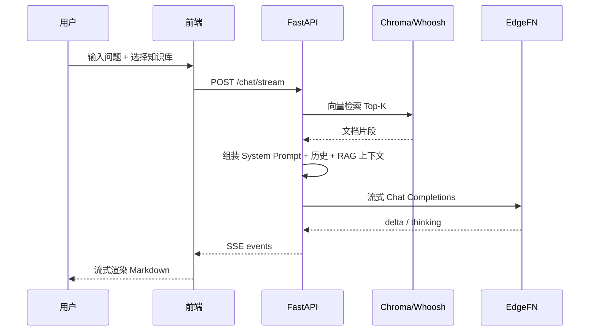

# KnowMind —— 通用知识场景智能知识库平台

> **说明**：本文档由早期 **KnowMind AI** 企业知识库 PRD 演进而来，产品名与代码仓统一为 **KnowMind**；Word 文件名保留 `KnowMind_AI_PRD_v2.0.docx` 以便延续版本管理。

## 产品需求规格说明书（PRD）

| 属性 | 内容 |
|------|------|
| **文档编号** | SM-PRD-2026-002 |
| **文档版本** | v2.2（与代码仓对齐） |
| **文档状态** | 正式发布 |
| **编写日期** | 2026-05-24 |
| **适用仓库** | `KnowMind` 单仓（`knowmind-server` / `knowmind-web` / `knowmind-agent` / `knowmind-mcp` / `knowmind-eval`） |
| **关联文档** | [开发流程与步骤 v1.2](KnowMind_开发流程与步骤_v1.md)、[对话记忆与上下文技术方案 v1](KnowMind_对话记忆与上下文技术方案_v1.md) |
| **Word 版** | [`KnowMind_AI_PRD_v2.0.docx`](KnowMind_AI_PRD_v2.0.docx)（与本文同步）· [`KnowMind_PRD_v2.0.docx`](KnowMind_PRD_v2.0.docx) |

### 修订记录

| 版本 | 日期 | 修订说明 |
|------|------|----------|
| v2.0 | 2026-05 | 自 KnowMind AI PRD 升级，对齐 KnowMind 单仓实现 |
| v2.1 | 2026-05-23 | **完善版**：保留单用户自助模型，补全功能细则、业务流程、接口契约、数据模型、交互规范与验收矩阵；去除多角色 RBAC 与企业后台描述 |
| v2.2 | 2026-05-24 | **代码对齐**：路由、API、数据库字段与 `knowmind-server` / `knowmind-web` 一致；补充技术选型理由；标注 ✅已实现 / 🔄部分 / ⏳规划 |

### 文档约定

- **优先级**：P0 = MVP 必须交付；P1 = 首版后 1–2 个迭代；P2 = 加分项或远期规划。
- **实现状态**：✅ 已实现 · 🔄 部分实现 · ⏳ 规划中。
- **读者**：产品、研发、测试、答辩评审；本文档为产品规格的**唯一权威来源**。

---

## 目录

1. [项目概述](#第一章--项目概述)
2. [用户与使用场景](#第二章--用户与使用场景)
3. [功能需求详细设计](#第三章--功能需求详细设计)
4. [非功能需求](#第四章--非功能需求)
5. [系统架构设计](#第五章--系统架构设计)
6. [数据设计](#第六章--数据设计)
7. [接口设计](#第七章--接口设计)
8. [前端设计规范](#第八章--前端设计规范)
9. [开发里程碑与排期](#第九章--开发里程碑与排期)
10. [部署、运维与验收](#第十章--部署运维与验收)
11. [附录](#附录)

---

## 第一章  项目概述

### 1.1  产品定义

**KnowMind** 是一款面向通用知识场景的 **AI Native 私有知识库平台**。用户注册登录后，可自助创建多个知识库、上传 PDF 文档并完成自动解析与索引，在对话页基于所选知识库进行 **Hybrid RAG 检索增强问答**，获得可流式呈现、可核对依据的智能回答。

产品核心价值链：

```
文档上传 → 解析切块 → 向量 + 全文索引 → 检索增强对话 → （迭代）工具扩展 / 报告 / 评估
```

### 1.2  背景与痛点

知识资料高度分散于 PDF 论文、阅读笔记、预印本、网页摘要等载体，带来三类典型问题：

| 痛点 | 具体表现 | 本产品应对 |
|------|----------|------------|
| 知识生产低效 | 手工整理文档，入库慢 | PDF 上传 + 异步解析流水线 |
| 知识消费薄弱 | 关键词检索无法理解语义 | 向量检索 + BM25 混合召回（目标） |
| 知识难以对话化 | 材料堆在文件夹，无法「问」 | RAG 流式对话 + 多轮记忆 |

### 1.3  产品目标

| 目标编号 | 描述 | 衡量方式 |
|----------|------|----------|
| G-01 | 用户可在 5 分钟内完成「注册 → 建库 → 上传 PDF → 首次问答」 | 端到端演示通过率 |
| G-02 | 回答应基于用户私有文档检索片段，减少无依据幻觉 | 人工核对 + RAGAS（P1） |
| G-03 | 多用户数据严格隔离，互不可见 | 安全测试用例 |
| G-04 | 支持本地开发与后续生产部署扩展 | 环境变量 + 存储/向量抽象 |

### 1.4  产品范围

#### 1.4.1  范围内（In Scope）

- 邮箱注册 / 登录、JWT 鉴权
- 知识库 CRUD（按用户隔离，上限可配置）
- PDF 文档上传、解析、切块、Embedding、Chroma 向量 + Whoosh 全文索引
- 基于知识库的 SSE 流式对话、多轮会话与对话记忆
- MCP 工具启用与配置（arXiv、Semantic Scholar、联网搜索、文件读写等）
- 响应式 Web 前端（桌面 + 移动端基础适配）

#### 1.4.2  范围外（Out of Scope — 当前版本）

- 多角色权限体系（管理员 / 审核员 / 组织租户）
- 知识库跨用户共享与协作编辑
- 富文本知识条目编辑器（P1 规划）
- 完整 LangGraph Agent 工厂 UI（P1 规划）
- 生产级 OAuth、SSO、计费系统

#### 1.4.3  边界说明

本产品为 **单用户自助型** 私有知识库：每位注册用户拥有完整的产品能力，系统配置（模型网关、存储路径、嵌入模式等）由**部署侧环境变量**管理，**不提供**面向终端用户的多角色管理后台。

### 1.5  实现状态总览

| 模块 | 规格目标 | 当前实现（2026-05-24） |
|------|----------|------------------------|
| 账户与知识库 | JWT、多库、重命名、用户隔离 | ✅ |
| 文档入库 | PDF 上传/预览/删除 + 解析 + 双索引 | ✅ |
| 知识条目 | 分类树、草稿/发布/归档、URL 采集、对话提炼 | ✅ |
| 混合检索 RAG | 向量 Top-K 注入对话 | ✅ |
| BM25 + RRF + Rerank | Whoosh 写入 + 对话融合精排 | 🔄 Whoosh 已写入；对话主路仍为向量检索 |
| 流式对话 | SSE、思维链分区、文件工具 | ✅ |
| 对话记忆 | MySQL + Redis + Chroma 对话向量 | ✅ |
| 研究报告 | 会话生成、列表/详情、Markdown 导出 | ✅ |
| MCP 工具 | 内置工具注册、导入、工作区文件 API | ✅ |
| 知识缺口蒸馏 | 检索日志分析、缺口草稿生成 | 🔄 API 已实现；前端入口待完善 |
| Agent 编排 | LangGraph Plan-and-Execute | ⏳ `knowmind-agent` 占位 |
| 引用溯源 UI | 点击片段跳转 PDF 页 | ⏳ |
| RAGAS 评估 | 离线 Pipeline + 看板真实数据 | ⏳ 看板为示意数据 |
| Google OAuth | 第三方登录 | ⏳ P1 |

---

## 第二章  用户与使用场景

### 2.1  用户模型

平台仅有一种使用主体：**已注册登录用户**。

| 属性 | 说明 |
|------|------|
| 注册方式 | 邮箱 + 密码（密码长度 8–128 字符） |
| 认证方式 | JWT Bearer Token，默认有效期 7 天 |
| 权限模型 | **无角色区分**；登录即拥有全部终端功能 |
| 数据归属 | 知识库、文档、会话、工具配置均绑定 `user_id` |
| 隔离规则 | API 层校验 JWT，仅允许读写本人资源；跨用户访问返回 403/404 |

### 2.2  用户画像

**典型用户：研究生 / 科研工作者「小李」**

- 需要管理数十篇 PDF 论文与阅读笔记
- 希望针对「自己的材料」提问，如「这篇论文的方法论是什么？」
- 不接受空泛回答，需要回答与文档内容相关
- 使用场景：个人电脑浏览器为主，偶尔移动端查看

### 2.3  用户故事（User Stories）

| ID | 作为… | 我希望… | 以便… | 优先级 |
|----|-------|---------|-------|--------|
| US-01 | 新用户 | 用邮箱注册并登录 | 开始使用平台 | P0 |
| US-02 | 登录用户 | 创建多个命名知识库 | 按课题/方向分类管理文档 | P0 |
| US-03 | 登录用户 | 向知识库批量上传 PDF | 自动解析并建立检索索引 | P0 |
| US-04 | 登录用户 | 查看文档解析进度与失败原因 | 知道何时可以开始问答 | P0 |
| US-05 | 登录用户 | 在对话页选择知识库并提问 | 获得基于文档的流式回答 | P0 |
| US-06 | 登录用户 | 继续历史会话 | 多轮讨论同一主题 | P0 |
| US-07 | 登录用户 | 删除知识库或文档 | 清理无用数据 | P0 |
| US-08 | 登录用户 | 开启联网搜索 / arXiv 等工具 | 补充私有库外的公开信息 | P1 |
| US-09 | 登录用户 | 点击引用跳转到原文片段 | 核对 AI 回答依据 | P1 |
| US-10 | 登录用户 | 导出研究报告 | 用于组会或论文写作 | P1 |

### 2.4  核心用户旅程

#### 旅程 A：首次使用（P0 主路径）


**步骤说明：**

1. 用户访问 `/login`，填写邮箱与密码完成注册或登录，前端持久化 `access_token`。
2. 进入 `/knowledge-bases`，点击「新建知识库」，输入名称（1–50 字符）。
3. 进入 `/documents` 或在知识库卡片跳转，选择目标库，上传一个或多个 PDF（单文件 ≤ 50MB，单次最多 20 个）。
4. 列表展示文档状态：`pending` → `processing` → `done` / `failed`；失败时可「重试解析」。
5. 进入 `/chat`，在侧栏或顶部选择刚建的知识库，输入研究问题。
6. 后端检索 Top-K 片段注入 Prompt，经 EdgeFN 网关 SSE 流式返回；前端分区展示思维链与正文。

#### 旅程 B：日常研究问答

1. 登录后默认进入 `/chat`。
2. 从会话列表选择历史会话，或新建会话并绑定知识库。
3. 可选开启「深度研究」「联网搜索」等开关（取决于 MCP 工具启用状态）。
4. 多轮追问；服务端通过 MySQL 消息表 + Redis 热缓存 + 对话向量检索构建上下文。

#### 旅程 C：知识库维护

1. 在 `/knowledge-bases` 搜索、切换栅格/列表视图。
2. 删除整个知识库（级联删除文档记录、本地文件、Chroma/Whoosh 索引条目）。
3. 在 `/documents` 按库管理单篇文档，删除或重试失败任务。

### 2.5  业务规则（全局）

| 规则编号 | 规则描述 |
|----------|----------|
| BR-01 | 每用户最多创建 `max_knowledge_bases_per_user` 个知识库（默认 10） |
| BR-02 | 知识库名称不可为空，最长 50 字符 |
| BR-03 | 仅支持 PDF 上传；非 PDF 拒绝并提示 |
| BR-04 | 同一知识库内相同 MD5 的文件视为重复，跳过上传 |
| BR-05 | 删除知识库时同步清理存储、向量索引、Whoosh 文档 |
| BR-06 | 未登录访问受保护 API 返回 401 |
| BR-07 | 访问他人 `kb_id` / `doc_id` / `conversation_id` 返回 403 或 404 |

---

## 第三章  功能需求详细设计

### 3.1  账户与认证模块

**模块编号**：M1 · **优先级**：P0 · **状态**：✅

#### 3.1.1  功能清单

| 功能 ID | 功能名称 | 描述 | 状态 |
|---------|----------|------|------|
| M1-001 | 用户注册 | 邮箱 + 密码注册，返回 JWT | ✅ |
| M1-002 | 用户登录 | 校验凭证，返回 JWT | ✅ |
| M1-003 | 当前用户信息 | 获取登录用户 id、邮箱、注册时间 | ✅ |
| M1-004 | 退出登录 | 前端清除 Token（无服务端黑名单） | ✅ |
| M1-005 | Google OAuth | 第三方登录 | ⏳ P1 |

#### 3.1.2  注册规则

- 邮箱格式合法且唯一；重复注册返回业务错误码。
- 密码最少 8 位；服务端 bcrypt 哈希存储，禁止明文落库。
- 注册成功同时返回 `UserPublic` 与 `access_token`。

#### 3.1.3  登录与会话

- 请求头：`Authorization: Bearer <access_token>`。
- Token 过期后需重新登录；前端 401 时跳转 `/login`。
- 当前版本无 Refresh Token；`expires_in` 以秒为单位返回（默认 7 天）。

#### 3.1.4  验收标准

- [ ] 合法邮箱可注册并成功登录
- [ ] 重复邮箱注册失败并提示
- [ ] 错误密码登录失败
- [ ] 携带有效 Token 可访问受保护接口
- [ ] 无效/过期 Token 返回 401

---

### 3.2  知识库管理模块

**模块编号**：M1-KB · **优先级**：P0 · **状态**：✅

#### 3.2.1  功能清单

| 功能 ID | 功能名称 | 描述 | 状态 |
|---------|----------|------|------|
| KB-001 | 创建知识库 | 指定名称，归属当前用户 | ✅ |
| KB-002 | 知识库列表 | 按更新时间倒序，含文档数量 | ✅ |
| KB-003 | 删除知识库 | 级联删除文档与索引 | ✅ |
| KB-004 | 搜索过滤 | 前端按名称关键字过滤 | ✅ |
| KB-005 | 重命名知识库 | `PATCH /knowledge-bases/{kb_id}` | ✅ |
| KB-006 | 知识库详情页 | 独立详情与统计 | ⏳ P1 |

#### 3.2.2  数据字段

| 字段 | 类型 | 说明 |
|------|------|------|
| id | UUID | 主键 |
| user_id | UUID | 所属用户 |
| name | string(50) | 展示名称 |
| doc_count | int | 文档数量（冗余计数） |
| created_at | datetime | 创建时间 |
| updated_at | datetime | 最后更新时间 |

#### 3.2.3  交互说明（`/knowledge-bases`）

- **桌面端**：左侧主导航 + 内容区；支持栅格 / 列表视图切换。
- **移动端**：顶栏标题 + 搜索框 + 卡片列表；底部 Tab 导航。
- **新建**：弹窗输入名称，提交后刷新列表。
- **删除**：二次确认；删除后不可恢复。
- **卡片信息**：名称、文档数、更新时间；点击进入文档管理或对话（按产品设计跳转 `/documents?kb=` 或 `/chat`）。

#### 3.2.4  验收标准

- [ ] 用户 A 无法看到或删除用户 B 的知识库
- [ ] 达到上限时创建失败并提示
- [ ] 删除知识库后关联文档与索引均被清理

---

### 3.3  文档入库与解析模块

**模块编号**：M2 · **优先级**：P0 · **状态**：✅

#### 3.3.1  功能清单

| 功能 ID | 功能名称 | 描述 | 状态 |
|---------|----------|------|------|
| DOC-001 | PDF 上传 | 单库批量上传 | ✅ |
| DOC-002 | 文档列表 | 含状态、大小、切块数 | ✅ |
| DOC-003 | 异步解析 | 后台任务解析 PDF | ✅ |
| DOC-004 | 重复检测 | MD5 去重 | ✅ |
| DOC-005 | 失败重试 | 重新触发解析任务 | ✅ |
| DOC-006 | 删除文档 | `DELETE .../documents/{doc_id}` | ✅ |
| DOC-008 | 文档预览 | `GET .../documents/{doc_id}/file` | ✅ |
| DOC-007 | DOCX / 图片 OCR | 扩展格式 | ⏳ P2 |

#### 3.3.2  上传约束

| 约束项 | 值 | 配置项 |
|--------|-----|--------|
| 单文件大小上限 | 50 MB | `PDF_MAX_UPLOAD_MB` |
| 单次批量上限 | 20 个文件 | `PDF_MAX_BATCH` |
| 允许 MIME/扩展名 | `.pdf` | 服务端校验 |

#### 3.3.3  文档状态机

```
pending ──► processing ──► done
                │
                └──► failed ──► (retry) ──► processing
```

| 状态 | 含义 | 用户可见 |
|------|------|----------|
| pending | 已入库，等待解析 | 「等待中」 |
| processing | 正在抽取/切块/嵌入 | 「解析中」 |
| done | 解析成功，可检索 | 「已完成」+ chunk_count |
| failed | 解析失败 | 「失败」+ error_message |

#### 3.3.4  解析流水线

1. **校验**：格式、大小、知识库归属、MD5 去重。
2. **存储**：写入 `STORAGE_LOCAL_ROOT/users/{user_id}/kb/{kb_id}/docs/{doc_id}/`。
3. **调度**：
   - 生产：`Celery + Redis` Worker 异步执行；
   - 开发：`INGEST_BACKGROUND_THREAD=true` 时 API 进程内 daemon 线程。
4. **文本抽取**：PyMuPDF 按页抽取纯文本。
5. **切块**：论文感知切块（保留页码 metadata）。
6. **嵌入**：`EMBEDDING_MODE` = `bge`（本地 BGE-M3）/ `http`（OpenAI 兼容 API）/ `hash`（测试）。
7. **索引写入**：
   - Chroma collection `doc_chunks_bge_m3`（按 kb_id 过滤）；
   - Whoosh 按知识库分索引目录。
8. **回写**：更新 `documents.status`、`chunk_count`、`title`（若可提取）。

#### 3.3.5  交互说明（`/documents`）

- 顶部或侧边选择目标知识库（无库时引导创建）。
- 拖拽或点击上传 PDF；上传后列表自动刷新或轮询状态。
- `failed` 状态展示 `error_message` 摘要与「重试」按钮。

#### 3.3.6  验收标准

- [ ] 10MB 以内 PDF 在 60s 内完成解析（常规硬件，http 嵌入模式）
- [ ] 重复文件不上传第二次，`skipped_duplicates` 计数正确
- [ ] 解析完成后对话检索可命中该文档内容
- [ ] 失败文档重试后可进入 `done`

---

### 3.3.7  知识条目与分类模块

**模块编号**：M2-ITEM · **优先级**：P0 · **状态**：✅

#### 3.3.7.1  功能清单

| 功能 ID | 功能名称 | API / 路由 | 状态 |
|---------|----------|------------|------|
| ITEM-001 | 分类树 CRUD | `/knowledge-bases/{kb_id}/categories` | ✅ |
| ITEM-002 | 条目列表/详情 | `GET .../items`、`GET .../items/{item_id}` | ✅ |
| ITEM-003 | 创建/编辑条目 | `POST/PATCH .../items` | ✅ |
| ITEM-004 | 发布/归档 | `POST .../publish`、`.../archive` | ✅ |
| ITEM-005 | URL 预览与导入 | `preview-url`、`import-url` | ✅ |
| ITEM-006 | 对话提炼草稿 | `POST /conversations/{id}/extract-knowledge` | ✅ |
| ITEM-007 | 条目向量索引 | 发布条目写入 Chroma + Whoosh | ✅ |
| ITEM-008 | 富文本 Lexical 编辑器 | 前端所见即所得 | ⏳ P1 |

#### 3.3.7.2  条目字段（`knowledge_items`）

| 字段 | 类型 | 说明 |
|------|------|------|
| id | UUID | 主键 |
| kb_id / user_id | UUID | 归属知识库与用户 |
| document_id | UUID? | 关联 PDF 文档（解析自动生成条目时） |
| category_id | UUID? | 分类节点 |
| source_type | string(32) | `manual` / `url` / `distill` / `document` 等 |
| title | string(200) | 标题 |
| content | text | 正文（Markdown） |
| summary | string(500)? | 摘要 |
| tags | JSON array? | 标签 |
| lifecycle_status | string(32) | `draft` / `published` / `archived` |
| access_level | string(32) | `public` / `internal` / `restricted` |
| source | string(512)? | 来源 URL 或说明 |
| chunk_id / page | | 溯源到文档块 |
| published_at | datetime? | 发布时间 |

#### 3.3.7.3  前端路由

| 页面 | 路由 | 状态 |
|------|------|------|
| 文档管理（文档 + 条目 Tab） | `/documents` | ✅ |
| 条目详情编辑 | `/documents/items/:kbId/:itemId` | ✅ |

---

### 3.4  智能检索与 RAG 对话模块

**模块编号**：M3 · **优先级**：P0 · **状态**：🔄

#### 3.4.1  功能清单

| 功能 ID | 功能名称 | 描述 | 状态 |
|---------|----------|------|------|
| RAG-001 | 向量检索 | 按 kb_id 检索 Top-K 片段 | ✅ |
| RAG-002 | BM25 检索 | Whoosh 关键词召回 | 🔄 写入已实现，对话融合待完善 |
| RAG-003 | RRF 融合 | 双路结果合并 | ⏳ P1 |
| RAG-004 | Rerank | BGE-Reranker 精排 | ⏳ P1 |
| RAG-005 | SSE 流式对话 | 实时输出回答 | ✅ |
| RAG-006 | 思维链展示 | 推理过程分区渲染 | ✅ |
| RAG-007 | 引用标注 | 回答中标注文档来源 | ⏳ P1 |
| RAG-008 | 同步对话 API | 非流式一次性返回 | ✅ |

#### 3.4.2  RAG 问答流程



**Prompt 结构（逻辑顺序）：**

1. 系统提示（知识助手角色、引用要求、工具说明）
2. 知识库检索摘录（Markdown 格式，含文件名与页码）
3. 对话记忆（摘要 + 近期消息 + 向量召回的历史轮次）
4. 当前用户消息

#### 3.4.3  SSE 事件协议

| 事件类型 | 字段 | 说明 |
|----------|------|------|
| `trace_id` | string | 本轮追踪 ID |
| `thinking_delta` | string | 推理链增量（若模型支持） |
| `delta` | string | 正文增量 |
| `done` | object | 结束，含完整 trace_id |

Media-Type：`text/event-stream`；需禁用代理缓冲（`X-Accel-Buffering: no`）。

#### 3.4.4  对话请求参数

| 字段 | 类型 | 必填 | 说明 |
|------|------|:----:|------|
| message | string | 是 | 用户消息，1–8000 字符 |
| knowledge_base_id | string | 否 | 绑定的知识库；空则不注入 RAG |
| conversation_id | string | 否 | 续聊会话 ID；空则新建 |
| deep_research | bool | 否 | 深度研究模式 |
| web_search | bool | 否 | 是否允许联网搜索 |
| file_tools | bool | 否 | 是否启用本地文件读写工具 |

#### 3.4.5  检索参数（服务端配置）

| 配置项 | 默认值 | 说明 |
|--------|--------|------|
| `rag_top_k` | 8 | 注入 Prompt 的片段数 |
| `chroma_collection_name` | doc_chunks_bge_m3 | 文档向量集合 |

#### 3.4.6  验收标准

- [ ] 选择已索引知识库提问，回答内容与文档相关
- [ ] 流式输出无明显卡顿，首 Token ≤ 2s（依赖网关）
- [ ] 不选知识库时仍可对话（无 RAG 上下文）
- [ ] SSE 断连后前端有错误提示

---

### 3.5  会话与对话记忆模块

**模块编号**：M6-MEM · **优先级**：P0 · **状态**：✅

#### 3.5.1  功能清单

| 功能 ID | 功能名称 | 描述 | 状态 |
|---------|----------|------|------|
| CONV-001 | 创建会话 | 绑定知识库与开关 | ✅ |
| CONV-002 | 会话列表 | 按更新时间倒序 | ✅ |
| CONV-003 | 消息历史 | 拉取会话内消息 | ✅ |
| CONV-004 | 删除会话 | 级联删除消息与摘要 | ✅ |
| CONV-005 | 自动摘要 | 超长上下文压缩 | ✅ |
| CONV-006 | 对话向量记忆 | 历史轮次语义召回 | ✅ |

#### 3.5.2  记忆架构（三层）

| 层级 | 存储 | 作用 |
|------|------|------|
| 事实源 | MySQL `conversations` / `chat_messages` / `conversation_summaries` | 持久化会话与消息 |
| 热缓存 | Redis | 近期消息快速读取 |
| 语义层 | Chroma `chat_memory_bge_m3` | 向量召回相关历史 |

详细策略见 [对话记忆与上下文技术方案 v1](KnowMind_对话记忆与上下文技术方案_v1.md)。

#### 3.5.3  会话字段

| 字段 | 说明 |
|------|------|
| knowledge_base_id | 会话默认绑定的知识库 |
| deep_research / web_search | 会话级开关 |
| title | 会话标题（首条消息摘要或用户编辑，P1） |
| last_summarized_message_id | 摘要覆盖进度 |

#### 3.5.4  验收标准

- [ ] 同一会话多轮追问，模型能引用前文
- [ ] 刷新页面后会话与消息可恢复
- [ ] 删除会话后消息不可再访问

---

### 3.6  MCP 工具模块

**模块编号**：M4 · **优先级**：P1 · **状态**：✅ 基础能力

#### 3.6.1  内置工具

| 工具 ID | 名称 | 能力 | 默认 |
|---------|------|------|------|
| web_search | 联网搜索 | 检索公开网页摘要 | 可配置 |
| arxiv | arXiv | 检索预印本 | 可配置 |
| semantic_scholar | Semantic Scholar | 学术图谱检索 | 可配置 |
| file_writer | 文件读写 | 用户工作区文件操作（白名单路径） | 可配置 |

#### 3.6.2  功能清单

| 功能 ID | 功能名称 | 描述 | 状态 |
|---------|----------|------|------|
| MCP-001 | 工具列表 | 查看内置与自定义工具 | ✅ |
| MCP-002 | 启用/禁用 | 按用户偏好开关 | ✅ |
| MCP-003 | 导入 MCP JSON | 导入自定义 MCP 配置 | ✅ |
| MCP-004 | 删除自定义工具 | 移除导入项 | ✅ |
| MCP-005 | 对话中调用 | Chat 流程内触发工具 | 🔄 |

#### 3.6.3  交互说明（`/tools`）

- 展示内置工具卡片：名称、描述、启用开关。
- 支持粘贴 MCP JSON 导入第三方工具。
- 工具启用状态按 `user_id` 持久化。

#### 3.6.4  验收标准

- [ ] 关闭 web_search 后，对话请求不触发联网
- [ ] 导入非法 JSON 返回 400 与明确错误

---

### 3.7  Agent 编排模块（规划）

**模块编号**：M5 · **优先级**：P1 · **状态**：⏳

#### 3.7.1  目标能力

LangGraph 驱动的 Plan-and-Execute 流程：

```
planner → retriever → reasoner → skill_executor → answer_generator → memory_updater
```

- **planner**：拆解用户研究任务为子步骤
- **retriever**：调用私有库 RAG + MCP 工具
- **执行面板**：SSE 推送每步状态（Phase 3 交付）
- **错误重试**：单步失败可重试或降级

#### 3.7.2  前端路由

- 规划 `/agents`：Agent 工厂与模板（当前未实现）
- 当前工具能力入口：`/tools`

---

### 3.8  报告与评估模块

**模块编号**：M7 · **优先级**：P1 · **状态**：🔄

#### 3.8.1  研究报告（✅ 已实现）

| 功能 ID | 功能 | API / 路由 | 状态 |
|---------|------|------------|------|
| RPT-001 | 从会话生成报告 | `POST /conversations/{id}/generate-report` | ✅ |
| RPT-002 | 报告列表 | `GET /reports?kb_id=` · `/reports` | ✅ |
| RPT-003 | 报告详情 | `GET /reports/{id}` · `/reports/:id` | ✅ |
| RPT-004 | 删除报告 | `DELETE /reports/{id}` | ✅ |
| RPT-005 | 导出 Markdown | `GET /reports/{id}/export` | ✅ |
| RPT-006 | 导出 PDF | — | ⏳ P1 |

**表 `research_reports`**：`title`、`summary`、`content_md`、`outline_json`、`citations_json`、`status`（默认 `ready`）。

#### 3.8.2  评估看板（⏳ 示意）

| 功能 | 路由 | 状态 |
|------|------|------|
| RAGAS 指标趋势 | `/evaluation` | ⏳ 前端 Recharts 示意数据 |
| 离线 Pipeline | `knowmind-eval/pipelines/` | ⏳ 脚本存在，未接真实看板 |

**目标指标（Phase 5）**：Context Precision、Faithfulness、Answer Relevancy、Context Recall 达到 RAGAS 目标阈值。

---

### 3.9  设置模块

**模块编号**：M-SET · **优先级**：P1 · **状态**：🔄

| 功能 | 说明 | 状态 |
|------|------|------|
| 账户信息展示 | 邮箱、注册时间 | ✅ |
| 工具快捷入口 | 跳转 `/tools` | ✅ |
| 修改密码 | 服务端 API | ⏳ P1 |
| 主题 / 语言 | 国际化 | ⏳ P2 |

---

## 第四章  非功能需求

### 4.1  性能需求

| 指标 | 目标值 | 测量条件 |
|------|--------|----------|
| 页面首屏加载 | ≤ 2s | 4G 网络，冷启动 |
| RAG 检索链路 P95 | ≤ 800ms | 不含 LLM 生成 |
| 对话首 Token | ≤ 2s | EdgeFN 网关正常 |
| PDF 解析（10MB） | ≤ 60s | http 嵌入模式 |
| 知识库列表 API | ≤ 200ms | 10 库以内 |
| 并发用户（MVP） | ≥ 50 | 单实例部署 |

### 4.2  安全需求

| 类别 | 要求 |
|------|------|
| 传输 | 生产环境 HTTPS |
| 认证 | JWT HS256；`JWT_SECRET` 生产必须覆盖默认值 |
| 授权 | 所有业务 API 校验 `user_id` 与资源归属 |
| 密码 | bcrypt 哈希；禁止日志打印明文 |
| 注入 | SQLAlchemy 参数化；前端 Markdown 渲染防 XSS |
| 文件 | 上传路径不可穿越；文件工具限定 `FILE_WRITER_ALLOWED_ROOTS` |
| 密钥 | `.env` 不入库；CI 使用占位配置 |

### 4.3  可用性与可靠性

- 向量服务不可用时，对话可降级为无 RAG 纯 LLM 模式（并提示用户）。
- 解析任务失败保留 `error_message`，支持人工重试。
- 健康检查：`GET /api/v1/health` 返回 `{"status":"ok"}`。

### 4.4  兼容性与可扩展性

| 扩展点 | 说明 |
|--------|------|
| 存储 | `StorageBackend` 抽象，可切换 OSS/S3 |
| 向量 | Chroma（默认）/ Milvus Lite / 远程 Milvus |
| 嵌入 | bge / http / hash 三模式 |
| LLM | OpenAI 兼容网关（EdgeFN 等） |
| 任务队列 | Celery 或本机线程 |

### 4.5  可维护性

- 后端：`uv` + `pytest`；Alembic 数据库迁移。
- 前端：`pnpm build` TypeScript 校验。
- API 自描述：`/docs` OpenAPI。

---

## 第五章  系统架构设计

### 5.1  逻辑架构

```
┌─────────────────────────────────────────────────────────────┐
│                    knowmind-web (React SPA)               │
│  Login │ Chat │ KnowledgeBases │ Documents │ Tools │ ...    │
└───────────────────────────┬─────────────────────────────────┘
                            │ HTTPS / SSE
┌───────────────────────────▼─────────────────────────────────┐
│              knowmind-server (FastAPI)                    │
│  Auth │ KB │ Documents │ Chat │ Conversations │ MCP │ Health │
└─┬─────────┬──────────┬────────────┬──────────────────────────┘
  │         │          │            │
  ▼         ▼          ▼            ▼
 MySQL    Redis     Chroma       Whoosh
          Celery    (vectors)    (BM25)
            │
            ▼
      Ingest Worker (PDF parse / embed)
            │
            ▼
      EdgeFN / OpenAI-compatible LLM & Embeddings API
```

### 5.2  代码仓映射

| 模块 | 目录 | 职责 |
|------|------|------|
| M1 用户与知识库 | `knowmind-server/app/api/v1/endpoints/auth.py`、`knowledge_bases.py` | 鉴权与 KB CRUD |
| M2 解析与索引 | `knowmind-server/app/ingest/`、`workers/` | PDF 流水线 |
| M3 RAG | `knowmind-server/app/services/rag_context.py` | 检索与 Prompt 注入 |
| M4 MCP | `knowmind-mcp/*`、`app/services/mcp_registry.py` | 工具注册 |
| M5 Agent | `knowmind-agent/agent/graph.py` | LangGraph（占位） |
| M6 前端 | `knowmind-web/src/pages/*` | 页面与交互 |
| M7 评估 | `knowmind-eval/pipelines/` | RAGAS |

### 5.3  技术选型与选用理由

| 领域 | 选型 | 选用理由 | 实现状态 |
|------|------|----------|----------|
| 前端框架 | React 18 + TypeScript | 生态成熟、组件化适合复杂对话 UI | ✅ |
| 构建工具 | Vite 5 | 冷启动快、HMR 适合前后端联调 | ✅ |
| 样式 | Tailwind CSS 3 | 与现有页面一致、响应式断点简单 | ✅ |
| 路由 | React Router 6 | 与 `App.tsx` 声明式路由一致 | ✅ |
| 流式 Markdown | Streamdown + `@streamdown/cjk` + Shiki | 专为 LLM 流式输出设计，CJK 排版与代码高亮 | ✅ |
| 图表（评估） | Recharts | 评估看板趋势图（当前为 mock） | 🔄 |
| 后端 | FastAPI + Pydantic v2 | 异步原生、自动生成 OpenAPI `/docs` | ✅ |
| ORM | SQLAlchemy 2.0（async） | 与 Alembic 迁移配套，类型友好 | ✅ |
| MySQL 驱动 | asyncmy | 异步连接，适配 FastAPI 事件循环 | ✅ |
| 迁移 | Alembic | 版本化 schema（`alembic/versions/`） | ✅ |
| 关系库 | MySQL 8.x | 团队熟悉、事务与 JSON 字段满足条目/报告元数据 | ✅ |
| 缓存 | Redis | 对话热消息、Celery Broker | ✅ |
| 向量库（默认） | Chroma 持久化 | 零运维本地开发；`vector_factory` 可切换 | ✅ |
| 向量库（可选） | Milvus（`milvus_uri` 配置） | 生产横向扩展；不可用时自动回退 Chroma | 🔄 |
| 全文索引 | Whoosh | 纯 Python、按 `kb_id` 分目录，免 Elasticsearch 集群 | 🔄 写入 ✅，检索融合 ⏳ |
| 嵌入模型 | BGE-M3（`EMBEDDING_MODE=bge`） | 中英文语义检索质量；支持 `http`/`hash` 降级 | ✅ |
| LLM 网关 | EdgeFN（OpenAI 兼容） | 统一 Chat Completions + 可选 Embeddings API | ✅ |
| 异步任务 | Celery + Redis | 生产 PDF 解析；`INGEST_BACKGROUND_THREAD` 开发免 Worker | ✅ |
| PDF 解析 | PyMuPDF | 按页抽取文本，保留页码 metadata | ✅ |
| 存储 | `StorageBackend` 本地实现 | 抽象 `put/get/delete`，后续可换 OSS/S3 | ✅ |
| MCP | `knowmind-mcp` + `mcp_registry` | 标准工具协议，与 Cursor 配置互通 | ✅ |
| Agent（规划） | LangGraph | Plan-and-Execute；目录 `knowmind-agent/agent/` | ⏳ |
| 包管理 | uv（Python）、pnpm（前端） | 锁定依赖、CI 可复现 | ✅ |
| 测试 | pytest（后端）、`tsc -b`（前端） | 回归鉴权、KB、工作区文件等 | ✅ |

---

## 第六章  数据设计

### 6.1  ER 关系概览

```
users 1───N knowledge_bases 1───N documents
              │              1───N knowledge_categories (树形 parent_id)
              │              1───N knowledge_items
              │              1───N knowledge_gaps
              │              1───N research_reports
              │              1───N rag_retrieval_logs
  │
  ├───N conversations 1───N chat_messages
  │                 └───N conversation_summaries
  └───N user_feedback
```

- **向量切块**：Chroma collection（默认 `doc_chunks_bge_m3`）；对话记忆 collection `chat_memory_bge_m3`。
- **Whoosh**：索引根目录 `WHOOSH_INDEX_ROOT`，按知识库分片。
- **实现文件**：`knowmind-server/app/models/orm.py`；迁移 `alembic/versions/*.py`。

### 6.2  核心表结构

#### users

| 列名 | 类型 | 约束 | 说明 |
|------|------|------|------|
| id | CHAR(36) | PK | UUID |
| email | VARCHAR(255) | UNIQUE, NOT NULL | 登录邮箱 |
| password_hash | VARCHAR(255) | NOT NULL | bcrypt |
| is_active | BOOLEAN | DEFAULT true | 账户状态 |
| created_at | TIMESTAMP | NOT NULL | 注册时间 |

#### knowledge_bases

| 列名 | 类型 | 约束 | 说明 |
|------|------|------|------|
| id | CHAR(36) | PK | |
| user_id | CHAR(36) | FK → users, INDEX | 所有者 |
| name | VARCHAR(50) | NOT NULL | 库名 |
| doc_count | INT | DEFAULT 0 | 文档计数 |
| created_at / updated_at | TIMESTAMP | | |

#### documents

| 列名 | 类型 | 约束 | 说明 |
|------|------|------|------|
| id | CHAR(36) | PK | |
| kb_id | CHAR(36) | FK → knowledge_bases | |
| user_id | CHAR(36) | FK → users | 冗余便于隔离校验 |
| filename | VARCHAR(512) | NOT NULL | 原始文件名 |
| storage_key | VARCHAR(1024) | NOT NULL | 存储路径键 |
| status | VARCHAR(20) | NOT NULL | pending/processing/done/failed |
| chunk_count | INT | DEFAULT 0 | |
| file_bytes | BIGINT | | 文件大小 |
| md5 | CHAR(32) | INDEX | 去重 |
| title | VARCHAR(512) | NULL | 提取标题 |
| error_message | TEXT | NULL | 失败原因 |

#### knowledge_categories

| 列名 | 类型 | 说明 |
|------|------|------|
| id | CHAR(36) | PK |
| kb_id | CHAR(36) | FK → knowledge_bases |
| user_id | CHAR(36) | FK → users |
| parent_id | CHAR(36)? | 父分类，树形结构 |
| name | VARCHAR(100) | 分类名 |
| sort_order | INT | 排序 |

#### knowledge_items

| 列名 | 类型 | 说明 |
|------|------|------|
| id | CHAR(36) | PK |
| kb_id / user_id | CHAR(36) | 归属 |
| document_id | CHAR(36)? | 关联文档 |
| category_id | CHAR(36)? | 分类 |
| source_type | VARCHAR(32) | 来源类型 |
| title | VARCHAR(200) | 标题 |
| content | TEXT | 正文 |
| summary | VARCHAR(500)? | 摘要 |
| tags | JSON? | 标签数组 |
| lifecycle_status | VARCHAR(32) | draft / published / archived |
| access_level | VARCHAR(32) | public / internal / restricted |
| source | VARCHAR(512)? | 来源说明 |
| chunk_id | CHAR(36)? | 文档块 ID |
| page | INT? | 页码 |
| published_at | TIMESTAMP? | 发布时间 |

#### conversations

| 列名 | 类型 | 说明 |
|------|------|------|
| id | CHAR(36) | PK |
| user_id | CHAR(36) | 所有者 |
| knowledge_base_id | CHAR(36)? | 默认 RAG 知识库 |
| deep_research / web_search | BOOLEAN | 会话开关 |
| title | VARCHAR(255)? | 会话标题 |
| last_summarized_message_id | CHAR(36)? | 摘要进度 |
| acc_turns_since_summary | INT | 摘要触发计数 |
| acc_tokens_since_summary | INT | Token 累计 |

#### chat_messages

| 列名 | 类型 | 说明 |
|------|------|------|
| id | CHAR(36) | PK |
| conversation_id | CHAR(36) | FK |
| role | VARCHAR(20) | user / assistant / system |
| content | TEXT | 消息正文 |
| trace_id | CHAR(36)? | 追踪 ID |
| token_est | INT? | 估算 Token |

#### conversation_summaries / research_reports / knowledge_gaps / rag_retrieval_logs / user_feedback

与 ORM 模型一致；报告表含 `content_md`、`citations_json`、`outline_json`；缺口表含 `gap_key`、`trigger_rule`、`sample_queries`、`status`。

### 6.3  向量 Metadata（Chroma）

| 键 | 说明 |
|----|------|
| user_id | 租户隔离 |
| kb_id | 知识库过滤 |
| doc_id | 文档 ID |
| filename | 展示用 |
| page_index | 页码（0-based） |
| chunk_index | 块序号 |

---

## 第七章  接口设计

**Base URL**：`/api/v1`  
**认证**：`Authorization: Bearer <token>`（Auth 注册/登录/health 除外）  
**错误格式**：`{"detail": {"code": "...", "message": "..."}}` 或 HTTP 标准 detail 字符串

### 7.1  认证

#### POST `/auth/register`

**请求体：**

```json
{
  "email": "user@example.com",
  "password": "securepass123"
}
```

**响应 200：**

```json
{
  "user": { "id": "uuid", "email": "user@example.com", "created_at": "2026-05-23T00:00:00Z" },
  "access_token": "eyJ...",
  "token_type": "bearer",
  "expires_in": 604800
}
```

#### POST `/auth/login`

请求体同注册（password 无最小长度校验）。响应结构同注册。

#### GET `/auth/me`

**响应 200：** `UserPublic`

---

### 7.2  知识库

#### GET `/knowledge-bases`

**响应 200：** `KnowledgeBaseOut[]`

```json
[
  {
    "id": "uuid",
    "name": "深度学习文档",
    "doc_count": 12,
    "created_at": "...",
    "updated_at": "..."
  }
]
```

#### POST `/knowledge-bases`

**请求体：** `{ "name": "库名" }`  
**响应 201：** `KnowledgeBaseOut`

#### PATCH `/knowledge-bases/{kb_id}`

**请求体：** `{ "name": "新名称" }`  
**响应 200：** `KnowledgeBaseOut`

#### DELETE `/knowledge-bases/{kb_id}`

**响应 204** 无 body

---

### 7.3  文档

#### GET `/knowledge-bases/{kb_id}/documents`

**响应 200：** `DocumentOut[]`

#### POST `/knowledge-bases/{kb_id}/documents`

**Content-Type：** `multipart/form-data`  
**字段：** `files`（多个 PDF）

**响应 200：**

```json
{
  "documents": [ { "id": "...", "status": "pending", ... } ],
  "skipped_duplicates": 1
}
```

#### GET `/knowledge-bases/{kb_id}/documents/{doc_id}`

**响应 200：** `DocumentOut`

#### GET `/knowledge-bases/{kb_id}/documents/{doc_id}/file`

**响应：** PDF 文件流（预览/下载）

#### DELETE `/knowledge-bases/{kb_id}/documents/{doc_id}`

**响应 204**

#### POST `/knowledge-bases/{kb_id}/documents/{doc_id}/retry-parse`

**响应 200：** `DocumentOut`

---

### 7.3.1  知识分类与条目

| Method | Path | 说明 | 状态 |
|--------|------|------|------|
| GET | `/knowledge-bases/{kb_id}/categories` | 分类树 | ✅ |
| POST | `/knowledge-bases/{kb_id}/categories` | 创建分类 | ✅ |
| PATCH | `/knowledge-bases/{kb_id}/categories/{category_id}` | 更新 | ✅ |
| DELETE | `/knowledge-bases/{kb_id}/categories/{category_id}` | 删除 | ✅ |
| GET | `/knowledge-bases/{kb_id}/items` | 条目列表（可筛 `lifecycle_status`） | ✅ |
| POST | `/knowledge-bases/{kb_id}/items` | 创建条目 | ✅ |
| GET | `/knowledge-bases/{kb_id}/items/{item_id}` | 详情 | ✅ |
| PATCH | `/knowledge-bases/{kb_id}/items/{item_id}` | 更新 | ✅ |
| DELETE | `/knowledge-bases/{kb_id}/items/{item_id}` | 删除 | ✅ |
| POST | `.../items/{item_id}/publish` | 发布 | ✅ |
| POST | `.../items/{item_id}/archive` | 归档 | ✅ |
| POST | `/knowledge-bases/{kb_id}/items/preview-url` | URL 预览 | ✅ |
| POST | `/knowledge-bases/{kb_id}/items/import-url` | URL 导入 | ✅ |
| POST | `/knowledge-bases/{kb_id}/items/import-drafts` | 批量导入草稿 | ✅ |

---

### 7.3.2  知识缺口蒸馏

| Method | Path | 说明 | 状态 |
|--------|------|------|------|
| GET | `/knowledge-bases/{kb_id}/distill/gaps` | 缺口列表 | ✅ |
| POST | `/knowledge-bases/{kb_id}/distill/analyze` | 分析生成缺口 | ✅ |
| POST | `/knowledge-bases/{kb_id}/distill/gaps/{gap_id}/generate` | 为缺口生成草稿条目 | ✅ |

---

### 7.4  对话

#### POST `/chat/stream`

**请求体：** `ChatRequest`（见 3.4.4）

**响应：** SSE 流

#### POST `/chat`

**响应 200：** `{ "reply": "...", "trace_id": "..." }`

#### POST `/chat/feedback`

**说明：** 用户纠错反馈，写入 `user_feedback`  
**响应 204**

---

### 7.5  会话

| Method | Path | 说明 | 状态 |
|--------|------|------|------|
| POST | `/conversations` | 创建会话 | ✅ |
| GET | `/conversations?limit=50` | 列表（1–100） | ✅ |
| GET | `/conversations/{id}` | 会话详情 | ✅ |
| GET | `/conversations/{id}/messages` | 消息列表 | ✅ |
| DELETE | `/conversations/{id}` | 删除会话 | ✅ |
| POST | `/conversations/{id}/extract-knowledge` | 提炼知识草稿 | ✅ |
| POST | `/conversations/{id}/generate-report` | 生成研究报告 | ✅ |

---

### 7.5.1  研究报告

| Method | Path | 说明 | 状态 |
|--------|------|------|------|
| GET | `/reports?kb_id=&limit=` | 报告列表 | ✅ |
| GET | `/reports/{report_id}` | 详情 | ✅ |
| DELETE | `/reports/{report_id}` | 删除 | ✅ |
| GET | `/reports/{report_id}/export` | 下载 Markdown | ✅ |

---

### 7.6  MCP 与工作区文件

| Method | Path | 说明 | 状态 |
|--------|------|------|------|
| GET | `/mcp/tools` | 工具列表 | ✅ |
| PATCH | `/mcp/tools/builtin` | 切换内置工具 | ✅ |
| PATCH | `/mcp/tools/custom/{id}` | 切换自定义工具 | ✅ |
| POST | `/mcp/tools/import` | 导入 MCP JSON | ✅ |
| DELETE | `/mcp/tools/custom/{id}` | 删除自定义工具 | ✅ |
| GET | `/workspace/files/roots` | 文件工具允许根目录 | ✅ |
| POST | `/workspace/files/read` | 读文件 | ✅ |
| POST | `/workspace/files/write` | 写文件 | ✅ |

---

### 7.7  健康检查

#### GET `/health`

**响应：** `{ "status": "ok" }`

---

## 第八章  前端设计规范

### 8.1  信息架构与路由

| 页面 | 路由 | 优先级 | 状态 |
|------|------|--------|------|
| 登录 | `/login` | P0 | ✅ |
| 智能对话 | `/chat` | P0 | ✅ |
| 知识库 | `/knowledge-bases` | P0 | ✅ |
| 文档管理 | `/documents` | P0 | ✅ |
| 工具 | `/tools` | P1 | ✅ |
| 设置 | `/settings` | P1 | ✅ |
| 条目详情 | `/documents/items/:kbId/:itemId` | P0 | ✅ |
| 报告列表/详情 | `/reports`、`/reports/:id` | P1 | ✅ |
| 评估看板 | `/evaluation` | P1 | 🔄 示意数据 |
| Agent 工厂 | `/agents` | P1 | ⏳ 规划 |

**布局：**

- `/login`：全屏独立布局
- 其余页面：`AppShell`（左侧桌面导航 + 内容区；移动端底部 Tab）

### 8.2  对话页（`/chat`）交互细则

| 区域 | 行为 |
|------|------|
| 会话侧栏 | 列出历史会话；新建、切换、删除 |
| 知识库选择器 | 下拉选择当前 RAG 目标库 |
| 输入区 | 多行文本；Enter 发送（Shift+Enter 换行） |
| 消息区 | 用户消息右对齐；助手消息 Markdown 渲染 |
| 思维链 | `thinking_delta` 或 `<think>` 标签内容单独折叠区 |
| 流式状态 | 生成中显示光标/加载态；失败 Toast |
| 开关 | deep_research、web_search（与会话绑定） |

**Markdown 渲染：**

- Streamdown + Shiki 代码高亮
- `@streamdown/cjk` 中文排版
- fenced code 需指定语言标识

### 8.3  知识库页交互细则

- 栅格 / 列表视图切换
- 名称搜索过滤（前端）
- 新建弹窗、删除确认
- 卡片展示：名称、文档数、日期

### 8.4  文档页交互细则

- 知识库选择（必选）
- 拖拽上传 + 点击上传
- 状态 Badge 颜色区分
- 失败行展示 error_message + 重试

### 8.5  UI 规范

| 项 | 规范 |
|----|------|
| 样式 | Tailwind CSS，与现有组件一致 |
| 主色 | 沿用 `knowmind-web` 设计令牌 |
| 反馈 | Toast 错误；列表骨架屏 |
| 响应式 | 断点适配桌面与移动 Tab |
| 无障碍 | 表单 label、按钮可聚焦（基础） |

---

## 第九章  开发里程碑与排期

与 [开发流程与步骤 v1.2](KnowMind_开发流程与步骤_v1.md) 对齐，**12 周 6 Phase**：

| Phase | 周次 | 交付物 | 完成标志 |
|-------|------|--------|----------|
| 1 | 1–2 | PDF 解析 + 切块 + 基础 RAG | 上传论文并可问答 ✅ |
| 2 | 3–4 | MCP + 基础 Agent | Agent 联网 + 检索私有库 |
| 3 | 5–6 | Plan-and-Execute + 执行面板 | 执行过程可视化 |
| 4 | 7–8 | 完整 UI + 溯源 + 报告导出 | 端到端可演示 |
| 5 | 9–10 | RAGAS + 评估看板 | 指标达标 |
| 6 | 11–12 | 部署 + 优化 + 答辩材料 | 生产可部署 |

**P0 功能包（当前阶段验收）：** M1 账户与知识库、M2 文档入库、M3 基础 RAG 对话、M6 会话记忆、前端主路径页面。

**P1 功能包：** MCP 深度集成、混合检索 RRF/Rerank、引用溯源、报告导出、OAuth。

**P2 功能包：** 富文本条目、DOCX/OCR、Skill 插件、热度分析、Agent 工厂。

---

## 第十章  部署、运维与验收

### 10.1  环境依赖

| 组件 | 版本要求 | 用途 |
|------|----------|------|
| MySQL | 8.x | 元数据 |
| Redis | 6+ | Celery / 会话缓存 |
| Python | 3.11+ | 后端 |
| Node.js | 18+ | 前端构建 |
| EdgeFN API Key | — | 对话与可选嵌入 |

### 10.2  关键环境变量

| 变量 | 说明 |
|------|------|
| `DATABASE_URL` | MySQL 异步连接串 |
| `JWT_SECRET` | JWT 签名密钥 |
| `STORAGE_LOCAL_ROOT` | 上传根目录 |
| `CHROMA_DATA_PATH` / `WHOOSH_INDEX_ROOT` | 索引目录 |
| `EDGEFN_API_KEY` / `EDGEFN_CHAT_MODEL` | 对话网关 |
| `EMBEDDING_MODE` | bge / http / hash |
| `INGEST_BACKGROUND_THREAD` | 开发模式免 Celery |

完整清单见 `knowmind-server/env.example`。

### 10.3  启动命令

**后端：**

```bash
cd knowmind-server
uv sync && uv run alembic upgrade head
uv run uvicorn app.main:app --reload --host 127.0.0.1 --port 8000
```

**前端：**

```bash
cd knowmind-web
pnpm install && pnpm dev
```

### 10.4  功能验收矩阵（P0）

| 编号 | 验收项 | 通过标准 |
|------|--------|----------|
| AC-01 | 用户注册登录 | 邮箱流程完整，JWT 有效 |
| AC-02 | 知识库 CRUD | 创建、列表、删除；用户隔离 |
| AC-03 | PDF 入库 | 上传→解析→status=done |
| AC-04 | 去重 | 相同 MD5 跳过 |
| AC-05 | RAG 对话 | 选库提问，流式返回答案 |
| AC-06 | 多轮记忆 | 同会话上下文连贯 |
| AC-07 | 失败重试 | failed 文档可 retry |
| AC-08 | 健康检查 | `/health` 200 |

### 10.5  预期成果

KnowMind 将个人科研资料从「静态 PDF 文件夹」升级为 **可检索、可对话、可核对** 的私有智能知识库：用户自助完成建库与文档管理，基于 Hybrid RAG 获得有据可依的流式回答，并可通过 MCP 与 Agent（迭代）扩展研究能力。

---

## 附录

### A. 术语表

| 术语 | 定义 |
|------|------|
| RAG | Retrieval-Augmented Generation，检索增强生成 |
| Hybrid RAG | 向量检索 + BM25 关键词检索融合 |
| RRF | Reciprocal Rank Fusion，倒数排名融合 |
| SSE | Server-Sent Events，服务端推送流 |
| MCP | Model Context Protocol，模型上下文工具协议 |
| Chunk | 文档切块，向量检索的最小单元 |
| EdgeFN | OpenAI 兼容的第三方 LLM 网关 |

### B. 错误码（Auth 示例）

| code | HTTP | 说明 |
|------|------|------|
| EMAIL_TAKEN | 409 | 邮箱已注册 |
| INVALID_CREDENTIALS | 401 | 邮箱或密码错误 |
| USER_INACTIVE | 403 | 账户已禁用 |

### C. 文档维护

- Markdown 源文件为本 PRD 的编辑源；变更后同步生成 Word 版。
- 实现状态随版本发布更新「1.5 实现状态总览」与各模块状态列。

---

**文档版本**：v2.2（代码对齐） · **Word 版**：[`KnowMind_AI_PRD_v2.0.docx`](KnowMind_AI_PRD_v2.0.docx)
