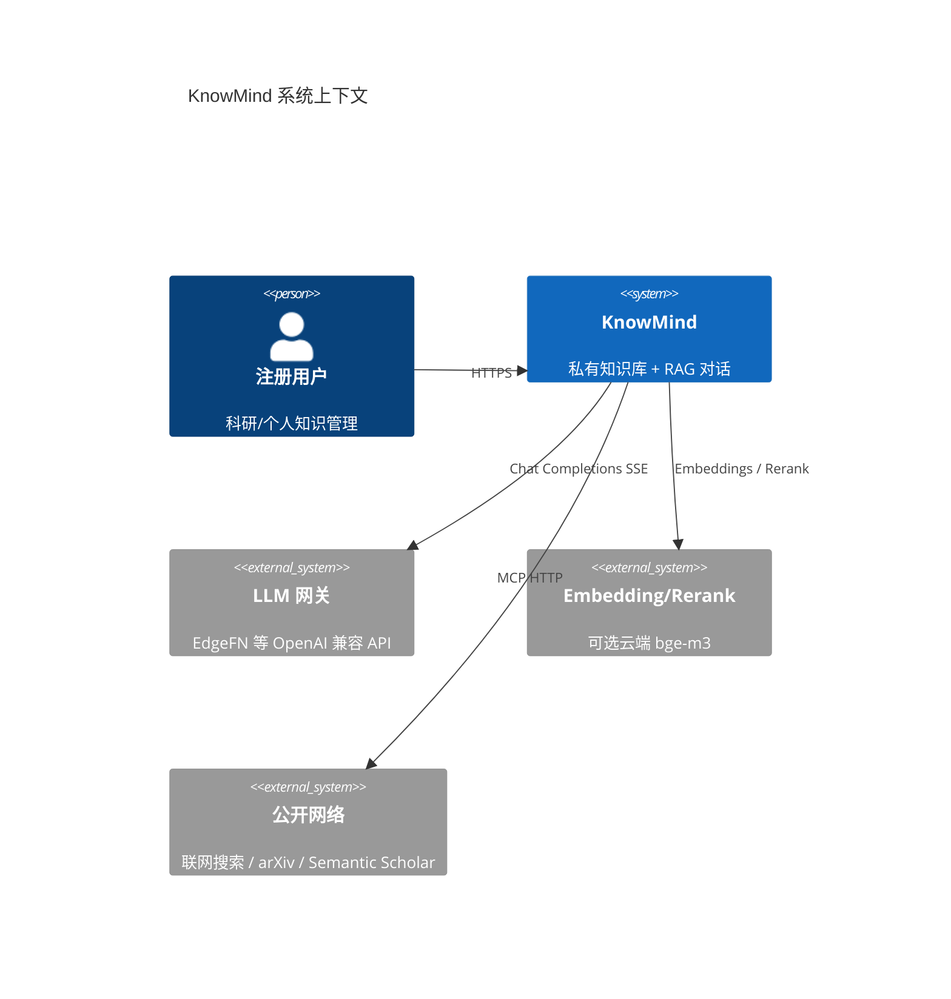
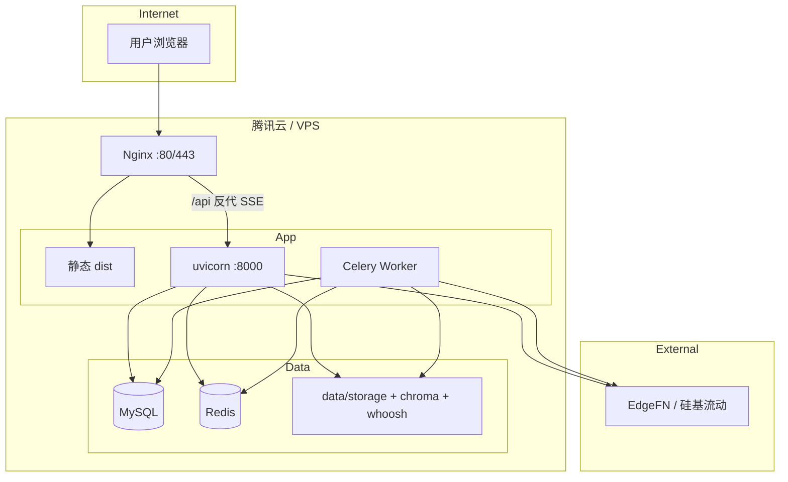
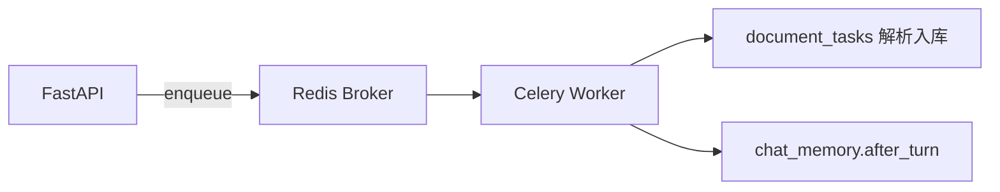
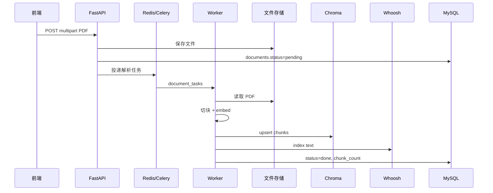
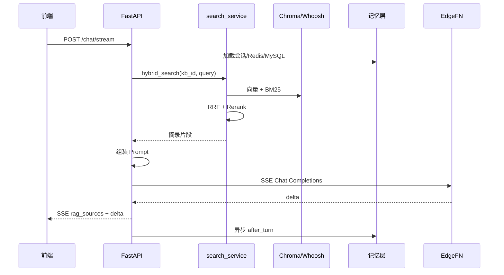
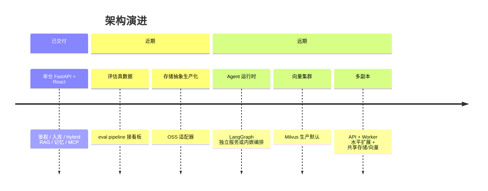

# KnowMind 架构方案

| 属性 | 内容 |
|------|------|
| **文档版本** | v1.0 |
| **编写日期** | 2026-06-04 |
| **适用仓库** | KnowMind 单仓 |
| **关联文档** | [设计技术方案](KnowMind_设计技术方案.md) |

---

## 1. 系统上下文

KnowMind 为**私有化部署**的 Web 应用：终端用户通过浏览器访问 React SPA，经 HTTPS 调用 FastAPI 后端；后端连接 MySQL、Redis、本地/云端向量与全文索引，并通过 OpenAI 兼容网关调用大模型与（可选）云端 Embedding/Rerank。



---

## 2. 逻辑架构

### 2.1 分层视图

```text
┌─────────────────────────────────────────────────────────────────┐
│  表现层   knowmind-web (React SPA)                               │
│           页面：对话 / 知识库 / 文档 / 报告 / 专家 / 工具 / 设置    │
└────────────────────────────┬────────────────────────────────────┘
                             │ REST + SSE (/api/v1)
┌────────────────────────────▼────────────────────────────────────┐
│  应用层   knowmind-server (FastAPI)                              │
│           API 路由 · 鉴权 · 编排 · SSE 网关                       │
│           Services: chat, rag, search, document, expert, mcp...  │
└─┬──────────┬──────────┬────────────┬──────────────┬─────────────┘
  │          │          │            │              │
  ▼          ▼          ▼            ▼              ▼
┌──────┐ ┌──────┐ ┌──────────┐ ┌──────────┐ ┌──────────────────┐
│MySQL │ │Redis │ │  Celery  │ │ Chroma   │ │ Whoosh + 本地文件 │
│元数据│ │缓存/ │ │  Worker  │ │ 向量索引 │ │ BM25 + PDF 存储   │
│      │ │队列  │ │ 解析任务 │ │          │ │                   │
└──────┘ └──────┘ └──────────┘ └──────────┘ └──────────────────┘
                              │
                              ▼
                    ┌─────────────────────┐
                    │ knowmind-mcp       │
                    │ 工具实现与协议适配  │
                    └─────────────────────┘
                              │
                              ▼
                    ┌─────────────────────┐
                    │ 外部 LLM / 搜索 API │
                    └─────────────────────┘
```

### 2.2 代码仓与职责

| 包/目录 | 架构角色 | 说明 |
|---------|----------|------|
| `knowmind-web` | 前端表现层 | 静态资源构建为 `dist/`，无服务端渲染 |
| `knowmind-server` | 核心应用服务 | 唯一对外业务 API；任务编排、RAG、鉴权 |
| `knowmind-mcp` | 工具适配层 | MCP 协议工具实现，被 Server 注册调用 |
| `knowmind-agent` | Agent 运行时（规划） | LangGraph 占位，未接入主链路 |
| `knowmind-eval` | 质量评估子系统 | 离线 RAGAS Pipeline，结果供看板读取 |

**依赖关系（uv workspace）：** 根 `pyproject.toml` 聚合 server、agent、eval、mcp；Server 运行时依赖 `knowmind-mcp`。

---

## 3. 部署架构

### 3.1 推荐生产拓扑（单机）



| 进程 | 说明 |
|------|------|
| **Nginx** | 同域托管前端；`/api` 反代后端；`proxy_buffering off` 支持 SSE |
| **uvicorn** | `app.main:app`，建议只监听 `127.0.0.1:8000` |
| **Celery Worker** | `app.workers.celery_app`；与 API 共用 `.env` |
| **MySQL** | 元数据；可与 Docker 共存（注意 3306 端口冲突） |
| **Redis** | Broker + 对话热缓存 |

### 3.2 开发环境差异

| 项 | 开发 | 生产 |
|----|------|------|
| 前端 | Vite dev `:5173`，代理 `/api` | `pnpm build` + Nginx |
| 解析 | 可 `INGEST_BACKGROUND_THREAD=true` | Celery Worker |
| Celery | `CELERY_TASK_ALWAYS_EAGER=true` 可同步 | 独立 Worker 进程 |
| 嵌入 | 常用 `EMBEDDING_MODE=http` 免 GPU | 同左或本地 `bge` |

### 3.3 网络与安全边界

| 端口 | 暴露 | 说明 |
|------|------|------|
| 80/443 | 公网 | 仅 Nginx |
| 8000 | 内网 | 禁止公网直连 |
| 3306 | 内网 | MySQL |
| 6379 | 内网 | Redis |

---

## 4. 运行时组件

### 4.1 FastAPI 应用

```text
app/main.py
  ├── CORSMiddleware
  ├── lifespan → init_db / eval_bootstrap
  └── api_router (/api/v1)
        ├── auth, knowledge_bases, documents
        ├── knowledge_items, categories, distill
        ├── conversations, chat, chat_attachments
        ├── reports, experts, mcp_tools
        ├── workspace_files, evaluation, analytics
        └── health
```

**横切能力：**

- `app/api/deps.py`：当前用户、DB Session
- `app/core/config.py`：Pydantic Settings，读取 `knowmind-server/.env`
- `app/db/session.py`：异步 SQLAlchemy + asyncmy

### 4.2 异步任务



| 任务 | 触发 | 作用 |
|------|------|------|
| 文档解析 | 上传/重试 | PDF → chunk → embed → Chroma/Whoosh |
| 对话后置 | 每轮结束 | 对话向量写入、条件摘要 |

### 4.3 索引子系统

```text
app/indexing/
  ├── vector_factory.py    → Chroma / Milvus 适配
  ├── vector_chroma.py
  └── whoosh_index.py      → 按 kb_id 分目录 BM25
```

**双 collection 策略：**

| Collection | 内容 |
|------------|------|
| `doc_chunks_bge_m3`（可配置） | 文档与已发布条目块 |
| `chat_memory_bge_m3`（可配置） | 对话滑动窗口块与摘要块 |

### 4.4 MCP 工具链

```text
用户启用工具 → mcp_registry 加载配置
    → chat_service / agent_orchestrator 组装 tool 描述
    → knowmind-mcp 各模块 HTTP/stdio 调用
    → 结果回注 Prompt 或 SSE 事件
```

---

## 5. 数据架构

### 5.1 数据分类

| 类型 | 存储 | 一致性 |
|------|------|--------|
| 结构化业务数据 | MySQL | ACID，Alembic 迁移 |
| 会话热数据 | Redis | 可重建，TTL 淘汰 |
| 语义索引 | Chroma 文件 | 可由 MySQL+文件重建 |
| 全文索引 | Whoosh 目录 | 可随文档任务重建 |
| 二进制文件 | 本地 `STORAGE_LOCAL_ROOT` | 与 `documents.storage_key` 对应 |

### 5.2 多租户隔离

```text
所有业务表含 user_id 和/或 kb_id
API 层：JWT → user_id → 校验资源归属
向量查询：metadata filter user_id + kb_id
Whoosh：按 kb_id 分索引目录
```

### 5.3 数据流：文档入库



### 5.4 数据流：RAG 对话



### 5.5 数据流：对话记忆写入

```text
写入：Client → API → MySQL（消息）→ Redis（近期窗口）→ 异步 Embedding → Chroma chat_memory
                              ↘ 满足触发条件 → 摘要 LLM → MySQL → 向量库

读取：Redis（未命中则 MySQL）→ 向量检索 + 最近 K 条 → 组装 Prompt → LLM
```

**原则：** MySQL 先写入 → Redis 更新 → 异步向量/摘要；禁止仅以缓存为唯一事实源。

---

## 6. 集成架构

### 6.1 外部依赖

| 依赖 | 协议 | 用途 |
|------|------|------|
| EdgeFN | OpenAI 兼容 REST | 对话、可选 Embedding/Rerank |
| 硅基流动 | OpenAI 兼容 REST | DeepSeek-OCR 识图 |
| Brave Search | REST API | 联网搜索增强（可选） |
| arXiv / Semantic Scholar | HTTP | 学术 MCP |
| HuggingFace | HTTPS | 本地 `bge` 模式拉取模型 |

### 6.2 前端集成

```text
浏览器 → 同源 /api/v1（Nginx 反代）
apiFetch:
  Authorization: Bearer access_token
  401 → POST /auth/refresh → 重试
SSE:
  EventSource 或 fetch stream 解析 event: type
```

---

## 7. 安全架构

| 层 | 措施 |
|----|------|
| 传输 | 生产 HTTPS |
| 认证 | JWT access + refresh；`JWT_SECRET` 强随机 |
| 授权 | 资源级 `user_id` / `kb_id` 校验 |
| 密码 | bcrypt |
| 上传 | 扩展名/MIME 校验；存储路径不可穿越 |
| 文件工具 | `FILE_WRITER_ALLOWED_ROOTS` 白名单 |
| 密钥 | `.env` 不入库；日志不打印明文 prompt/密钥 |
| 暴露面 | 安全组仅 22/80/443；数据库/redis 不对公网 |

---

## 8. 扩展架构

| 扩展点 | 接口/配置 | 目标 |
|--------|-----------|------|
| 对象存储 | `StorageBackend` | OSS / S3 |
| 向量库 | `vector_factory`、`MILVUS_URI` | 远程 Milvus 集群 |
| 嵌入 | `EMBEDDING_MODE` | bge / http / hash |
| Rerank | `RERANK_MODE` | local / http |
| LLM | `EDGEFN_*` | 任意 OpenAI 兼容网关 |
| 任务队列 | Celery / 后台线程 | 开发/生产切换 |
| Agent | `knowmind-agent` | LangGraph Plan-and-Execute |
| 评估 | `knowmind-eval` | CI 接入 RAGAS 门禁 |

---

## 9. 与课题/PRD 架构差异说明

| 文档原表述 | 当前实现 |
|------------|----------|
| 向量库默认 Milvus Lite | **Chroma 持久化** 为默认；Milvus 为可选配置 |
| 对话主路仅向量 | **Hybrid**：RRF + Rerank 已落地于 `search_service` |
| 三角色 RBAC + `/admin` | 课题流程中的**可选顶配**；主线为单用户 JWT |
| LangGraph 执行面板 | `knowmind-agent` 占位；深度研究为 Server 内多步预取 |

---

## 10. 演进路线（架构视角）



---

## 11. 关联文档

- [KnowMind_设计技术方案.md](KnowMind_设计技术方案.md) — 模块设计、接口摘要、部署与非功能需求

---

*维护说明：部署方式、中间件或主链路变更时更新 §3、§5；新增子系统时更新 §2、§4。*
