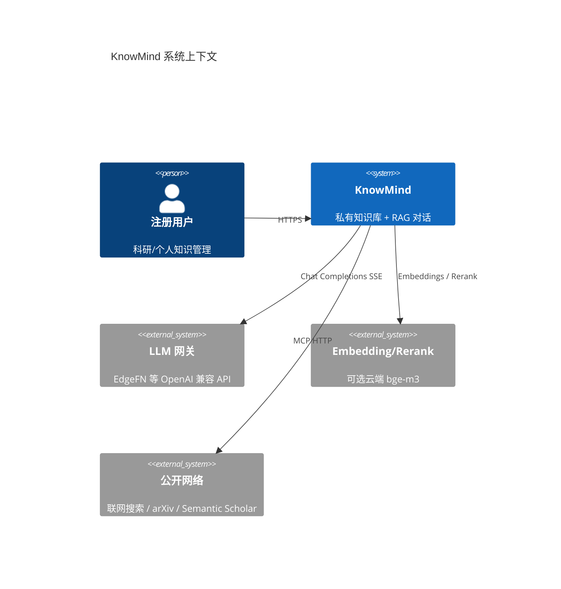
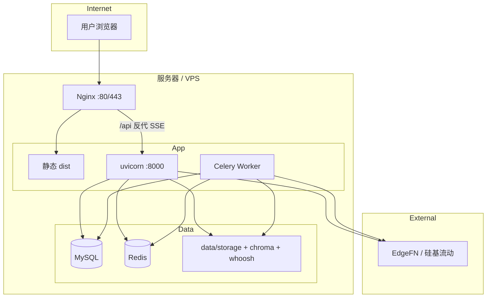
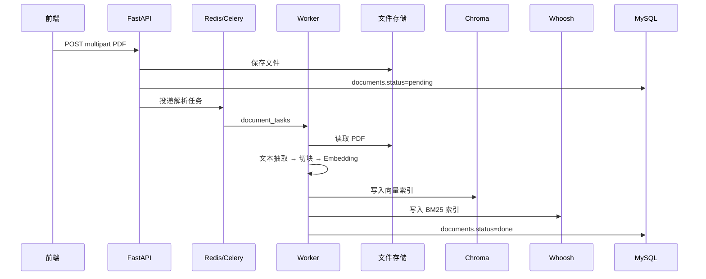

# KnowMind 项目答辩文档

| 属性 | 内容 |
|------|------|
| **项目名称** | KnowMind |
| **项目定位** | AI Native 私有知识库平台 |
| **代码仓库** | [https://github.com/panderBother/ScholarMind](https://github.com/panderBother/ScholarMind) |
| **文档版本** | 2026-06 |

---

## 一、项目介绍

### 1.1 产品定义

**KnowMind** 是一款面向个人与团队的 **AI Native 私有知识库平台**。用户注册登录后，可自助创建多个知识库、上传 PDF 文档并完成自动解析与索引，在对话页基于所选知识库进行 **Hybrid RAG（混合检索增强生成）** 流式问答，并将对话结果提炼为结构化知识条目、一键生成带脚注的研究报告。

### 1.2 解决的核心问题

| 痛点 | KnowMind 的解法 |
|------|----------------|
| 文档散落，难以快速检索 | 统一入库 + 向量 + 全文双路索引 |
| 通用大模型不了解「我的材料」 | 基于私有知识库的 RAG，回答附带可核对引用 |
| 问答结果难以沉淀复用 | 对话提炼条目、生成报告，发布后可再次被检索 |
| 需要联网 / 学术检索等扩展能力 | 内置 MCP 工具链，支持联网搜索、arXiv、Semantic Scholar 等 |

### 1.3 典型用户

- 科研人员：管理论文 PDF，对文献库提问并生成研究报告
- 知识工作者：整理笔记与文档，基于私有材料进行智能问答
- 个人用户：构建个人第二大脑，实现「问题 → 检索 → 回答 → 沉淀」闭环

### 1.4 核心价值链路

```text
文档 / URL / 对话
    → 解析切块 → Embedding
    → Chroma 向量索引 + Whoosh BM25 全文索引
    → 混合检索（向量 + BM25 + RRF + Rerank）→ Prompt 注入
    → SSE 流式回答（可点击 [N] 引用溯源）
    → 条目沉淀 / 报告导出
```

### 1.5 设计目标

| 编号 | 目标 | 实现要点 |
|------|------|----------|
| G-01 | 5 分钟内完成「注册 → 建库 → 上传 → 问答」 | 后台线程或 Celery 异步解析；http 嵌入免本地下载模型 |
| G-02 | 回答基于私有材料，可核对依据 | Hybrid RAG + 引用编号与 PDF / 条目跳转 |
| G-03 | 多用户数据隔离 | JWT 鉴权 + API 层 `user_id` 校验 |
| G-04 | 可本地开发、可单机生产部署 | 环境变量配置；Chroma / Whoosh 本地持久化；Docker Compose 一键部署 |

---

## 二、系统架构

### 2.1 系统上下文



### 2.2 逻辑分层架构

```text
┌─────────────────────────────────────────────────────────────────┐
│  表现层   knowmind-web (React SPA)                               │
│           页面：对话 / 知识库 / 文档 / 报告 / 专家 / 工具 / 设置    │
└────────────────────────────┬────────────────────────────────────┘
                             │ REST + SSE (/api/v1)
┌────────────────────────────▼────────────────────────────────────┐
│  应用层   knowmind-server (FastAPI)                              │
│           API 路由 · 鉴权 · 编排 · SSE 网关                       │
│           Services: chat, rag, search, document, expert, mcp...  │
└─┬──────────┬──────────┬────────────┬──────────────┬─────────────┘
  │          │          │            │              │
  ▼          ▼          ▼            ▼              ▼
┌──────┐ ┌──────┐ ┌──────────┐ ┌──────────┐ ┌──────────────────┐
│MySQL │ │Redis │ │  Celery  │ │ Chroma   │ │ Whoosh + 本地文件 │
│元数据│ │缓存/ │ │  Worker  │ │ 向量索引 │ │ BM25 + PDF 存储   │
│      │ │队列  │ │ 解析任务 │ │          │ │                   │
└──────┘ └──────┘ └──────────┘ └──────────┘ └──────────────────┘
                              │
                              ▼
                    ┌─────────────────────┐
                    │ knowmind-mcp       │
                    │ 工具实现与协议适配  │
                    └─────────────────────┘
                              │
                              ▼
                    ┌─────────────────────┐
                    │ 外部 LLM / 搜索 API │
                    └─────────────────────┘
```

### 2.3 部署架构（生产环境）



### 2.4 仓库结构与模块职责

| 目录 | 架构角色 | 说明 |
|------|----------|------|
| `knowmind-web/` | 前端表现层 | React + Vite + Tailwind，构建为静态 SPA |
| `knowmind-server/` | 核心应用服务 | FastAPI 后端，唯一对外业务 API |
| `knowmind-mcp/` | 工具适配层 | MCP 协议工具实现（联网搜索、学术检索、文件读写等） |
| `knowmind-eval/` | 质量评估子系统 | 离线 RAGAS 评估流水线，结果供看板读取 |
| `knowmind-agent/` | Agent 运行时（规划中） | LangGraph 占位，尚未接入主链路 |
| `docs/` | 工程文档 | 设计技术方案、架构方案、部署说明等 |
| `docker/` | 容器化配置 | Dockerfile、Nginx 配置、入口脚本 |

### 2.5 典型用户工作流


### 2.6 文档入库数据流



---

## 三、核心功能

### 3.1 功能模块总览

| 模块 | 能力摘要 | 前端路由 |
|------|----------|----------|
| **鉴权** | 邮箱注册/登录、JWT + Refresh 自动续期 | `/login` |
| **知识库** | 创建、列表、重命名、删除；多租户按 `user_id` 隔离 | `/knowledge-bases` |
| **文档管理** | PDF 上传/预览/删除、解析状态机、失败重试 | `/documents` |
| **知识条目** | 分类树、草稿/发布/归档、URL 导入、对话提炼 | `/documents` |
| **智能对话** | SSE 流式 RAG、深度研究、附件、可点击 `[N]` 引用 | `/chat` |
| **会话记忆** | MySQL 事实源 + Redis 热读 + 对话向量 + 周期摘要 | `/chat` 会话侧栏 |
| **领域专家** | 领域人设、流式对话、学术检索开关 | `/experts` |
| **研究报告** | 由对话生成、Markdown/PDF 导出、脚注溯源 | `/reports` |
| **MCP 工具** | 内置/自定义工具、导入 mcp.json、工作区文件 API | `/tools` |
| **评估看板** | RAGAS 流水线、忠实度/召回等指标趋势 | `/evaluation` |
| **知识分析** | 检索/对话打点、库级统计 | `/knowledge-bases/:kbId/analytics` |

### 3.2 智能对话（核心亮点）

- **Hybrid RAG 检索**：向量检索（Chroma）+ 全文检索（Whoosh BM25）+ RRF 融合 + Rerank 重排
- **SSE 流式输出**：实时返回生成内容，支持 Markdown 渲染与代码高亮
- **可点击引用**：回答正文中的 `[1]`、`[^2]` 等编号可点击，直达 PDF 对应页或知识条目
- **深度研究模式**：多步预取，结合知识库与外部工具进行扩展检索
- **对话附件**：支持上传临时文件参与当轮对话
- **多轮会话记忆**：保留历史上下文，支持会话列表管理

### 3.3 知识库与文档

- 支持创建多个私有知识库，展示文档数量、存储与更新时间
- PDF 上传：单文件 ≤ 50MB，单次最多 20 个
- 解析状态：`pending` → `processing` → `done` / `failed`，失败可重试
- 除 PDF 外，还支持从对话提炼、URL 采集等来源的知识条目管理

### 3.4 知识沉淀

- **提炼到知识库**：将对话中的有价值内容提炼为结构化知识条目
- **生成报告**：一键生成带摘要与脚注的研究报告，支持导出 Markdown 与 PDF
- **条目生命周期**：草稿 → 已发布 → 已归档，已发布条目进入检索池

### 3.5 MCP 工具与集成

内置并可扩展的 MCP（Model Context Protocol）工具：

| 工具 | 说明 |
|------|------|
| 联网搜索 | 实时检索公开网络信息 |
| arXiv | 学术论文检索 |
| Semantic Scholar | 学术文献语义检索 |
| 本地文件读写 | 工作区文件操作 |
| 自定义 MCP | 支持从 Cursor / Claude 等环境导入 `mcp.json` 配置 |

### 3.6 RAG 评估

- 集成 `knowmind-eval` 离线评估流水线
- 支持 RAGAS 指标（忠实度、答案相关性、上下文召回/精准）
- 前端评估看板展示趋势与版本对比

---

## 四、技术选型

### 4.1 技术栈总览

| 层次 | 技术 | 选型理由 |
|------|------|----------|
| **前端** | React 18 + Vite + TypeScript | 现代 SPA 开发体验，热更新快 |
| **UI** | Tailwind CSS | 原子化 CSS，快速构建一致界面 |
| **Markdown** | Streamdown + Shiki | 流式 Markdown 渲染与代码高亮，支持 CJK 排版 |
| **后端** | FastAPI + Python 3.11+ | 异步高性能，OpenAPI 自动生成 |
| **ORM** | SQLAlchemy 2.x（asyncmy） | 异步 MySQL 访问 |
| **数据库** | MySQL 8.x | 成熟稳定，多租户元数据存储 |
| **缓存/队列** | Redis + Celery | 任务队列与会话热缓存 |
| **向量索引** | Chroma | 本地持久化，免运维 |
| **全文索引** | Whoosh（BM25） | 轻量本地全文检索，与向量互补 |
| **嵌入模型** | bge-m3（本地）/ http（云端）/ hash（测试） | 可降级，开发环境免 GPU |
| **大模型** | EdgeFN 等 OpenAI 兼容网关 | 统一 Chat Completions + SSE 接口 |
| **鉴权** | JWT（HS256）+ Refresh Token | 无状态鉴权，前端自动续期 |
| **容器化** | Docker Compose | 一键部署 MySQL / Redis / API / 前端 |
| **包管理** | uv（Python）+ pnpm（Node） | 快速依赖安装与 workspace 管理 |
| **评估** | RAGAS | RAG 质量量化评估 |

### 4.2 关键技术决策

| 决策点 | 方案 | 说明 |
|--------|------|------|
| 检索策略 | Hybrid RAG | 向量语义 + BM25 关键词，RRF 融合后 Rerank |
| 索引隔离 | 双 Collection | 文档块与对话记忆分 collection，避免污染 |
| 多租户 | `user_id` + `kb_id` | API 层校验 + 向量 metadata filter |
| 解析任务 | Celery / 后台线程二选一 | 开发用后台线程免 Redis；生产用 Celery |
| 存储抽象 | `StorageBackend` | 本地存储可替换为对象存储 |
| 向量后端 | `vector_factory` | 默认 Chroma，可切换 Milvus |

### 4.3 环境依赖

| 依赖 | 版本/说明 |
|------|-----------|
| Python | 3.11+ |
| Node.js | 18+ |
| pnpm | 前端包管理 |
| MySQL | 8.x |
| Redis | Celery 模式需要 |
| EdgeFN（或兼容 OpenAI 的网关） | 对话与可选云端 Embeddings |

---

## 五、启动方式

### 5.1 方式一：本地开发（推荐入门）

#### 环境准备

```bash
# 1. 克隆仓库
git clone https://github.com/panderBother/ScholarMind.git
cd ScholarMind
```

#### 启动 Redis（Celery 模式需要，可选）

```bash
cd knowmind-server
docker compose -f docker-compose.redis.yml up -d
```

#### 启动后端

```bash
cd knowmind-server
cp env.example .env
# 编辑 .env：DATABASE_URL、JWT_SECRET、EDGEFN_API_KEY 等

uv sync
uv run alembic upgrade head
uv run uvicorn app.main:app --reload --host 127.0.0.1 --port 8000
```

- API 文档：<http://127.0.0.1:8000/docs>
- 健康检查：<http://127.0.0.1:8000/api/v1/health>

**解析任务两种模式（二选一）：**

| 模式 | 配置 | 说明 |
|------|------|------|
| 后台线程（开发推荐） | `.env` 设置 `INGEST_BACKGROUND_THREAD=true` | 无需 Celery，解析在 API 进程内异步执行 |
| Celery Worker | 保持默认，另开终端启动 Worker | 与 API 共用同一 `.env` |

```bash
# Celery Worker（生产或不用后台线程时）
cd knowmind-server
uv run python -m celery -A app.workers.celery_app.celery_app worker -l info
```

#### 启动前端

```bash
cd knowmind-web
pnpm install
pnpm dev    # 默认 http://localhost:5173
```

开发环境通过 Vite 将 `/api` 代理到 `http://127.0.0.1:8000`。

#### 首次使用

1. 打开 <http://localhost:5173/login> 注册并登录
2. 在「知识库」创建库，进入「文档管理」上传 PDF
3. 等待解析完成后，在「智能对话」选择该库开始提问
4. 若回答中出现 `[1]` 等编号，点击可跳转至对应 PDF 页或条目

---

### 5.2 方式二：Docker Compose 生产部署（推荐）

适合服务器一键部署，支持自动重启、健康检查、启动时自动数据库迁移。

```bash
# 1. 克隆并进入项目目录
git clone https://github.com/panderBother/ScholarMind.git
cd ScholarMind

# 2. 配置环境变量（密码、JWT、模型 Key）
cp .env.docker.example .env.docker
# 编辑 .env.docker：MYSQL_ROOT_PASSWORD、JWT_SECRET、EDGEFN_API_KEY 等

# 3. 构建并后台启动
docker compose --env-file .env.docker up -d --build

# 4. 检查 API 是否就绪
docker compose logs -f api
curl -s http://127.0.0.1/api/v1/health
```

浏览器访问：`http://服务器IP/`（默认 80 端口，Nginx 提供前端并反代 `/api`）。

#### Docker 服务说明

| 服务 | 作用 |
|------|------|
| `mysql` | 数据库，数据持久化在 `mysql-data` 卷 |
| `redis` | Celery 任务队列 |
| `api` | FastAPI 后端，启动时自动执行 `alembic upgrade head` |
| `web` | 前端静态资源 + Nginx 反代 API |
| `worker` | Celery Worker（可选，`--profile celery` 启用） |

#### 常用运维命令

```bash
docker compose ps                              # 查看状态
docker compose logs -f api web                 # 查看日志
docker compose --env-file .env.docker up -d --build api   # 重建 API
docker compose down                            # 停止（保留数据卷）
```

---

### 5.3 主要环境变量

| 变量 | 作用 |
|------|------|
| `DATABASE_URL` | MySQL 异步连接 |
| `JWT_SECRET` | JWT 签发密钥 |
| `EDGEFN_API_KEY` / `EDGEFN_API_BASE_URL` / `EDGEFN_CHAT_MODEL` | 对话模型网关 |
| `EMBEDDING_MODE` | `bge` \| `http` \| `hash` |
| `CHROMA_DATA_PATH` / `WHOOSH_INDEX_ROOT` | 向量与全文索引目录 |
| `STORAGE_LOCAL_ROOT` | 上传文件本地根路径 |
| `INGEST_BACKGROUND_THREAD` | `true` 时在本进程内异步解析 |
| `REDIS_URL` | Celery 任务队列 |

完整说明见仓库内 `knowmind-server/env.example`。

---

## 六、代码仓库

### 6.1 仓库地址

| 项目 | 地址 |
|------|------|
| **GitHub** | [https://github.com/panderBother/ScholarMind](https://github.com/panderBother/ScholarMind) |
| **克隆命令** | `git clone https://github.com/panderBother/ScholarMind.git` |

### 6.2 目录结构

```text
KnowMind/
├── knowmind-server/     # FastAPI 后端
│   ├── app/
│   │   ├── api/         # API 路由
│   │   ├── services/    # 业务逻辑
│   │   ├── ingest/      # 文档解析流水线
│   │   ├── indexing/    # 向量与全文索引
│   │   └── models/      # 数据模型
│   ├── alembic/         # 数据库迁移
│   └── tests/           # 后端测试
├── knowmind-web/        # React 前端
│   └── src/
│       ├── pages/       # 页面组件
│       ├── components/  # 通用组件
│       └── services/    # API 封装
├── knowmind-mcp/        # MCP 工具实现
├── knowmind-eval/       # RAG 评估流水线
├── knowmind-agent/      # Agent 运行时（规划中）
├── docker/              # Docker 构建文件
├── docs/                # 工程文档
├── assets/              # 界面截图
├── docker-compose.yml   # 生产部署编排
└── README.md            # 项目说明
```

### 6.3 相关文档

| 文档 | 路径 |
|------|------|
| 项目 README | `README.md` |
| 设计技术方案 | `docs/KnowMind_设计技术方案.md` |
| 架构方案 | `docs/KnowMind_架构方案.md` |
| Docker 部署说明 | `docs/KnowMind_Docker部署.md` |

---

## 七、测试与质量保障

### 7.1 自动化测试

```bash
# 后端单元测试
cd knowmind-server
uv sync --dev
uv run pytest tests/ -q

# 前端构建验证
cd knowmind-web
pnpm run build
```

### 7.2 测试覆盖范围

- 鉴权与知识库 CRUD
- 文档解析与索引
- RAG 检索与引用
- MCP 工具注册与调用
- 报告生成与 PDF 导出
- 聊天同步与会话记忆

### 7.3 RAG 质量评估

通过 `knowmind-eval` 流水线对 RAG 回答质量进行量化评估：

- **忠实度（Faithfulness）**：回答是否忠于检索上下文
- **答案相关性（Answer Relevancy）**：回答与问题的相关程度
- **上下文召回（Context Recall）**：检索是否覆盖所需信息
- **上下文精准（Context Precision）**：检索结果的相关性

---

## 八、项目亮点总结

| 亮点 | 说明 |
|------|------|
| **端到端私有 RAG** | 从文档入库到流式问答到知识沉淀，完整闭环 |
| **Hybrid 混合检索** | 向量 + BM25 双路索引，RRF 融合 + Rerank，检索质量更稳 |
| **可核对引用** | 回答中 `[N]` 编号可点击，直达 PDF 页或知识条目 |
| **MCP 可扩展** | 内置联网搜索、学术检索等工具，支持导入外部 MCP 配置 |
| **多模式部署** | 本地开发、Docker 生产部署均支持，解析任务可灵活切换 |
| **质量可观测** | RAGAS 评估看板，量化 RAG 效果 |
| **工程规范** | 单仓 Monorepo、Alembic 迁移、pytest 测试、OpenAPI 文档 |

---

## 九、演示建议（答辩现场）

### 9.1 推荐演示流程（约 5–8 分钟）

1. **登录注册**（30 秒）：展示简洁的登录界面
2. **创建知识库**（30 秒）：新建知识库，展示多库管理
3. **上传 PDF**（1 分钟）：上传一篇论文，展示解析进度条
4. **智能对话**（2–3 分钟）：
   - 选择知识库提问，展示 SSE 流式回答
   - 点击 `[1]` 引用，跳转 PDF 对应页
   - 开启深度研究或联网搜索，展示 MCP 扩展能力
5. **知识沉淀**（1 分钟）：提炼对话为知识条目，或生成研究报告
6. **报告导出**（30 秒）：展示 Markdown / PDF 导出与脚注溯源
7. **评估看板**（可选，30 秒）：展示 RAG 质量指标

### 9.2 可重点讲解的技术点

- Hybrid RAG 检索链路（向量 + BM25 + RRF + Rerank）
- SSE 流式对话与引用溯源的实现
- 多租户数据隔离方案
- Celery 异步解析 vs 后台线程模式
- MCP 工具链的注册与调用机制

---

## 十、附录

### A. 前端页面路由一览

| 路由 | 页面 |
|------|------|
| `/login` | 登录 / 注册 |
| `/chat` | 智能对话 |
| `/knowledge-bases` | 知识库管理 |
| `/documents` | 文档视图 + 条目视图 |
| `/documents/items/:kbId/:itemId` | 条目详情与编辑 |
| `/reports`、`/reports/:id` | 报告列表与详情 |
| `/evaluation` | RAG 评估看板 |
| `/experts` | 领域专家 |
| `/tools` | MCP 工具与集成 |
| `/settings` | 账户设置 |

### B. 后端 API 模块一览

| 模块 | 主要端点 |
|------|----------|
| 鉴权 | `/api/v1/auth/register`、`/login`、`/refresh` |
| 知识库 | `/api/v1/knowledge-bases` |
| 文档 | `/api/v1/documents` |
| 知识条目 | `/api/v1/knowledge-items` |
| 对话 | `/api/v1/chat`、`/chat/stream`（SSE） |
| 会话 | `/api/v1/conversations` |
| 报告 | `/api/v1/reports` |
| 专家 | `/api/v1/experts` |
| MCP | `/api/v1/mcp-tools` |
| 评估 | `/api/v1/evaluation` |
| 健康检查 | `/api/v1/health` |

---

*本文档基于 KnowMind 仓库当前实现整理，可直接复制至飞书文档使用。Mermaid 图表在飞书中需开启「代码块 → Mermaid」或使用飞书自带的流程图工具重新绘制。*
