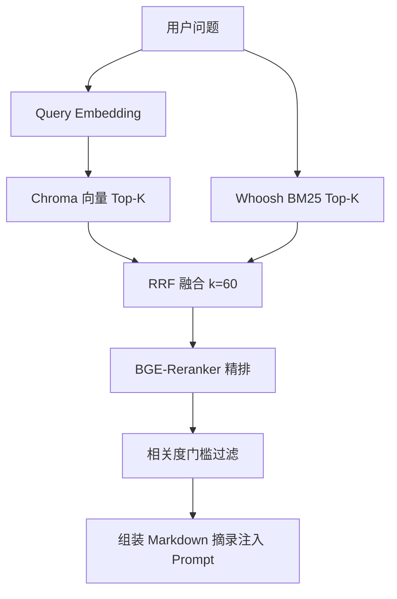

# KnowMind 设计技术方案

| 属性 | 内容 |
|------|------|
| **文档版本** | v1.0 |
| **编写日期** | 2026-06-04 |
| **适用仓库** | KnowMind 单仓 |
| **关联文档** | [架构方案](KnowMind_架构方案.md) |
| **说明** | KnowMind 项目**唯一设计技术方案**，涵盖原 PRD、开发流程、对话记忆、课题流程等文档内容。 |

---

## 1. 概述

### 1.1 产品定义

**KnowMind** 是面向通用知识场景的 **AI Native 私有知识库平台**。用户注册登录后自助创建知识库、上传 PDF、经异步流水线完成解析与双路索引，在对话页基于所选知识库进行 **Hybrid RAG** 流式问答，并可将对话提炼为知识条目、生成研究报告；通过 MCP 扩展联网搜索、学术检索与本地文件读写。

### 1.2 核心价值链

```text
文档/URL/对话 → 解析切块 → Embedding → Chroma + Whoosh
    → 混合检索（向量 + BM25 + RRF + Rerank）→ Prompt 注入
    → SSE 流式回答（可点击引用）→ 条目沉淀 / 报告导出
```

### 1.3 设计目标

| 编号 | 目标 | 技术实现要点 |
|------|------|----------------|
| G-01 | 5 分钟内完成「注册 → 建库 → 上传 → 问答」 | 后台线程或 Celery 解析；http 嵌入免本地下载模型 |
| G-02 | 回答基于私有材料，可核对依据 | Hybrid RAG + 引用编号与 PDF/条目跳转 |
| G-03 | 多用户数据隔离 | JWT + API 层 `user_id` 校验 |
| G-04 | 可本地开发、可单机生产部署 | 环境变量配置；Chroma/Whoosh 本地持久化 |

### 1.4 产品边界

| 范围内 | 范围外（当前版本） |
|--------|-------------------|
| 邮箱注册登录、JWT + Refresh | 多角色 RBAC、组织租户、协作编辑 |
| PDF 入库、知识条目、混合检索对话 | 生产级 OAuth / SSO / 计费 |
| MCP 工具、专家 Agent、报告导出 | 完整 LangGraph 工厂 UI（`knowmind-agent` 占位） |

---

## 2. 系统能力地图

### 2.1 功能模块一览

| 模块 | 能力摘要 | 后端入口 | 前端路由 |
|------|----------|----------|----------|
| **M1 鉴权** | 注册/登录、Refresh 续期、`/auth/me` | `auth.py` | `/login` |
| **M2 知识库** | CRUD、重命名、用户隔离、文档计数 | `knowledge_bases.py` | `/knowledge-bases` |
| **M3 文档** | PDF 上传/预览/删除、MD5 去重、解析状态机 | `documents.py` | `/documents` |
| **M4 知识条目** | 分类树、草稿/发布/归档、URL 导入、对话提炼 | `knowledge_items.py`、`distill.py` | `/documents`、`/production` |
| **M5 混合检索** | 向量 + BM25 + RRF + Rerank；管理端搜索 API | `search_service.py` | 对话内嵌、知识生产页 |
| **M6 对话** | SSE 流式、深度研究、附件、可点击 `[N]` 引用 | `chat.py` | `/chat` |
| **M7 会话记忆** | MySQL 事实源 + Redis 热读 + Chroma 对话向量 + 周期摘要 | `conversations.py`、`chat_memory` 任务 | `/chat` 会话侧栏 |
| **M8 MCP** | 内置/自定义工具、导入 mcp.json、工作区文件 API | `mcp_tools.py`、`workspace_files.py` | `/tools` |
| **M9 专家** | 领域人设、流式对话、学术检索开关 | `experts.py` | `/experts` |
| **M10 报告** | 会话生成、Markdown/PDF 导出、脚注溯源 | `reports.py` | `/reports` |
| **M11 评估** | RAGAS 流水线、看板 API | `evaluation.py`、`knowmind-eval` | 评估页（可选挂载） |
| **M12 分析** | 检索/对话打点、库级统计 | `analytics.py` | `/knowledge-bases/:kbId/analytics` |

### 2.2 典型用户旅程


---

## 3. 技术原则

| 原则 | 说明 |
|------|------|
| **纵向切片** | 每条用户主路径从 API 贯通到存储/模型，再横向扩展 |
| **单用户自助** | 无多角色后台；配置由部署侧 `.env` 管理 |
| **事实源唯一** | 关系库为权威；向量/缓存可重建 |
| **检索与记忆隔离** | 文档块 `doc_chunks_*` 与对话块 `chat_memory_*` 分 collection |
| **存储可替换** | `StorageBackend` 抽象；向量经 `vector_factory` 可切 Milvus |
| **嵌入可降级** | `bge`（本地）/ `http`（EdgeFN 等）/ `hash`（测试） |

---

## 4. 核心模块设计

### 4.1 鉴权与会话

- **注册/登录**：邮箱 + 密码，bcrypt 存储；返回 `access_token` + `refresh_token`。
- **访问令牌**：JWT HS256，默认 7 天；前端 `apiFetch` 在 401 时自动 Refresh 重试。
- **授权**：受保护 API 校验 Bearer Token，资源操作校验 `user_id` 与 `kb_id` 归属。

### 4.2 文档入库与解析流水线

**状态机：**

```text
pending → processing → done
              ↓
           failed → (retry) → processing
```

**流水线步骤：**

1. 校验：PDF、≤50MB、单次 ≤20、MD5 去重。
2. 存储：`STORAGE_LOCAL_ROOT/users/{user_id}/kb/{kb_id}/docs/{doc_id}/`。
3. 调度：生产 **Celery + Redis**；开发可 `INGEST_BACKGROUND_THREAD=true`。
4. 抽取：PyMuPDF 按页文本；可选硅基流动 OCR（图片/PDF）。
5. 切块：语义切块（`CHUNK_MIN/MAX_CHARS`、重叠）。
6. 嵌入：`EMBEDDING_MODE` 写入向量维数须与 `EMBEDDING_VECTOR_DIM` 一致。
7. 索引：Chroma（语义）+ Whoosh（BM25，按库分目录）。
8. 回写：`documents.status`、`chunk_count`；可同步生成 `knowledge_items`。

**关键配置：**

| 变量 | 作用 |
|------|------|
| `INGEST_BACKGROUND_THREAD` | 开发免 Celery |
| `REDIS_URL` | Celery Broker |
| `CHROMA_DATA_PATH` / `WHOOSH_INDEX_ROOT` | 索引持久化 |

### 4.3 知识条目与生命周期

- **来源**：`manual`、`document`、`url`、`distill`、`ai_extract` 等。
- **生命周期**：`draft` → `published` → `archived`；**仅 `published` 参与检索与 RAG**。
- **能力**：分类树 CRUD、URL 预览/导入、对话 `extract-knowledge`、缺口蒸馏（`distill` API）。

### 4.4 混合检索（Hybrid RAG）

**实现位置：** `knowmind-server/app/services/search_service.py`

**流程：**



| 阶段 | 说明 |
|------|------|
| 向量路 | `embed_query` → Chroma，按 `kb_id`、生命周期过滤 |
| BM25 路 | `whoosh_search`，按库分片索引 |
| RRF | `rrf_merge`，以 `chunk_id` 去重融合 |
| Rerank | `RERANK_MODE=http/local`；对话可配置 `RAG_CHAT_SKIP_RERANK` |
| 门槛 | `RAG_MIN_RELEVANCE_SCORE` / `RAG_CHAT_MIN_RELEVANCE_SCORE` |

**对话 RAG** 由 `rag_context.py` 委托 `search_service`；管理端 `GET .../search` 返回 `HybridSearchHit` 列表。

### 4.5 对话与 SSE

**接口：** `POST /api/v1/chat/stream`

**请求字段（核心）：**

| 字段 | 说明 |
|------|------|
| `message` | 用户消息 |
| `knowledge_base_id` | RAG 目标库 |
| `conversation_id` | 续聊；空则新建并 SSE 下发 |
| `deep_research` | 多步预取扩展上下文 |
| `web_search` / `file_tools` | MCP 开关 |

**SSE 事件：**

| 事件 | 说明 |
|------|------|
| `conversation_id` | 新会话 ID |
| `trace_id` | 追踪 ID |
| `rag_sources` | 引用源列表（供前端卡片与 `[N]` 对齐） |
| `thinking_delta` | 推理链增量 |
| `delta` | 正文增量 |
| `done` | 结束 |

**Prompt 组装顺序（逻辑）：**

1. 系统提示（角色、引用规范、工具说明）
2. 知识库检索摘录（文件名、页码）
3. 对话记忆（摘要 + 近期消息 + 向量召回历史）
4. 当前用户消息

**网关：** EdgeFN OpenAI 兼容 `/chat/completions`；识图可走硅基流动 OCR。

### 4.6 对话记忆

| 层级 | 存储 | 职责 |
|------|------|------|
| 事实源 | MySQL `conversations`、`chat_messages`、`conversation_summaries` | 持久化 |
| 热缓存 | Redis `conv:{id}:recent` | 近期消息快读 |
| 语义层 | Chroma `chat_memory_bge_m3`（可配置） | 历史轮次向量召回 |

**默认参数：**

| 参数 | 默认值 |
|------|--------|
| 原文窗口 K | 最近 8 条消息 |
| 原文 token 硬顶 | 4000 |
| 摘要触发 | 10 轮 或 未摘要 8000 tokens |
| 检索注入预算 | 2000 tokens |

**异步任务：** `knowmind.chat_memory.after_turn`（Celery 或 eager 模式）— 嵌入上轮、条件触发摘要。

**Prompt 拼接顺序（利于 Prefix KV 缓存）：** 稳定系统提示 → 会话摘要 → 向量检索块（≤2000 tokens）→ 最近 K 条原文（≤4000 tokens）→ 当前用户输入。块 A 内避免每请求唯一 ID/时间戳。

**一致性原则：** 先写 MySQL 再更新 Redis/向量；向量与库不一致时可从 MySQL 全量重建对话索引。

### 4.7 MCP 与工具

| 工具 | 能力 |
|------|------|
| `web_search` | 联网搜索（可选 Brave API） |
| `arxiv` / `semantic_scholar` | 学术检索 |
| `file_writer` | 白名单目录读写（`FILE_WRITER_ALLOWED_ROOTS`） |
| 外部 MCP | 用户导入 `mcp.json`，SSE 远程工具 |

**模式：** `FILE_TOOLS_MODE=prompt`（默认）或 `native`（网关支持 OpenAI tools 时）。

**实现包：** `knowmind-mcp`；注册于 `app/services/mcp_registry.py`。

### 4.8 专家 Agent

- 表 `expert_profiles`：名称、`system_prompt`、绑定 `kb_id`、默认模型。
- 流式对话：`POST /experts/{id}/chat/stream`，Prompt = 专家人设 + RAG 摘录 + 用户消息。
- 可选学术检索 MCP 开关。

### 4.9 报告与评估

**报告：**

- `POST /conversations/{id}/generate-report` → `research_reports`（`content_md`、`citations_json`）。
- 导出 Markdown / PDF；正文脚注可点击溯源。

**评估：**

- 离线：`knowmind-eval` RAGAS + 简易指标。
- 在线：`POST /evaluation/run`、`GET /evaluation/dashboard` 读 `EVAL_REPORTS_DIR`。

### 4.10 深度研究

多步编排：预取检索与 MCP 结果后一次性注入上下文（`deep_research_executor`），在单轮 SSE 内完成，非 LangGraph 可视化面板。

---

## 5. 数据设计摘要

### 5.1 关系模型（MySQL）

```text
users 1──N knowledge_bases 1──N documents
              │              1──N knowledge_categories
              │              1──N knowledge_items
              │              1──N research_reports
users 1──N conversations 1──N chat_messages
              └──N conversation_summaries
```

**ORM：** `knowmind-server/app/models/orm.py`  
**迁移：** `knowmind-server/alembic/versions/`

### 5.2 向量与全文

| 存储 | 用途 | 默认 |
|------|------|------|
| Chroma | 文档块、对话记忆块 | `doc_chunks_bge_m3`、`chat_memory_bge_m3` |
| Whoosh | BM25 全文 | `WHOOSH_INDEX_ROOT/{kb_id}/` |

**Chunk Metadata：** `user_id`、`kb_id`、`doc_id`、`item_id`、`page_index`、`chunk_index`、`lifecycle_status`

### 5.3 文件存储

本地路径：`STORAGE_LOCAL_ROOT`；键规则见 `document_service` 与 `StorageBackend` 实现。

---

## 6. 接口设计摘要

- **Base URL：** `/api/v1`
- **认证：** `Authorization: Bearer <access_token>`
- **错误：** `{"detail": {"code": "...", "message": "..."}}` 或标准 HTTP detail

**模块前缀：**

| 前缀 | 模块 |
|------|------|
| `/auth` | 注册、登录、Refresh、me |
| `/knowledge-bases` | 库、文档、条目、分类、搜索、蒸馏、分析 |
| `/conversations` | 会话 CRUD、提炼、生成报告 |
| `/chat` | 流式/同步对话、反馈、附件 |
| `/reports` | 报告 CRUD、导出 |
| `/experts` | 专家 CRUD、流式对话 |
| `/mcp/tools` | 工具配置 |
| `/workspace/files` | 文件读写 |
| `/evaluation` | 评估看板与触发 |
| `/health` | 健康检查 |

完整 OpenAPI 契约见运行中的 Swagger：`http://127.0.0.1:8000/docs`。

---

## 7. 前端技术方案

| 项 | 选型 |
|----|------|
| 框架 | React 18 + TypeScript |
| 构建 | Vite 5 |
| 样式 | Tailwind CSS 3 |
| 路由 | React Router 6 |
| 流式 Markdown | Streamdown + Shiki + `@streamdown/cjk` |
| HTTP | `apiFetch` 封装（401 自动 Refresh） |

**布局：** `/login` 全屏；其余 `AppShell`（侧栏 + 内容区，移动端 Tab）。

**对话页要点：** 会话列表、知识库选择器、SSE 解析、`rag_sources` 与正文 `[N]` 引用点击跳转 PDF/条目。

---

## 8. 非功能需求

| 类别 | 要求 |
|------|------|
| 性能 | RAG 检索 P95 ≤800ms（不含 LLM）；对话首 Token 依赖网关 |
| 安全 | 生产 HTTPS；强 `JWT_SECRET`；上传防路径穿越；文件工具白名单 |
| 可用性 | 向量不可用可降级无 RAG 对话；解析失败可重试 |
| 可维护性 | `uv` + pytest；Alembic 迁移；`pnpm build` |
| 可扩展性 | 存储/向量/嵌入/LLM 均可通过配置切换 |

---

## 9. 部署与运维

| 组件 | 要求 |
|------|------|
| MySQL | 8.x |
| Redis | 6+（Celery + 会话缓存） |
| Python | 3.11+，推荐 uv |
| Node | 18+，pnpm 构建前端 |
| 模型网关 | EdgeFN 或 OpenAI 兼容 API |

**推荐生产拓扑：** Nginx 托管 `knowmind-web/dist`，反代 `/api` → uvicorn:8000；Celery Worker 与 API 共用 `.env`；**勿对公网开放** 3306/6379/8000。

**数据备份目录：** `data/storage`、`data/chroma`、`data/whoosh`、MySQL 库。

完整启动步骤见根目录 [README.md](../README.md)。

---

## 10. 源码索引

| 能力 | 路径 |
|------|------|
| 配置 | `knowmind-server/app/core/config.py` |
| 混合检索 | `knowmind-server/app/services/search_service.py` |
| RAG 上下文 | `knowmind-server/app/services/rag_context.py` |
| 对话 | `knowmind-server/app/services/chat_service.py` |
| 解析任务 | `knowmind-server/app/workers/document_tasks.py` |
| 向量/Whoosh | `knowmind-server/app/indexing/` |
| MCP | `knowmind-mcp/` |
| 前端页面 | `knowmind-web/src/pages/` |

---

## 11. 关联文档

- [KnowMind_架构方案.md](KnowMind_架构方案.md) — 逻辑架构、部署拓扑、数据流与安全

---

*维护说明：代码能力变更时同步更新 §2、§4。*
