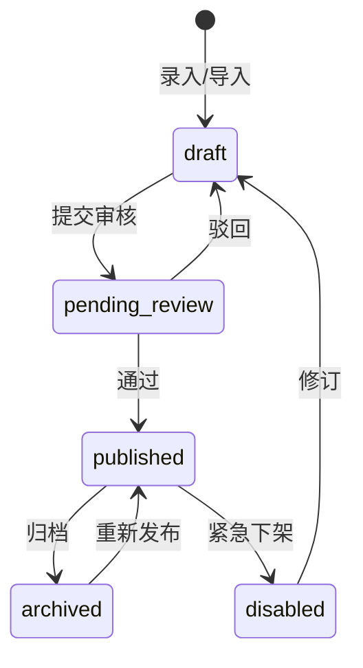
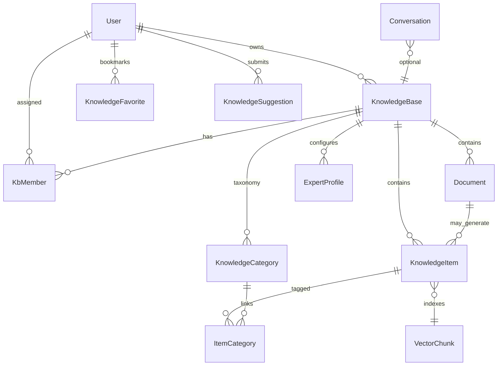
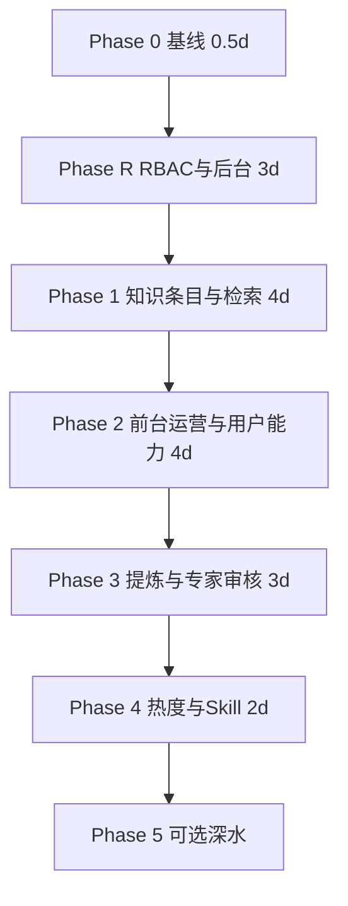

# KnowMind：课题「AI 知识库管理平台」最高规格执行流程（v1.1）

> **文档用途**：将课程/课题 rubric（2.1–2.5）与仓库现状对齐，给出**可逐周执行**的最高规格落地路线。  
> **依据**：课题要求「知识生产 / 管理 / 消费」+ 基础要求 2.4 + 加分项 2.5；仓库现状以 `README.md` 与代码为准（2026-05）。  
> **原则**：在现有 **PDF 入库 → Chroma + Whoosh → RAG 流式对话** 主干上**叠加**能力，避免推倒重来；每条 Phase 以**可演示纵向切片**验收。  
> **关联文档**：[开发流程与步骤](KnowMind_开发流程与步骤_v1.md)、[对话记忆与上下文技术方案](KnowMind_对话记忆与上下文技术方案_v1.md)、根目录 `README.md`。

---

## 1. 课题对齐总览

### 1.1 课题目标映射

| 课题能力 | 最高规格定义（本仓库） | 当前基线 | 目标状态 |
|----------|------------------------|----------|----------|
| 知识生产 | 手动录入 + 文档导入 + **对话/AI 提炼入库** | PDF 导入 + 切块索引 | 三路生产闭环 |
| 知识管理 | **知识条目** CRUD、标签、**可用/不可用**、混合检索 | 知识库 + 文档（解析状态） | 管理端可搜可管可禁用 |
| 知识消费 | **专家 Agent 对话** + **Skill/MCP 导出** | RAG 流式对话；MCP 工具页 | 专家向导 + 对外 Skill |
| 基础体验 | 路径清晰、消费端流畅 | 已具备 | 保持并补管理端检索页 |
| 加分项 | 提炼闭环、多模态、热度、一键专家、评估真数据 | 大多未做 | Phase 3–5 逐项闭合 |
| **组织与权限** | **三角色 RBAC + 前台/后台分端** | 仅单用户 JWT，无角色 | 系统管理员后台 + 知识管理员前台 + 普通用户前台 |

### 1.2 答辩定位（一句话）

> **面向科研与文档的 AI 知识库管理平台**：三角色分工（系统管理员 / 知识管理员 / 普通用户），前台消费与知识运营、后台系统治理；知识条目全生命周期与审核发布；混合检索 + RAG 问答 + 专家 Agent 审核 + 模型统一配置。

### 1.3 与现有 PRD 文档的关系

| 文档 | 关系 |
|------|------|
| `KnowMind_PRD_v2.0.md` / `.docx` | **权威产品规格**（v2.0，升级自 KnowMind AI PRD） |
| `KnowMind_开发流程与步骤_v1.md` | PRD 12 周里程碑与代码仓映射；本文件为**课题 rubric 补强**专轨，可并行执行 |
| `KnowMind_对话记忆与上下文技术方案_v1.md` | 对话记忆已实现；**提炼入库**与之独立，勿把 Redis/对话向量当作知识库回写 |

---

## 2. 现状缺口矩阵（执行前必读）

| Rubric 条目 | 现状 | 最高规格必须补齐 |
|-------------|------|------------------|
| 知识创建/编辑/删除 | 库创删、PDF 上传；**无库改名、无文档删、无单条知识编辑** | KnowledgeItem CRUD + 库 PATCH + 文档 DELETE |
| 检索 | 对话前仅**向量**；Whoosh 仅写入未查询 | 管理端搜索 API + **BM25 + 向量 RRF** |
| 条目状态可用/不可用 | 仅有 `pending/processing/done/failed`（流水线） | `active` / `disabled`，检索与 RAG **过滤 disabled** |
| 知识消费 | RAG 对话 ✅ | 保留；加**专家向导** + **Skill 导出** |
| 使用提炼新知识 | 无 | 对话后「提炼 → 确认 → 入库」 |
| 多模态 | PDF 文本 | 图片 OCR + 表格 Markdown（P2） |
| 热度可视化 | Eval 看板为示意数据 | 检索/引用打点 + 统计 API + 图表页 |
| 一键专家 Agent | 对话页选库即可 | 独立「创建专家」流程 + 固定专家会话 |
| LangGraph 深度编排 | 占位 | P2 可选，**不阻塞**课题满分演示 |
| 三角色与权限 | 无 | `system_admin` / `knowledge_admin` / `user` + 前后台菜单隔离 |
| 知识审核发布 | 无 | 条目状态机：草稿→待审→已发布→归档 |
| 用户建议/收藏 | 无 | `knowledge_suggestions` + `knowledge_favorites` |

---

## 3. 角色与权限体系（RBAC）

### 3.1 前后台分端

| 端 | 目录/路由 | 主要使用者 | 说明 |
|----|-----------|------------|------|
| **前台（用户端）** | `knowmind-web`，路由 `/`、`/chat`、`/knowledge-bases`… | 普通用户、知识管理员 | 知识查询、对话、收藏、提交建议；知识管理员额外可见「知识运营」菜单 |
| **后台（管理端）** | 同仓 `knowmind-web/src/admin/*` 或独立 `knowmind-admin`，路由 **`/admin/*`** | **系统管理员** | 用户权限、模型配置、Agent 审核、系统监控；**与普通用户界面隔离** |

实现建议（最高规格）：

- **MVP**：单 SPA + `RequireRole` 路由守卫 + 按角色渲染侧边栏（不必拆两个仓库）。
- **顶配**：`knowmind-admin` 独立 Vite 应用，共用同一 FastAPI 与 JWT，仅 `role=system_admin` 可访问 `/api/v1/admin/*`。

登录后 `GET /api/v1/auth/me` 返回 `role`、`kb_scopes`（知识管理员绑定的库列表），前端一次决定进入前台或跳转 `/admin`。

### 3.2 角色定义与职责

#### 3.2.1 系统管理员（`system_admin`）

| 职责域 | 具体能力 | 后台页面（建议） |
|--------|----------|------------------|
| **用户权限管理** | 用户列表、启用/禁用、分配全局角色、分配知识库级「知识管理员」 | `/admin/users` |
| **模型配置管理** | 对话模型、嵌入模型、API 基址/密钥（脱敏展示）、默认 `rag_top_k` 等 | `/admin/models` |
| **Agent 审核管理** | 审核用户/知识管理员提交的「专家 Agent」与对外 MCP/Skill 配置 | `/admin/agents` |
| **系统监控** | 健康检查、队列积压、索引量、错误率、近 24h 活跃用户数 | `/admin/monitor` |

> 系统管理员**默认不**直接编辑业务知识条目（避免越权）；必要时只读查看各库统计。

#### 3.2.2 知识管理员（`knowledge_admin`）

| 职责域 | 具体能力 | 前台页面（建议） |
|--------|----------|------------------|
| **知识录入维护** | 手动录入、文档上传、编辑条目、批量导入 | `/knowledge-bases/:kbId/items` |
| **分类体系维护** | 维护分类树/标签体系，条目绑定分类 | `/knowledge-bases/:kbId/taxonomy` |
| **知识审核发布** | 审核草稿、待审条目；通过→发布进索引，驳回→退回 | `/knowledge-bases/:kbId/review` |
| **生命周期管理** | 已发布→归档/下架；处理用户「知识建议」 | `/knowledge-bases/:kbId/lifecycle`、`/suggestions` |

知识管理员权限**按知识库授权**（`kb_members.role = knowledge_admin`），可管理多库，但不能访问 `/admin/*`。

#### 3.2.3 普通用户（`user`）

| 职责域 | 具体能力 | 前台页面（建议） |
|--------|----------|------------------|
| **知识查询** | 对已发布条目混合检索、浏览分类 | `/search` 或 KB 内检索 Tab |
| **对话提问** | 选已发布知识库 RAG 对话、专家 Agent（已审核） | `/chat`、`/experts/:id/chat` |
| **收藏知识** | 收藏条目，个人收藏夹 | `/favorites` |
| **提交知识建议** | 提交补充/纠错建议，待知识管理员处理 | 条目页「建议」、 `/my/suggestions` |

普通用户**不可**：直接发布知识、改分类树、进后台、审核 Agent。

### 3.3 权限矩阵（API 级）

| 能力 | system_admin | knowledge_admin | user |
|------|:------------:|:-----------------:|:----:|
| `/admin/*` 全部 | ✅ | ❌ | ❌ |
| 用户/角色 CRUD | ✅ | ❌ | ❌ |
| 模型配置 CRUD | ✅ | ❌ | ❌ |
| Agent/专家 审核 | ✅ | ❌ | ❌ |
| 系统监控只读 | ✅ | ❌ | ❌ |
| 知识库创建/删除 | ✅（可代建） | 授权库 ✅ | 自建库可选¹ |
| 分类体系 CRUD | ❌ | 授权库 ✅ | ❌ |
| 知识条目 录入/编辑 | ❌ | 授权库 ✅ | ❌ |
| 知识 审核/发布/归档 | ❌ | 授权库 ✅ | ❌ |
| 混合检索 / 浏览已发布 | ✅ 只读 | ✅ | ✅ |
| 对话 / 专家（已审核） | ✅ | ✅ | ✅ |
| 收藏 / 提交建议 | ✅ | ✅ | ✅ |
| 处理建议（采纳/驳回） | ❌ | 授权库 ✅ | ❌ |

¹ 课题演示可简化为：**普通用户只能消费**，建库权仅交给知识管理员；若保留「用户自建私有库」，则其库内自任 `owner`，不与其他库混审。

### 3.4 知识条目生命周期（知识管理员）

与 §4 数据模型联动，**仅 `published` 进入检索与 RAG**：



| 状态 | 编码 | 普通用户可见 | 参与检索/RAG |
|------|------|:------------:|:------------:|
| 草稿 | `draft` | ❌ | ❌ |
| 待审核 | `pending_review` | ❌ | ❌ |
| 已发布 | `published` | ✅ | ✅ |
| 已归档 | `archived` | 可选只读 | ❌ |
| 已下架 | `disabled` | ❌ | ❌ |

文档解析入库默认 `pending_review` 或按库配置「自动发布」。

### 3.5 Agent 审核（系统管理员）

专家 Agent / 对外 Skill 增加审核态：

| 状态 | 说明 |
|------|------|
| `draft` | 创建者编辑中 |
| `pending_review` | 提交系统管理员审核 |
| `approved` | 可在前台被普通用户选用 |
| `rejected` | 驳回并附理由 |

普通用户创建专家 → 默认需审核；知识管理员在本库创建可配置「免审」（库级开关，由系统管理员设定）。

### 3.6 RBAC 数据表（MySQL）

**迁移建议**：`005_rbac_taxonomy_suggestions.py`（可与 `004` 合并为 `004_rbac_and_knowledge.py`）

| 表 | 用途 |
|----|------|
| `users` 增列 `role` | `system_admin` \| `knowledge_admin` \| `user`，默认 `user` |
| `kb_members` | `kb_id`, `user_id`, `role`（`owner` \| `knowledge_admin` \| `viewer`） |
| `knowledge_categories` | 分类树：`kb_id`, `parent_id`, `name`, `sort_order` |
| `item_categories` | 条目↔分类多对多 |
| `knowledge_suggestions` | 用户建议：`item_id?`, `kb_id`, `content`, `status`, `reviewer_id` |
| `knowledge_favorites` | `user_id`, `item_id`, `created_at` |
| `system_settings` | KV：模型名、API 地址、嵌入维度等（密钥只存引用/环境变量名） |
| `expert_profiles` 增列 | `approval_status`, `submitted_at`, `reviewed_by`, `reject_reason` |

JWT payload 或 `/auth/me` 建议返回：

```json
{
  "id": "...",
  "email": "...",
  "role": "knowledge_admin",
  "kb_admin_ids": ["kb-uuid-1", "kb-uuid-2"]
}
```

### 3.7 后端实现要点

| 组件 | 路径 | 说明 |
|------|------|------|
| 依赖注入 | `app/api/deps.py` | `require_roles("system_admin")`、`require_kb_admin(kb_id)` |
| 权限服务 | `app/services/rbac_service.py` | 统一判定 |
| 管理 API | `app/api/v1/endpoints/admin/*.py` | 前缀 `/admin` |
| 检索过滤 | `search_service` | `lifecycle_status == published` |
| 种子数据 | `scripts/seed_admin.py` | 首个系统管理员账号（环境变量初始化） |

---

## 4. 目标架构（最高规格）

### 4.1 概念模型



- **KnowledgeItem（知识条目）**：对外 rubric 的「知识」一等公民；文档解析、手动录入、AI 提炼均落在此表；生命周期见 §3.4。
- **Chunk 索引**：继续用现有 `chunk_id` 写入 Chroma + Whoosh；**仅 `published`** 参与检索（metadata：`item_id`、`lifecycle_status`）。

### 4.2 新增/扩展数据表（MySQL）

**迁移文件建议**：`alembic/versions/004_knowledge_items_rbac.py`、`005_experts_stats.py`（或合并为一个迁移）

#### 表 `knowledge_items`

| 字段 | 类型 | 说明 |
|------|------|------|
| `id` | UUID PK | |
| `kb_id` | FK → knowledge_bases | |
| `user_id` | FK → users | 冗余便于隔离查询 |
| `document_id` | FK nullable | 来自文档时关联 |
| `source_type` | enum/string | `manual` \| `document` \| `ai_extract` |
| `title` | varchar(512) | |
| `content` | text | 正文 |
| `tags` | JSON / 关联表 | MVP 可用 JSON 数组；分类见 `item_categories` |
| `lifecycle_status` | string | `draft` \| `pending_review` \| `published` \| `archived` \| `disabled`（§3.4） |
| `created_by` | FK users | 录入人 |
| `reviewed_by` | FK nullable | 审核人 |
| `published_at` | datetime nullable | |
| `page` | int nullable | 文档来源页码 |
| `chunk_id` | string nullable | 与向量/Whoosh 一致 |
| `created_at` / `updated_at` | datetime | |

#### 表 `expert_profiles`（一键专家）

| 字段 | 类型 | 说明 |
|------|------|------|
| `id` | UUID PK | |
| `user_id` | FK | |
| `kb_id` | FK | 绑定知识库 |
| `name` | varchar(100) | 专家名称 |
| `system_prompt` | text | 生成或用户编辑 |
| `default_model` | string nullable | |
| `approval_status` | string | `draft` \| `pending_review` \| `approved` \| `rejected`（§3.5） |
| `reject_reason` | text nullable | |
| `reviewed_by` | FK nullable | 系统管理员 |
| `created_at` | datetime | |

#### 表 `knowledge_usage_events`（热度）

| 字段 | 类型 | 说明 |
|------|------|------|
| `id` | bigint PK | |
| `user_id` | FK | |
| `kb_id` | FK | |
| `item_id` | FK nullable | |
| `document_id` | FK nullable | |
| `event_type` | string | `search_hit` \| `rag_cite` \| `chat_turn` |
| `conversation_id` | FK nullable | |
| `created_at` | datetime | |

索引建议：`(kb_id, created_at)`、`(item_id, event_type)`。

### 4.3 索引 metadata 扩展

入库 `rows` 增加字段（`document_tasks.py` / `vector upsert`）：

```python
{
    "chunk_id": "...",
    "kb_id": "...",
    "item_id": "...",      # 新增
    "lifecycle_status": "published",  # 仅 published 参与 query filter
    "doc_id": "...",
    "page": 1,
    "text": "...",
}
```

`rag_context.build_kb_context_markdown` 与 `search_service` 查询时增加 filter：`lifecycle_status == published`。

---

## 5. API 契约（最高规格）

前缀均为 `/api/v1`，需 JWT + RBAC（§3）。下列为**新增或扩展**接口；现有 `knowledge-bases`、`documents`、`chat/stream` 保持兼容。

### 5.1 认证与当前用户

| 方法 | 路径 | 角色 | 说明 |
|------|------|------|------|
| `GET` | `/auth/me` | 已登录 | 返回 `role`、`kb_admin_ids`、`permissions[]` |
| `POST` | `/auth/register` | 公开 | 默认注册为 `user`；首个账号可通过 env 提升为 `system_admin` |

### 5.2 系统管理后台 `/admin`（仅 `system_admin`）

| 方法 | 路径 | 说明 |
|------|------|------|
| `GET` | `/admin/users` | 用户列表、筛选角色/状态 |
| `PATCH` | `/admin/users/{id}` | 改 `role`、`is_active`、重置密码（可选） |
| `GET` | `/admin/settings/models` | 模型配置列表 |
| `PUT` | `/admin/settings/models` | 更新对话/嵌入模型、RAG 参数 |
| `GET` | `/admin/agents/pending` | 待审核专家 Agent 队列 |
| `POST` | `/admin/agents/{id}/approve` | 通过 |
| `POST` | `/admin/agents/{id}/reject` | 驳回 body: `{ "reason" }` |
| `GET` | `/admin/monitor/overview` | 健康、队列、索引条数、24h DAU |
| `GET` | `/admin/monitor/errors` | 近期失败任务/5xx 摘要 |

### 5.3 知识库

| 方法 | 路径 | 说明 |
|------|------|------|
| `PATCH` | `/knowledge-bases/{kb_id}` | body: `{ "name": "..." }` |
| `GET` | `/knowledge-bases/{kb_id}` | 详情：条目数、文档数、最近更新 |

### 5.4 知识条目（知识管理员写；普通用户读已发布）

| 方法 | 路径 | 角色 | 说明 |
|------|------|------|------|
| `GET` | `/knowledge-bases/{kb_id}/items` | admin² / user 只读已发布 | 查询：`lifecycle_status`, `category_id`, `source_type` |
| `POST` | `/knowledge-bases/{kb_id}/items` | knowledge_admin | 手动创建 → 默认 `draft` |
| `PATCH` | `/knowledge-bases/{kb_id}/items/{item_id}` | knowledge_admin | 编辑 |
| `DELETE` | `/knowledge-bases/{kb_id}/items/{item_id}` | knowledge_admin | 删 DB + 索引 |
| `POST` | `/knowledge-bases/{kb_id}/items/{item_id}/submit-review` | knowledge_admin | → `pending_review` |
| `POST` | `/knowledge-bases/{kb_id}/items/{item_id}/publish` | knowledge_admin | 通过并 embed（若未索引） |
| `POST` | `/knowledge-bases/{kb_id}/items/{item_id}/archive` | knowledge_admin | 归档 |
| `GET` | `/knowledge-bases/{kb_id}/search` | 全员 | **混合检索**，仅 `published` |

² `knowledge_admin` 限于授权库；`system_admin` 只读。

### 5.5 分类体系（知识管理员）

| 方法 | 路径 | 说明 |
|------|------|------|
| `GET` | `/knowledge-bases/{kb_id}/categories` | 分类树 |
| `POST` | `/knowledge-bases/{kb_id}/categories` | 新增节点 |
| `PATCH` | `/knowledge-bases/{kb_id}/categories/{id}` | 改名/排序 |
| `DELETE` | `/knowledge-bases/{kb_id}/categories/{id}` | 删除（无子节点/无绑定条目） |

### 5.6 普通用户：收藏与建议

| 方法 | 路径 | 说明 |
|------|------|------|
| `GET` | `/me/favorites` | 我的收藏列表 |
| `POST` | `/me/favorites` | body: `{ "item_id" }` |
| `DELETE` | `/me/favorites/{item_id}` | 取消收藏 |
| `GET` | `/me/suggestions` | 我提交的建议 |
| `POST` | `/knowledge-bases/{kb_id}/suggestions` | body: `{ "item_id"?, "content" }` |
| `GET` | `/knowledge-bases/{kb_id}/suggestions` | knowledge_admin 待处理队列 |
| `PATCH` | `/knowledge-bases/{kb_id}/suggestions/{id}` | 采纳→生成条目草稿 / 驳回 |

### 5.7 文档（扩展）

| 方法 | 路径 | 说明 |
|------|------|------|
| `DELETE` | `/knowledge-bases/{kb_id}/documents/{doc_id}` | 删文件 + 关联 items + 索引 |

### 5.8 知识提炼（闭环）

| 方法 | 路径 | 说明 |
|------|------|------|
| `POST` | `/conversations/{conv_id}/extract-knowledge` | body: `{ "kb_id", "message_ids"? }`；返回草稿列表 |
| `POST` | `/knowledge-bases/{kb_id}/items/import-drafts` | body: `{ "drafts": [{ "title", "content", "tags"? }] }`；确认入库 |

### 5.9 专家 Agent

| 方法 | 路径 | 角色 | 说明 |
|------|------|------|------|
| `POST` | `/experts` | user / knowledge_admin | 创建 → `pending_review`（或库级免审） |
| `POST` | `/experts/{id}/submit-review` | 创建者 | 提交系统管理员审核 |
| `GET` | `/experts` | 全员 | 普通用户仅见 `approved` |
| `GET` | `/experts/{id}` | 全员 | 详情 |
| `PATCH` | `/experts/{id}` | 创建者 / system_admin | 编辑 |
| `DELETE` | `/experts/{id}` | 创建者 / system_admin | |
| `POST` | `/experts/{id}/chat/stream` | 全员 | 仅 `approved` 可对话 |

### 5.10 热度统计

| 方法 | 路径 | 说明 |
|------|------|------|
| `GET` | `/knowledge-bases/{kb_id}/analytics/overview` | 近 7/30 日问答量、检索次数 |
| `GET` | `/knowledge-bases/{kb_id}/analytics/top-items` | Top 条目/文档 |
| `GET` | `/knowledge-bases/{kb_id}/analytics/trend` | 按日序列（供 Recharts） |

### 5.11 Skill 导出（方式二满分）

| 方法 | 路径 | 说明 |
|------|------|------|
| `GET` | `/knowledge-bases/{kb_id}/export/skill` | 返回 `SKILL.md` 或 JSON（含 `search_kb` 工具说明、kb_id、API 基址占位） |
| `GET` | `/knowledge-bases/{kb_id}/export/mcp-manifest` | 可选：标准 MCP server 配置片段 |

### 5.12 检索服务（内部模块）

新建 `app/services/search_service.py`：

1. `embed_query(q)` → 向量 Top-K（Chroma，`kb_id` + `lifecycle_status=published`）
2. `whoosh_search(kb_id, q)` → BM25 Top-K
3. `rrf_merge(vector_hits, bm25_hits)` → 统一排序
4. 写 `knowledge_usage_events`（`search_hit`）
5. 返回条目 ID + 片段

`rag_context` **改为调用** `search_service`，避免双份检索逻辑。

---

## 6. 前端路由与页面（最高规格）

### 6.1 前台（`knowmind-web`）

| 路由 | 页面 | 角色 | Phase |
|------|------|------|-------|
| `/login` | 登录；按 `role` 跳转前台或 `/admin` | 全部 | R |
| `/chat` | 对话；仅可选**已发布**库与**已审核**专家 | user+ | 3 |
| `/search` | 全局知识检索（已发布） | user+ | 2 |
| `/favorites` | 我的收藏 | user | 2b |
| `/my/suggestions` | 我的建议 | user | 2b |
| `/knowledge-bases` | 库列表；知识管理员见「运营」入口 | km_admin+ | 1 |
| `/knowledge-bases/:kbId` | Tab：概览 / 条目 / **分类** / **审核** / 检索 / 统计 | km_admin | 1–4 |
| `/knowledge-bases/:kbId/review` | 待审队列、发布/驳回 | km_admin | 2b |
| `/knowledge-bases/:kbId/taxonomy` | 分类树维护 | km_admin | 2b |
| `/knowledge-bases/:kbId/suggestions` | 用户建议处理 | km_admin | 2b |
| `/documents` | 文档上传（知识管理员） | km_admin | 1 |
| `/experts` | 专家列表（用户只见 approved） | user+ | 3 |
| `/tools` | MCP；Skill 导出 | km_admin | 4 |

### 6.2 后台（`/admin/*`，系统管理员）

| 路由 | 页面 | Phase |
|------|------|-------|
| `/admin` | 仪表盘跳转 | R |
| `/admin/users` | 用户与角色 | R |
| `/admin/models` | 模型配置 | R |
| `/admin/agents` | Agent 审核队列 | R–3 |
| `/admin/monitor` | 系统监控 | R |

**布局**：`AdminLayout.tsx` 与前台 `AppLayout` 分离侧栏；`RequireRole system_admin`。

**服务层新增文件（建议）**：

- `knowmind-web/src/services/auth.ts`（扩展 `/auth/me`）
- `knowmind-web/src/services/knowledgeItems.ts`
- `knowmind-web/src/services/categories.ts`
- `knowmind-web/src/services/suggestions.ts`
- `knowmind-web/src/services/favorites.ts`
- `knowmind-web/src/services/admin/*.ts`
- `knowmind-web/src/components/auth/RequireRole.tsx`

---

## 7. 分阶段执行流程（权威排期）

默认 **Phase R + 5 个 Phase、约 17 个工作日**。每 Phase 结束必须完成 **§9 验收清单** 对应项。



---

### Phase 0：基线确认（0.5 天）

**目标**：冻结演示环境与课题映射表。

| 步骤 | 动作 | 产出 |
|------|------|------|
| 0.1 | `uv run alembic upgrade head`；确认 MySQL / Redis / EdgeFN 可用 | 环境检查表 |
| 0.2 | 跑通：注册 → 建库 → 上传 PDF → done → `/chat/stream` 有摘录 | 截图 4 张 |
| 0.3 | 填写 §1.1 映射表打印版（答辩用） | 1 页 rubric 对照 |

**禁止**：本 Phase 不写新功能，仅确认主干可演示。

---

### Phase R：RBAC + 系统管理后台（3 天）

**目标**：三角色可登录、菜单隔离；系统管理员可管用户/模型/监控；专家审核 API 骨架。

#### Day R1 — 数据层与鉴权

| 任务 ID | 任务 | 文件/位置 |
|---------|------|-----------|
| R.1 | `users.role` + `kb_members` 迁移 | `alembic/versions/004_*.py` |
| R.2 | `require_roles` / `require_kb_admin` | `app/api/deps.py`, `app/services/rbac_service.py` |
| R.3 | `GET /auth/me` 返回角色与授权库 | `app/api/v1/endpoints/auth.py` |
| R.4 | 种子脚本：env `BOOTSTRAP_ADMIN_EMAIL` 首个 `system_admin` | `scripts/seed_admin.py` |

#### Day R2 — 后台 API + 模型配置

| 任务 ID | 任务 |
|---------|------|
| R.5 | `/admin/users` 列表与 PATCH |
| R.6 | `system_settings` 表 + `/admin/settings/models` GET/PUT |
| R.7 | `/admin/monitor/overview`（健康、文档数、队列长度） |
| R.8 | 对话/嵌入读取配置优先 `system_settings`，fallback `.env` |

#### Day R3 — 后台前端

| 任务 ID | 任务 |
|---------|------|
| R.9 | `AdminLayout` + 路由 `/admin/*` + `RequireRole` |
| R.10 | 页面：用户管理、模型配置、监控大盘（简版） |
| R.11 | 登录后 `system_admin` 自动跳转 `/admin` |

**Phase R 交付物**：用管理员账号能改用户角色、改模型名；普通用户进不了 `/admin`。

---

### Phase 1：知识条目 + 混合检索（4 天）

**目标**：闭合 2.4.1「条目状态 + 检索」后端能力；文档解析自动产生条目。

#### Day 1 — 数据层

| 任务 ID | 任务 | 文件/位置 |
|---------|------|-----------|
| 1.1 | Alembic：`knowledge_items` 表 | `alembic/versions/004_*.py` |
| 1.2 | ORM：`KnowledgeItem` | `app/models/orm.py` |
| 1.3 | Schema：`KnowledgeItemCreate/Update/Out` | `app/schemas/knowledge_item.py` |
| 1.4 | Service：CRUD + 租户校验 | `app/services/knowledge_item_service.py` |

#### Day 2 — 入库联动

| 任务 ID | 任务 | 文件/位置 |
|---------|------|-----------|
| 1.5 | `document_tasks` 解析完成后 **bulk insert items**（每 chunk 一条或合并策略见 §8.1） | `app/workers/document_tasks.py` |
| 1.6 | 向量/Whoosh metadata 增加 `item_id`, `status` | `document_tasks.py`, `vector_*.py` |
| 1.7 | 手动 `POST items` 同样走 embed + upsert | `knowledge_item_service.py` |

#### Day 3 — 混合检索

| 任务 ID | 任务 | 文件/位置 |
|---------|------|-----------|
| 1.8 | `search_service.py`：Whoosh query + 向量 query + RRF | `app/services/search_service.py` |
| 1.9 | `whoosh_index.py` 增加 `search_kb(kb_id, q, top_k)` | `app/indexing/whoosh_index.py` |
| 1.10 | `GET .../search` 端点 | `app/api/v1/endpoints/knowledge_items.py` |
| 1.11 | `rag_context` 改为调用 `search_service` | `app/services/rag_context.py` |

#### Day 4 — 状态与测试

| 任务 ID | 任务 | 文件/位置 |
|---------|------|-----------|
| 1.12 | `lifecycle_status` 非 `published` 不参与检索/RAG | 单测 `tests/test_knowledge_search.py` |
| 1.13 | `router.py` 注册新 router | `app/api/v1/router.py` |

**Phase 1 交付物**：API §5.4、§5.12 可用；pytest 至少 3 条（创建、搜索、未发布不可检）。

---

### Phase 2：知识运营 + 普通用户能力（4 天）

**目标**：知识管理员完成「分类 / 审核发布 / 生命周期」；普通用户完成「检索 / 收藏 / 建议」。

#### Day 5 — 分类与审核后端

| 任务 ID | 任务 |
|---------|------|
| 2.1 | `knowledge_categories` + `item_categories` + API §5.5 |
| 2.2 | 条目状态机 API：submit-review / publish / archive |
| 2.3 | `knowledge_suggestions`、`knowledge_favorites` + API §5.6 |
| 2.4 | `PATCH /knowledge-bases/{id}`；`DELETE` 文档级联 |

#### Day 6–7 — 知识管理员前台

| 任务 ID | 任务 |
|---------|------|
| 2.5 | `KnowledgeBaseDetailPage`：条目列表按 `lifecycle_status` 筛选 |
| 2.6 | 「审核」Tab：待审队列、发布/驳回 |
| 2.7 | 「分类」Tab：树形 CRUD |
| 2.8 | 「建议」Tab：采纳/驳回用户建议 |

#### Day 8 — 普通用户前台

| 任务 ID | 任务 |
|---------|------|
| 2.9 | `/search` 全局检索（仅 published） |
| 2.10 | 条目详情「收藏」「提交建议」 |
| 2.11 | `/favorites`、`/my/suggestions` 页面 |
| 2.12 | 侧栏按角色隐藏：用户不见「审核/分类」 |

**Phase 2 交付物**：三账号演示——用户提建议 → 知识管理员发布 → 用户检索并收藏。

---

### Phase 3：消费增强 — 提炼入库 + 一键专家（3 天）

**目标**：闭合 2.4.2 方式一强化 + 2.5「提炼闭环」「一键专家」。

#### Day 9 — 提炼闭环

| 任务 ID | 任务 | 说明 |
|---------|------|------|
| 3.1 | `extract_knowledge` 服务：取最近 N 轮消息 → LLM 输出 1–5 条 draft | prompt 模板放 `app/prompts/extract_knowledge.txt` |
| 3.2 | API §5.8 | 用户确认后 `import-drafts` |
| 3.3 | Chat 页按钮「提炼到知识库」→ 弹窗勾选 → 入库 | `ChatPage.tsx` |
| 3.4 | 入库后 toast + 可选跳转条目列表 | |

#### Day 10–11 — 专家 Agent + 系统管理员审核

| 任务 ID | 任务 |
|---------|------|
| 3.5 | `expert_profiles` 审核字段 + API §5.9 |
| 3.6 | 用户/管理员创建专家 → `pending_review`；`/admin/agents` 审核 UI |
| 3.7 | 仅 `approved` 专家出现在用户 `ExpertsPage` |
| 3.8 | `ExpertChatPage`；prompt 拼接：专家人设 → RAG 摘录 → 用户消息 |

**Phase 3 交付物**：答辩 Demo §10.2；系统管理员在后台通过 Agent 审核。

---

### Phase 4：热度统计 + Skill 导出（2 天）

**目标**：闭合 2.5 热度可视化 + 2.4.2 方式二。

#### Day 11 — 打点与 API

| 任务 ID | 任务 |
|---------|------|
| 4.1 | `knowledge_usage_events` 迁移 |
| 4.2 | `search_service` / `rag_context` 写 `search_hit`、`rag_cite` |
| 4.3 | `chat/stream` 每轮写 `chat_turn`（按 kb_id） |
| 4.4 | Analytics API §5.10 |

#### Day 12 — 前端与导出

| 任务 ID | 任务 |
|---------|------|
| 4.5 | KB 详情「统计」Tab：折线 + Top 条目柱状（Recharts，替换 Eval 假数据模式） |
| 4.6 | `GET export/skill` 生成 Markdown；Tools 页或 KB 页「下载 Skill」 |
| 4.7 | 仓库 `docs/skills/KnowMind_KB_{kb_id}.skill.md` 生成示例（可选 CI 不提交） |

**Phase 4 交付物**：统计页有**真实** API 数据；可下载 Skill；监控页可展示检索/对话量。

---

### Phase 5：加分深水（可选，3–5 天）

**目标**：冲「顶配」演示，**不阻塞** Phase 1–4 答辩。

| 任务 ID | 任务 | Rubric |
|---------|------|--------|
| 5.1 | 图片上传 + OCR（pytesseract 或云 API）→ KnowledgeItem | 多模态 |
| 5.2 | PDF 表格抽取（pdfplumber）→ 单独条目 | 多模态 |
| 5.3 | `knowmind-eval` 流水线写库 + Eval 看板接 API | 质量可视 |
| 5.4 | LangGraph 步骤 SSE + 溯源侧栏 | PRD 顶配 |
| 5.5 | Rerank（bge-reranker）接入 `search_service` | 检索质量 |

---

## 8. 实现细则

### 8.1 文档切块 → 知识条目策略

| 策略 | 说明 | 推荐 |
|------|------|------|
| A. 一块一条 | 每个 chunk 一条 KnowledgeItem | **MVP 推荐**：与索引 1:1，禁用/删除简单 |
| B. 按页合并 | 每页一条，content 为页内拼接 | 条目少，编辑粗 |
| C. 按文档一条 | 全文一条 | 不适合长 PDF |

实现：在 `document_tasks` 写入 rows 循环中 `insert KnowledgeItem(chunk_id=..., title=文件名+页码, source_type=document)`。

### 8.2 RRF 融合（参考）

```text
score_rrf(d) = Σ 1 / (k + rank_i(d))   # k=60，i ∈ {vector, bm25}
```

两路各取 `top_k=20`，合并后取 Top `settings.rag_top_k` 注入 prompt。

### 8.3 提炼入库 Prompt 要点

- 输入：用户/助手最近 2–6 轮（或选中 message_ids）
- 输出 JSON：`[{ "title", "content", "tags" }]`
- 要求：可独立理解、勿编造未出现事实、中文
- 用户**确认前不写库**

### 8.4 专家 system_prompt 模板结构

```text
你是「{name}」，专注领域：{domain}。
回答规则：
1. 优先依据下列知识库检索摘录；
2. 摘录不足时明确说明，不编造；
3. 引用时标注文档与页码。
{user_custom_rules}
```

### 8.5 Skill 导出 Markdown 骨架

```markdown
---
name: scholar-mind-kb-{kb_slug}
description: 检索知识库「{kb_name}」并回答领域问题
---

## 何时使用
用户询问与「{kb_name}」相关的专业问题时。

## 工具
- 调用 POST {API_BASE}/knowledge-bases/{kb_id}/search
  Body: { "q": "<用户问题>", "top_k": 8 }

## 回答要求
依据返回 excerpts 作答，标注来源。
```

### 8.6 答辩用测试账号（建议）

| 角色 | 邮箱示例 | 密码 | 用途 |
|------|----------|------|------|
| 系统管理员 | `admin@knowmind.local` | 演示用统一密码 | 后台四模块 |
| 知识管理员 | `km@knowmind.local` | 同上 | 绑定 Demo 库 `kb-demo` |
| 普通用户 | `user@knowmind.local` | 同上 | 检索/对话/收藏/建议 |

由 `seed_admin.py` 在开发环境一次性写入，**勿提交真实密码进仓库**。

---

## 9. 验收清单（答辩前勾选）

### 9.1 角色与权限（必验）

- [ ] 系统管理员可登录 `/admin`，普通用户访问 `/admin` 返回 403 或跳转
- [ ] 系统管理员可修改用户角色、模型配置、审核 Agent
- [ ] 知识管理员可维护授权库的分类、条目、审核发布
- [ ] 普通用户可检索已发布知识、对话、收藏、提交建议且**不可**直接发布条目

### 9.2 基础要求 2.4

- [ ] **2.4.1** 可手动创建、编辑、删除知识条目
- [ ] **2.4.1** 管理端可按关键词/语义混合搜索并浏览结果
- [ ] **2.4.1** 条目生命周期完整：草稿→待审→发布→归档/下架；仅已发布参与检索
- [ ] **2.4.1** 知识库可改名；文档可删除
- [ ] **2.4.2** 基于知识库的对话问答可演示且回答含依据
- [ ] **2.4.2** 可导出 Skill/MCP 说明供外部 Agent 使用（方式二）
- [ ] **2.4.3** 前台路径：登录 → 检索/对话/收藏；知识运营路径：库详情 → 审核/分类
- [ ] **2.4.3** 后台路径：登录 → 用户 → 模型 → Agent 审核 → 监控
- [ ] **2.4.3** SSE 流式响应正常，无明显卡顿

### 9.3 加分项 2.5

- [ ] 对话提炼 → 确认 → 入库（生产闭环）
- [ ] 一键创建专家并完成至少 3 轮问答
- [ ] 热度统计页有真实数据（非写死）
- [ ] （可选）图片/表格类知识入库
- [ ] （可选）RAGAS 评估看板接真流水线

### 9.4 工程与非功能

- [ ] 新增 Alembic 迁移可在空库 `upgrade head`
- [ ] 核心路径 pytest ≥ 10 条或通过 CI
- [ ] `.env` 无密钥提交；答辩环境变量清单另附
- [ ] 答辩 Demo 脚本 §10 彩排 1 遍 ≤ 10 分钟

---

## 10. 答辩 Demo 脚本（最高规格，≤ 10 分钟）

### 10.1 路径 A — 三角色分工（必演，约 4 分钟）

| 步骤 | 角色 | 操作 | 话术要点 |
|------|------|------|----------|
| 1 | 知识管理员 | 登录前台，上传 PDF，手动录入一条草稿 | 「知识录入维护」 |
| 2 | 知识管理员 | 维护分类树，条目挂分类，提交审核并**发布** | 「分类体系 + 审核发布」 |
| 3 | 普通用户 | 登录，检索刚发布内容 → **收藏** → 对另一条**提交建议** | 「知识查询 + 收藏 + 建议」 |
| 4 | 知识管理员 | 处理建议（采纳/驳回），归档一条旧知识 | 「生命周期管理」 |
| 5 | 普通用户 | 对话页选库提问，回答带文档页码 | 「知识消费：RAG」 |

### 10.2 路径 B — 系统治理 + Agent（必演，约 3 分钟）

| 步骤 | 角色 | 操作 | 话术要点 |
|------|------|------|----------|
| 6 | 普通用户 | 创建专家 Agent，提交审核 | 「用户可配置专家」 |
| 7 | 系统管理员 | 登录 `/admin` → Agent 审核**通过** | 「Agent 审核管理」 |
| 8 | 系统管理员 | 打开模型配置，修改展示用模型名（或 top_k） | 「模型配置管理」 |
| 9 | 普通用户 | 使用已审核专家完成 1 轮问答 | 「审核后对外服务」 |

### 10.3 路径 C — 监控与闭环（约 3 分钟）

| 步骤 | 角色 | 操作 | 话术要点 |
|------|------|------|----------|
| 10 | 系统管理员 | `/admin/monitor` 查看健康、索引量、活跃 | 「系统监控」 |
| 11 | 普通用户 | 对话后「提炼到知识库」→ 知识管理员审核发布 | 「生产闭环」 |
| 12 | 知识管理员 | 统计 Tab：Top 条目；下载 Skill.md | 「热度 + 对外 Skill」 |

---

## 11. 代码触点索引（实施时快速定位）

| 模块 | 现有文件 | 最高规格改动 |
|------|----------|--------------|
| 入库 | `app/workers/document_tasks.py` | 同步写 KnowledgeItem + metadata |
| 向量 | `app/indexing/vector_chroma.py` | query filter `status` |
| 关键词 | `app/indexing/whoosh_index.py` | 新增 search；已被 search_service 调用 |
| RAG | `app/services/rag_context.py` | 委托 search_service |
| 对话 | `app/services/chat_service.py` | expert_id、提炼触发、打点 |
| 路由 | `app/api/v1/router.py` | admin, items, experts, analytics |
| RBAC | `app/api/deps.py`, `rbac_service.py` | 三角色依赖 |
| 鉴权 | `auth.py`, JWT payload | `role`, `kb_admin_ids` |
| 前台 | `KnowledgeBasesPage.tsx`, `admin/*` | 分端布局 |
| 前端对话 | `ChatPage.tsx` | 提炼、专家、收藏入口 |
| MCP | `mcp_registry.py` | 与 KB Skill 导出文档交叉引用 |

---

## 12. 风险与裁剪策略

| 风险 | 缓解 |
|------|------|
| 工期不足 | **必做 Phase R + 1 + 2**；Phase 3–4 可砍提炼或 Skill；Phase 5 全砍 |
| 三角色演示乱 | 固定 §8.6 三个 seed 账号；浏览器三配置文件 |
| Whoosh/向量不一致 | 以 `chunk_id` 为唯一键；删条目时双删 |
| 提炼幻觉 | 强制用户确认；prompt 禁止编造 |
| 专家与通用对话重复 | 专家入口独立路由，答辩只演专家页 |
| 嵌入成本 | 提炼/手动条目用批量 embed；开发可用 `EMBEDDING_MODE=hash` 测 UI |

**最低可答辩规格（时间极紧）**：Phase R（仅用户角色 + 简单 `/admin/users`）+ Phase 1 + Phase 2 的审核发布与检索；专家审核可手工在 DB 改 `approved` 演示。

---

## 13. 文档维护

| 版本 | 日期 | 变更 |
|------|------|------|
| v1 | 2026-05-21 | 首版：课题 rubric 最高规格执行流程、API/表结构、5 Phase 排期、验收与 Demo |
| v1.1 | 2026-05-21 | 三角色 RBAC、前后台分端、分类/审核/收藏/建议、Phase R、答辩三账号脚本 |

需求或答辩 rubric 变更时：更新 §1、§3、§9，并递增版本号。

---

*执行时以本文件 Phase 顺序为准；与 PRD 12 周表冲突时，**课题答辩优先 Phase R + Phase 1–4**。*
