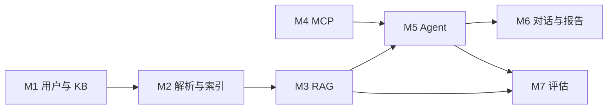

# ScholarMind 项目开发流程与步骤（v1.2）

> 依据：**[ScholarMind_PRD_v2.0](ScholarMind_PRD_v2.0.md)**（v2.0，升级自 KnowMind AI PRD；Word 版 [`ScholarMind_PRD_v2.0.docx`](ScholarMind_PRD_v2.0.docx)）  
> 仓库现状（截至文档编写时）：`scholarmind-web` 主要页面与布局已具备；`scholarmind-server` 仅有健康检查与占位对话接口；`scholarmind-agent` 为 LangGraph 占位；`scholarmind-mcp`、`scholarmind-agent/rag` 等目录已存在，需与 API、Agent 主链路集成。  
> **v1.1**：已锁定技术选型与节奏；**里程碑时间与交付物严格对齐 PRD 第 6 节「开发里程碑」**（第 1–12 周），周内任务仍按纵向切片排期。  
> **v1.2**：关系型数据库定为 **MySQL**（见第 2 节）。

---

## 1. 目标与原则

| 维度 | 说明 |
|------|------|
| 产品目标 | 研究问题 → 私有 RAG + 公开 MCP → 可溯源结构化报告 |
| 技术原则 | PRD 既定栈：FastAPI + Celery + Redis、BGE-M3 + 向量库 + Rerank、MCP、LangGraph Plan-and-Execute |
| 开发原则 | **纵向切片**：每条用户主路径从 API 贯通到存储/模型，再横向扩展功能；先 P0 再 P1/P2 |
| 节奏 | **严格按 PRD 周次表**（两周一阶段、共 6 个 Phase）；不在文档层面压缩或顺延 PRD 周次 |
| 与当前 UI 进度 | 页面骨架已较完整；在各 Phase 验收点仍需按 PRD 完成**流式、执行面板、溯源、导出**等能力与真实数据接线 |

---

## 2. 已定技术选型（2026-05 确认）

| 领域 | 决策 | 说明 |
|------|------|------|
| BM25 / 关键词检索 | **Whoosh** | 与 Python 后端一体，免 ES 运维；索引与重建策略在 M3 实现时单独设计 |
| 向量库 | **Milvus Lite**（本地嵌入） | 开发即本地嵌入；多租户与 PRD 一致按 `user_id`（或等价 namespace）隔离 collection/partition 策略在实现方案中写明 |
| 用户与鉴权（MVP） | **邮箱 + 密码 + JWT** | 对齐 PRD M1-001 / M1-002；刷新策略按 PRD（如 7 天 + 刷新）实现 |
| Google OAuth（M1-003） | **P1**（相对 PRD 原文 P2 提前） | 不阻塞 P0 闭环；排入具备「完整前端与账户体系」后的迭代（建议不早于 PRD Phase 4 周次内评估插入点） |
| 文件与上传物存储 | **开发期本地磁盘 + 自始抽象存储层** | 接口层支持后续切换 **OSS / S3 兼容**；业务代码只依赖抽象（如 `put` / `get` / `delete` / 可签名 URL 预留），不落死本地路径逻辑 |
| 关系型数据库 | **MySQL**（开源、常用 8.x） | ORM/迁移（如 SQLAlchemy 2 + Alembic）与异步驱动（如 **asyncmy**）在阶段 A 引入依赖；连接串经环境变量注入，禁止把生产口令写入仓库 |

---

## 3. PRD 模块与代码仓映射

| PRD 模块 | 主要落地位置 | 备注 |
|----------|--------------|------|
| M1 用户与知识库 | `scholarmind-server`（用户、KB CRUD、鉴权）、DB 迁移 | 多租户与 Milvus namespace 一致 |
| M2 文档解析与索引 | Server + Celery Worker、**存储抽象层** + 本地适配器、解析库（PyMuPDF 等） | 上传文件经抽象层落盘；后续换 OSS 只换适配器与配置 |
| M3 RAG 检索 | `scholarmind-agent/rag` 扩展 + Server 或 Agent 内调用 | **Milvus Lite** 向量路 + **Whoosh** BM25；RRF + BGE-Reranker |
| M4 MCP | `scholarmind-mcp/*`、Agent 工具注册、超时与缓存 | PRD 30s 超时、24h 缓存 |
| M5 Agent | `scholarmind-agent/agent/graph.py` 等 | Plan-and-Execute、SSE 步骤推送 |
| M6 对话与报告 | `scholarmind-web` + Server 流式与报告 API | 流式、执行面板、溯源 UI |
| M7 评估 | `scholarmind-eval` | RAGAS、看板与离线 Pipeline |
| M8 监控 | Server 日志/指标、可选 APM | P2 |

---

## 4. PRD 开发里程碑（权威周次表）

以下周次与交付物 **与 PRD 第 6 节一致**，作为验收与排期的最高优先级约束。

| Phase | 周次 | 交付物 | 完成标志（PRD） |
|-------|------|--------|------------------|
| Phase 1 | 第 1–2 周 | PDF 解析 + 论文感知切块 + 基础 RAG 问答 | 能上传论文并基于内容问答 |
| Phase 2 | 第 3–4 周 | arXiv + Semantic Scholar MCP Server + 基础 Agent | Agent 能联网搜索 + 检索私有库 |
| Phase 3 | 第 5–6 周 | Plan-and-Execute + 执行过程可视化 + 错误重试 | Agent 执行面板实时展示 |
| Phase 4 | 第 7–8 周 | 完整 React 界面 + 引用溯源 + 报告导出 | 可演示完整用户流程 |
| Phase 5 | 第 9–10 周 | RAGAS Pipeline + 测试集 + 评估看板 | 4 项指标达到目标值 |
| Phase 6 | 第 11–12 周 | 部署 + 性能优化 + 简历话术整理 | 项目可公开访问 + 面试材料就绪 |

**周内执行方式**：在每个 Phase 的两周窗口内，仍采用「纵向切片」排迭代（先打通最小闭环，再补全 PRD 子需求 ID），但 **Phase 结束点必须与上表对齐**，不得在无变更说明的情况下整体平移周次。

---

## 5. 与 PRD 阶段对应的工程阶段（映射说明）

下列字母阶段仅用于 **分解工作内容**，时间归属以第 4 节周次为准。

| 工程阶段 | 内容摘要 | 主要落在 PRD Phase |
|----------|----------|-------------------|
| A 基础设施与数据模型 | 关系型 DB、Redis、环境变量；认证、KB、文档任务路由与迁移 | Phase 1 前期 |
| B 上传 → 解析 → 索引 | PDF 限制、Celery、论文感知切块、**存储抽象**、Milvus 写入 | Phase 1 |
| C RAG 检索闭环 | 向量 + Whoosh BM25、RRF、Rerank、溯源字段 | Phase 1 |
| D MCP 与 Agent 最小可用 | MCP 接入、基础 Agent、chat 非占位 | Phase 2 |
| E Plan-and-Execute 与可观测 | 计划列表、SSE 步骤、错误重试 | Phase 3 |
| F 前端完整能力与报告 | 溯源、Markdown/KaTeX、导出；Google OAuth 若插入则在此窗口评估（P1） | Phase 3–4 |
| G 评估体系 | RAGAS、测试集、看板 | Phase 5 |
| H 非功能与上线 | 性能、部署、监控、安全加固 | Phase 6 |

---

## 6. 工作分解结构（WBS）摘要

1. **数据与鉴权**：User / JWT / 刷新；KB CRUD；租户隔离测试用例。  
2. **存储抽象**：定义接口；本地文件系统实现；配置项预留 OSS。  
3. **文档流水线**：上传 → 队列 → 解析 → 切块 → Milvus + Whoosh 索引 → 状态回调。  
4. **检索服务**：混合检索 + Rerank API（供 Agent 或 Chat 调用）。  
5. **Agent 编排**：状态、节点、MCP 工具适配、working memory（后续 8K 压缩）。  
6. **实时与观测**：SSE、trace_id、步骤日志。  
7. **前端接线**：`api.ts` 扩展、Chat 流式、执行面板与 KB/文档真实数据。  
8. **评估与回归**：RAGAS 四项、版本对比看板。

---

## 7. 依赖关系（简图）

---

## 8. 下一步（开发执行）

1. 代码实现顺序：**Phase 1 周次内**从阶段 A→B→C 贯通（含存储抽象与 Milvus Lite + Whoosh）。  
2. 每个 PRD Phase 末保留：**与上表「完成标志」对齐的验收清单** + 简短变更说明。  
3. 关系型 DB 已定为 **MySQL**；首次引入迁移的 PR 中落实依赖、`database_url` 配置与 Alembic 初始化。

---

**文档维护**：需求或选型变更时更新第 2、4 节并递增文档版本号。

*版本：v1.2 · MySQL 已写入选型 · 里程碑对齐 PRD 第 6 节*
