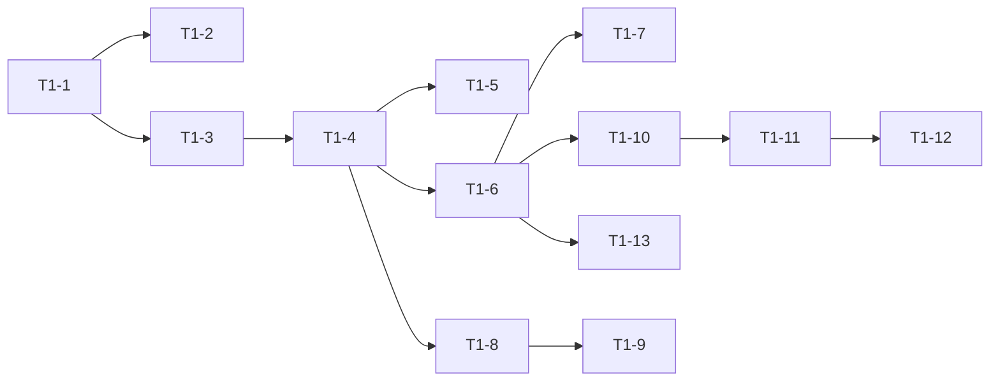

# Epic 1：混合检索（T1-1 ~ T1-13）— GitHub Issues

> **Epic 目标**：闭合 PRD **KM-M-002、M3-SEARCH、AC-M-04**；交付 Whoosh BM25 + Chroma 向量 + RRF 融合、管理端搜索 API、全局 `/search` 页，并可选将 RAG 对话接入混合检索。  
> **依据文档**：[AI知识库管理平台_产品需求规格说明书_PRD_v3.0.md](../AI知识库管理平台_产品需求规格说明书_PRD_v3.0.md) §3.5、§8.3、§9.1、AC-M-04  
> **建议 Milestone**：`Epic-1-Hybrid-Search`  
> **建议 Labels**：`epic-1`、`p0`、`backend` / `frontend` / `test`

---

## 如何使用

1. 在 GitHub 仓库 **Issues → New issue** 中粘贴各 Issue 的 **Title** 与 **Body**。
2. 或使用文末 **批量创建脚本**（需已安装 [`gh`](https://cli.github.com/) 并已 `gh auth login`）。
3. 创建 Epic 总览 Issue 后，将子 Issue 编号填入总览 Checklist；子 Issue Body 中的 `Depends on #N` 替换为实际 Issue 号。

---

## Epic 总览 Issue

### Title

`[Epic 1] 混合检索：Whoosh + Chroma + RRF + /search 页（P0）`

### Labels

`epic-1`, `p0`, `enhancement`

### Body

```markdown
## 背景

课题 2.4.1 要求知识检索支持语义 + 关键词；PRD v3.0 规定管理端 `GET /knowledge-bases/{kb_id}/search` 与全局路由 `/search`。

当前仓库现状：
- Whoosh 仅 **写入**（`whoosh_upsert_chunks`），无查询函数
- 无 `search_service.py`
- RAG 对话（`rag_context.py`）仅 Chroma 向量 Top-K
- 条目列表为 MySQL `LIKE`，非混合检索

## 目标

- [ ] T1-1 ~ T1-2：Whoosh BM25 查询 + 单测
- [ ] T1-3 ~ T1-5：`search_service` + RRF + Schema
- [ ] T1-6 ~ T1-7：检索 REST API + 集成测试
- [ ] T1-8 ~ T1-9：RAG 接入混合检索（可选同期）
- [ ] T1-10 ~ T1-13：前端 `/search` 页 + 导航 + 条目面板对接

## 验收（Epic 级）

- [ ] `GET /api/v1/knowledge-bases/{kb_id}/search?q=...` 返回融合后的 `items[]`（含 score、snippet、page）
- [ ] 仅 `lifecycle_status=published` 的 chunk 参与检索
- [ ] 前端 `/search` 可在 5 步内完成：选库 → 输入词 → 看结果 → 跳转条目详情
- [ ] `pytest` 新增用例通过；`tsc -b` 无报错

## 子任务

| ID | Issue 标题 |
|----|------------|
| T1-1 | Whoosh BM25 查询函数 |
| T1-2 | Whoosh 检索单测 |
| T1-3 | RRF 融合工具函数 |
| T1-4 | hybrid_search 主服务 |
| T1-5 | 检索 Pydantic Schema |
| T1-6 | GET .../search API 端点 |
| T1-7 | 知识库搜索 API 集成测试 |
| T1-8 | rag_context 接入混合检索 |
| T1-9 | 对话 RAG 检索回归验证 |
| T1-10 | 前端 search.ts 服务层 |
| T1-11 | SearchPage 全局检索页 |
| T1-12 | 路由与侧栏/TabBar 导航 |
| T1-13 | KnowledgeItemsPanel 对接混合检索 |

## 依赖关系



## 参考文件

- `knowmind-server/app/indexing/whoosh_index.py`
- `knowmind-server/app/services/rag_context.py`
- `knowmind-server/app/indexing/vector_chroma.py`
- `knowmind-web/src/App.tsx`
```

---

## T1-1

### Title

`[T1-1][Backend] Whoosh BM25 查询函数`

### Labels

`epic-1`, `p0`, `backend`

### Body

```markdown
## 描述

在现有 Whoosh 索引模块上增加 **只读查询** 能力，供混合检索服务调用。当前仅有 `whoosh_upsert_chunks` / `whoosh_delete_chunk`。

## 任务

- [ ] 在 `knowmind-server/app/indexing/whoosh_index.py` 新增 `whoosh_search(...)`
- [ ] 参数：`root`, `kb_id`, `query`, `top_k`（默认 20）, `lifecycle_status`（默认 `"published"`）
- [ ] 对 `content` 字段做 BM25 检索；`MultifieldParser` 或等价实现
- [ ] 返回 `list[dict]`，字段至少包含：`chunk_id`, `text`, `item_id`, `doc_id`, `page`（int）, `score`（float，归一化到 0~1 或保留 BM25 原始分 + 文档说明）
- [ ] 查询 filter：`kb_id` 精确匹配 + `lifecycle_status` 匹配
- [ ] 空 query / 无索引时返回 `[]`，不抛未捕获异常

## 接口草案

```python
def whoosh_search(
    root: str | Path,
    *,
    kb_id: str,
    query: str,
    top_k: int = 20,
    lifecycle_status: str = "published",
) -> list[dict[str, Any]]:
    ...
```

## 验收标准

- [ ] 对已 upsert 的 published chunk，关键词能命中
- [ ] `lifecycle_status=draft` 的文档不会被搜到
- [ ] 与现有 schema（`chunk_id`, `kb_id`, `content`, ...）兼容，不破坏 upsert

## 依赖

无（Epic 1 起点）

## 预估

0.5 天
```

---

## T1-2

### Title

`[T1-2][Test] Whoosh BM25 检索单测`

### Labels

`epic-1`, `p0`, `test`, `backend`

### Body

```markdown
## 描述

为 T1-1 的 `whoosh_search` 增加隔离单测，使用临时目录作为 `whoosh_index_root`，不依赖 MySQL / Chroma。

## 任务

- [ ] 新建 `knowmind-server/tests/test_whoosh_search.py`
- [ ] fixture：临时目录 + `whoosh_upsert_chunks` 写入 3 条 mock 数据（同 kb_id，2 published + 1 draft）
- [ ] 断言：查询 published 内容关键词 → 返回 2 条且含预期 `chunk_id`
- [ ] 断言：draft 条目的独特关键词 → 返回 0 条
- [ ] 断言：空字符串 query → 返回 `[]`

## 验收标准

- [ ] `uv run pytest tests/test_whoosh_search.py -q` 通过
- [ ] CI 无需 GPU / 外网

## 依赖

Depends on: **T1-1**（替换为实际 Issue 号）

## 预估

0.25 天
```

---

## T1-3

### Title

`[T1-3][Backend] RRF 融合工具函数（Reciprocal Rank Fusion）`

### Labels

`epic-1`, `p0`, `backend`

### Body

```markdown
## 描述

实现向量检索与 BM25 检索结果的 **RRF 融合排序**，为 `hybrid_search` 提供可复用纯函数。

## 任务

- [ ] 新建 `knowmind-server/app/services/search_service.py`（若文件已存在则追加）
- [ ] 实现 `rrf_merge(*ranked_lists: list[dict], key: str = "chunk_id", k: int = 60) -> list[dict]`
- [ ] 输入：多路检索结果，每项含 `chunk_id` 与原始 `score`（可选保留为 `vector_score` / `bm25_score`）
- [ ] 输出：按 RRF 分降序的去重列表，合并 metadata（优先保留分数较高的路的 text/page 等）
- [ ] 单元测试：两路人工排名 → 验证 Top1 符合 RRF 公式 `1/(k+rank)`

## 验收标准

- [ ] 同 `chunk_id` 只出现一次
- [ ] 同时出现在两路的 chunk 排名靠前
- [ ] 函数无 DB / 网络依赖，可独立单测

## 依赖

Depends on: **T1-1**

## 预估

0.5 天
```

---

## T1-4

### Title

`[T1-4][Backend] hybrid_search 混合检索主服务`

### Labels

`epic-1`, `p0`, `backend`

### Body

```markdown
## 描述

实现 PRD §3.5.2 检索服务主流程：向量 Top-K + Whoosh BM25 Top-K → RRF → MySQL 补全条目元数据。

## 任务

- [ ] 在 `search_service.py` 实现 `async def hybrid_search(session, user_id, kb_id, q, *, limit=20, category_id=None, tags=None)`
- [ ] 校验知识库归属（复用 `knowledge_base_service` 或 `_ensure_kb` 模式）
- [ ] 步骤 1：`embed_texts([q])` → `get_vector_index().query_similar(kb_id=..., top_k=limit)`（仅 published，与 `vector_chroma.py` filter 一致）
- [ ] 步骤 2：`whoosh_search(settings.whoosh_index_root, kb_id=..., query=q, top_k=limit)`
- [ ] 步骤 3：`rrf_merge(vector_hits, bm25_hits)` → 取 Top `limit`
- [ ] 步骤 4：按 `item_id` / `chunk_id` 批量查询 `KnowledgeItem`，补全 `title`, `snippet`（content 前 200 字）, `source_type`, `tags`, `page`
- [ ] 步骤 5（可选）：`category_id` / `tags` 在 SQL 层过滤（tags 为 JSON 包含）
- [ ] 预留 `log_search_hit` 钩子（Epic 6 热度统计可接，本 Epic 可 `pass`）

## 返回结构（内部）

```python
@dataclass
class HybridSearchHit:
    item_id: str
    chunk_id: str
    title: str
    snippet: str
    score: float
    source_type: str
    page: int | None
    tags: list[str]
```

## 验收标准

- [ ] 同一 query 下，仅向量 vs 混合结果有差异（Whoosh 有索引时）
- [ ] 未发布条目不出现在结果中
- [ ] `limit` 最大 50，默认 20

## 依赖

Depends on: **T1-1**, **T1-3**

## 预估

1 天
```

---

## T1-5

### Title

`[T1-5][Backend] 检索 API Pydantic Schema（SearchResultOut）`

### Labels

`epic-1`, `p0`, `backend`

### Body

```markdown
## 描述

定义混合检索 HTTP 响应模型，与 PRD §8.3 `GET .../search` 契约对齐。

## 任务

- [ ] 新建 `knowmind-server/app/schemas/search.py`
- [ ] `SearchHitOut`：`item_id`, `title`, `snippet`, `score`, `source_type`, `page`（optional）, `tags`（optional list）
- [ ] `SearchResultOut`：`query: str`, `total: int`, `items: list[SearchHitOut]`
- [ ] 在 `hybrid_search` 或 endpoint 层做 `model_validate` 映射

## PRD 响应示例

```json
{
  "query": "Transformer 注意力机制",
  "total": 8,
  "items": [
    {
      "item_id": "...",
      "title": "...",
      "snippet": "...",
      "score": 0.87,
      "source_type": "document",
      "page": 3,
      "tags": ["NLP"]
    }
  ]
}
```

## 验收标准

- [ ] OpenAPI `/docs` 中可见新 Schema
- [ ] 字段名与 PRD 一致

## 依赖

Depends on: **T1-4**

## 预估

0.25 天
```

---

## T1-6

### Title

`[T1-6][Backend] GET /knowledge-bases/{kb_id}/search 端点`

### Labels

`epic-1`, `p0`, `backend`, `api`

### Body

```markdown
## 描述

注册管理端混合检索 REST API，需 JWT 鉴权与用户隔离。

## 任务

- [ ] 在 `knowmind-server/app/api/v1/endpoints/knowledge_bases.py` 增加路由：

```
GET /api/v1/knowledge-bases/{kb_id}/search
```

- [ ] Query 参数（对齐 PRD）：
  - `q`（必填，string）
  - `limit`（int，默认 20，最大 50）
  - `category_id`（optional）
  - `tags`（optional，逗号分隔，如 `NLP,深度学习`）
- [ ] 响应：`SearchResultOut`
- [ ] 错误：`q` 为空 → 422；kb 不存在或非本人 → 404
- [ ] 依赖 `get_current_user_id`

## 验收标准

- [ ] `curl` + Bearer Token 可返回 JSON
- [ ] 跨用户访问他人 `kb_id` 返回 404

## 依赖

Depends on: **T1-4**, **T1-5**

## 预估

0.25 天
```

---

## T1-7

### Title

`[T1-7][Test] 知识库混合检索 API 集成测试`

### Labels

`epic-1`, `p0`, `test`, `backend`

### Body

```markdown
## 描述

端到端验证搜索 API：注册 → 建库 → 创建并发布条目 → 搜索命中；draft 不命中。

## 任务

- [ ] 新建 `knowmind-server/tests/test_kb_search.py`
- [ ] 复用 `conftest.py` 中 `async_client`（sqlite 内存库）
- [ ] 流程：
  1. register/login
  2. POST knowledge-bases
  3. POST categories（或默认分类）
  4. POST items + POST publish（`EMBEDDING_MODE=hash` 下索引）
  5. GET `.../search?q=独特关键词`
  6. 断言 `total >= 1` 且 `items[0].title` 匹配
- [ ] 负例：draft 条目独特词 → `total == 0`（或不含该 item_id）
- [ ] 负例：无 token → 401

## 验收标准

- [ ] `uv run pytest tests/test_kb_search.py -q` 通过
- [ ] 不依赖 Celery / Redis（索引用 `item_indexing` 同步路径或 mock）

## 依赖

Depends on: **T1-6**

## 预估

0.5 天
```

---

## T1-8

### Title

`[T1-8][Backend] rag_context 接入 hybrid_search`

### Labels

`epic-1`, `p0`, `backend`

### Body

```markdown
## 描述

将对话 RAG 的检索从 **纯向量** 升级为 **混合检索**，保持对外 `RagSearchResult` / SSE 行为不变。

## 任务

- [ ] 修改 `knowmind-server/app/services/rag_context.py` 中 `search_kb`
- [ ] 内部调用 `search_service.hybrid_search`（或抽取共用的 `_hits_to_rag_result`）
- [ ] 将融合后的 hits 映射为现有 `RagHit`（chunk_id, text, doc_id, item_id, page, score）
- [ ] `_format_hits` 生成注入 LLM 的 Markdown 保持不变
- [ ] 确认 `rag_logging_service.log_rag_retrieval` 仍写入 `rag_retrieval_logs`

## 验收标准

- [ ] `/api/v1/chat/stream` 选库提问仍正常返回流式内容
- [ ] 日志中 `hit_count` 反映融合后条数

## 依赖

Depends on: **T1-4**

## 预估

0.5 天
```

---

## T1-9

### Title

`[T1-9][QA] 对话 RAG 混合检索回归验证`

### Labels

`epic-1`, `p0`, `test`, `qa`

### Body

```markdown
## 描述

T1-8 合并后的手工/自动回归，确保流式对话、思维链、多轮记忆未被破坏。

## 任务

- [ ] 手工用例清单（可贴 PR 描述）：
  - [ ] 选库 → 提问 → 首 token ≤ 合理时间
  - [ ] 切换会话 → 历史消息加载
  - [ ] 无库提问 → 降级提示
  - [ ] PDF 入库后提问能引用文档片段
- [ ] 可选：扩展 `tests/test_chat_*.py` mock LLM，断言请求 body 含 RAG markdown
- [ ] 确认 `POST /api/v1/chat`（同步）行为记录已知差异（记忆未接）— 不在本 Issue 修复

## 验收标准

- [ ] 上述手工用例通过
- [ ] 无新增 500 / SSE 断流

## 依赖

Depends on: **T1-8**

## 预估

0.25 天
```

---

## T1-10

### Title

`[T1-10][Frontend] search.ts 检索服务层`

### Labels

`epic-1`, `p0`, `frontend`

### Body

```markdown
## 描述

封装混合检索 API，供 SearchPage 与 KnowledgeItemsPanel 复用。

## 任务

- [ ] 新建 `knowmind-web/src/services/search.ts`
- [ ] 类型：`SearchHitDto`, `SearchResultDto`（与后端 SearchResultOut 对齐）
- [ ] 方法：`searchKnowledgeBase(kbId, { q, limit?, categoryId?, tags? })`
- [ ] 复用 `api.ts` / `authHeaders` 错误处理模式（参考 `knowledgeItems.ts`）
- [ ] Query 构建：`tags` 数组 → 逗号拼接

## 验收标准

- [ ] TypeScript strict 无报错
- [ ] 未登录时抛出明确错误

## 依赖

Depends on: **T1-6**

## 预估

0.25 天
```

---

## T1-11

### Title

`[T1-11][Frontend] SearchPage 全局知识检索页（/search）`

### Labels

`epic-1`, `p0`, `frontend`

### Body

```markdown
## 描述

实现 PRD §9.1 全局检索页：选库、输入查询、展示混合检索结果、跳转条目详情。

## 任务

- [ ] 新建 `knowmind-web/src/pages/SearchPage.tsx`
- [ ] UI 区域：
  - [ ] 知识库下拉（`listKnowledgeBases`）
  - [ ] 搜索框 + 搜索按钮（Enter 触发）
  - [ ] 可选：分类下拉（`listCategoryTree`）、标签输入（Epic 2 可加强，本 Issue 可先留占位或简单文本）
  - [ ] 结果列表：title、snippet、score（保留 2 位小数）、source_type Badge、页码
  - [ ] 点击行 → `navigate(/documents/items/${kbId}/${itemId})`
- [ ] 状态：loading / empty / error Toast
- [ ] 样式与现有 Tailwind 卡片风格一致（参考 `KnowledgeBasesPage`）

## 验收标准

- [ ] 路由 `/search` 可访问且需登录（AppShell 内）
- [ ] 有结果时能跳转条目详情

## 依赖

Depends on: **T1-10**

## 预估

1 天
```

---

## T1-12

### Title

`[T1-12][Frontend] 注册 /search 路由与主导航入口`

### Labels

`epic-1`, `p0`, `frontend`

### Body

```markdown
## 描述

将检索页纳入应用路由与信息架构（PRD §9.2：消费端「全局检索」）。

## 任务

- [ ] `knowmind-web/src/App.tsx`：`<Route path="/search" element={<SearchPage />} />`（置于 AppShell 内）
- [ ] `knowmind-web/src/components/layout/Sidebar.tsx`：在「智能对话」下方增加「知识检索」→ `/search`（图标建议 `Search` from lucide-react）
- [ ] `MobileTabBar`：移动端 5 Tab 已满 — **方案二选一**（PR 中说明）：
  - A. 将「文档」合并入口，检索从知识库页链入；或
  - B. 替换一个不常用 Tab（需产品确认）
  - 默认建议：检索入口仅 Sidebar + 知识库页快捷按钮，TabBar 暂不改
- [ ] 可选：`KnowledgeBasesPage` 卡片增加「检索此库」跳转 `/search?kbId=...`

## 验收标准

- [ ] 桌面端侧栏可见「知识检索」
- [ ] 登录后可直接访问 `/search`

## 依赖

Depends on: **T1-11**

## 预估

0.25 天
```

---

## T1-13

### Title

`[T1-13][Frontend] KnowledgeItemsPanel 对接混合检索 API`

### Labels

`epic-1`, `p0`, `frontend`

### Body

```markdown
## 描述

文档管理 → 条目 Tab 的搜索框，从 MySQL `LIKE` 升级为调用混合检索 API（语义 + 关键词）。

## 任务

- [ ] 修改 `knowmind-web/src/components/KnowledgeItemsPanel.tsx`
- [ ] 当 `keyword` 非空时：调用 `searchKnowledgeBase(kbId, { q: keyword, categoryId: categoryFilter })` 展示结果
- [ ] 当 `keyword` 为空时：保持现有 `listKnowledgeItems` 列表逻辑
- [ ] 结果映射：SearchHit → 列表行（若无 item 正文，用 snippet）
- [ ] 保留状态 Tab（全部/已发布/草稿/已归档）与混合检索的交互说明：
  - 建议：有 keyword 时忽略 status Tab 或仅传 `published`（PR 中写明产品选择）

## 验收标准

- [ ] 条目 Tab 输入语义相关词可命中（非仅标题字面匹配）
- [ ] 清空关键词恢复完整列表

## 依赖

Depends on: **T1-6**, **T1-10**

## 预估

0.5 天
```

---

## 批量创建（GitHub CLI）

在仓库根目录执行前，先创建 Milestone（可选）：

```bash
gh api repos/{owner}/{repo}/milestones -f title="Epic-1-Hybrid-Search" -f description="混合检索 P0"
```

将下方脚本中的 `YOUR_ORG/YOUR_REPO` 替换为实际仓库，并确保已 `gh auth login`。

```bash
# 建议在 docs/issues/ 目录旁保存各 body 为单独文件后使用 gh issue create -F
# 以下为示例：仅创建 Epic 总览（其余 Issue 请用 -F 指向从本文档复制的 body 文件）

gh issue create \
  --repo YOUR_ORG/YOUR_REPO \
  --title "[Epic 1] 混合检索：Whoosh + Chroma + RRF + /search 页（P0）" \
  --label "epic-1,p0,enhancement" \
  --body-file docs/issues/epic1_body.md
```

**推荐工作流**：

1. 从本文档复制各 Issue 的 `### Body` 代码块到 `docs/issues/bodies/T1-01.md` … `T1-13.md`
2. 执行：

```bash
for i in 01 02 03 04 05 06 07 08 09 10 11 12 13; do
  gh issue create --repo YOUR_ORG/YOUR_REPO \
    --title "$(head -1 docs/issues/titles/T1-${i}.txt)" \
    --label "epic-1,p0" \
    --body-file "docs/issues/bodies/T1-${i}.md"
done
```

3. 在 GitHub Project 中按依赖列排序：T1-1 → T1-3 → T1-4 → T1-6 → T1-10 → T1-11 → T1-12

---

## Labels 初始化（一次性）

若仓库尚无 labels，可执行：

```bash
gh label create "epic-1" --description "Epic 1 混合检索" --color "1D76DB"
gh label create "p0" --description "必须交付 P0" --color "B60205"
gh label create "backend" --description "后端" --color "5319E7"
gh label create "frontend" --description "前端" --color "0E8A16"
gh label create "test" --description "测试" --color "FBCA04"
gh label create "api" --description "API 契约" --color "1D76DB"
gh label create "qa" --description "手工/回归 QA" --color "D93F0B"
```

---

## 修订记录

| 日期 | 说明 |
|------|------|
| 2026-05-24 | 首版：Epic 1 共 14 个 Issue（含 Epic 总览 + T1-1~T1-13） |
